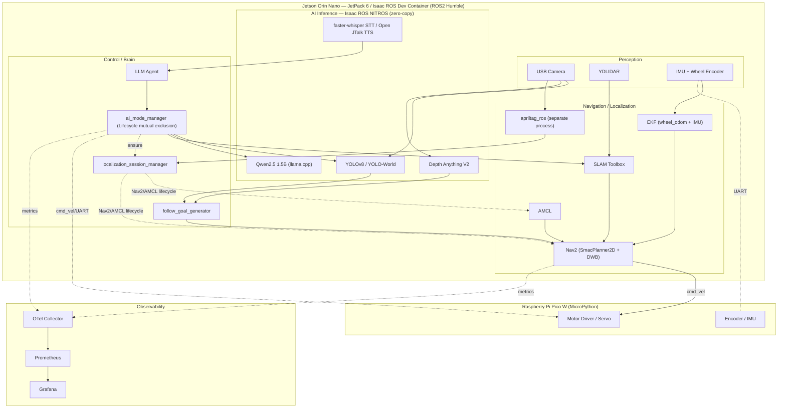

# Edge AI Robotics Platform

[🇯🇵 日本語](README.md) | [🇺🇸 English](README.en.md)

> **Making AI-powered robots reliable enough for real-world operation.**
>
> Built solo by an engineer with a background in DBA / IT operations / observability,
> to bring an "ops mindset" into robotics.

<!-- Robot photos (front + side). -->
<p align="center">
  
  
</p>

> **Note on language:** the robot only listens and speaks in **Japanese** — voice
> commands and replies below are shown in Japanese with an English gloss, e.g.
> 「ヘイロボ」*(Hey Robo)*.

---

## Demo

<p align="center">
  <a href="https://www.youtube.com/shorts/wOj_O3pmqlM">
    
  </a>
  <a href="https://www.youtube.com/shorts/eDrZ-v9ciB8">
    
  </a>
</p>

<p align="center">
  <sub><b>Left:</b> person following (YOLO + depth estimation + Nav2) &nbsp;|&nbsp; <b>Right:</b> map-free person following (<code>local</code> mode / odom frame, no prior map required)</sub>
</p>

<p align="center">▶ More videos on the <a href="https://www.youtube.com/@toyof-robo">YouTube channel</a></p>

### Demo Scenario

| Beat | Command (spoken in Japanese) | Robot Action | Tech |
|---|---|---|---|
| Open | 「ヘイロボ」*(Hey Robo)* | 「はい。何の処理をしましょうか？」*("Yes, what would you like me to do?")* | STT + LLM |
| Follow | 「人についてきて」*(Follow this person)* | Starts following → avoids obstacles autonomously → keeps following | YOLO + Depth + Nav2 |
| Search | 「くまのぬいぐるみを探して」*(Find the teddy bear)* | Explores autonomously → 「見つかりました」*("Found it")* | YOLO-World |
| Describe | 「何が見える？」*(What do you see?)* | 「男性が携帯を手に...」*("A man holding a phone...")* | Cloud VLM (Gemini) |

> Everything runs in real time on-device on a Jetson Orin Nano (8GB), except the VLM step, which uses the cloud.

---

## What This Robot Can Do

| Capability | How | Key Tech |
|---|---|---|
| Takes voice commands | 「ヘイロボ」*(Hey Robo)* → STT → LLM intent classification → mode switch | faster-whisper + Qwen2.5 1.5B |
| Follows a specified object | YOLO detection → depth estimation → Nav2 goal generation (defaults to a person; switchable by voice to any COCO object, e.g. a bottle) | YOLOv8 + Depth Anything V2 + Nav2 |
| Doesn't give up when it loses you | Predicts ahead from the tracked trail (Tier 1) → autonomous search (Tier 2) → re-acquire | Breadcrumb prediction + GVD / frontier exploration |
| Avoids obstacles autonomously | LiDAR → costmap → path re-planning | SLAM Toolbox + Nav2 DWB |
| Searches for an object | Natural-language query → zero-shot detection → autonomous exploration | YOLO-World |
| Remembers rooms via tags, recovers its pose | AprilTag detection → room resolution → AMCL initial-pose injection with the matching map (no manual RViz step) | AprilTag + AMCL + Nav2 |
| Describes what it sees | Camera frame → cloud VLM → natural-language answer | Gemini API |
| Visualizes operational state | OTel collection → time-series DB → dashboard | OpenTelemetry + Prometheus + Grafana |
| Detects and triages failures | Correlates workload × load → anomaly detection | Grafana alerts + correlation analysis |

---

## Key Numbers

| Metric | Value | Condition |
|---|---|---|
| YOLO inference latency | 70–128 ms (avg. ~10 Hz) | YOLOv8s, TensorRT FP16, 640x480, running concurrently with Depth Anything V2 |
| Depth inference latency | 90 ms – 1.3 s (avg. 2–3.6 Hz) | Depth Anything V2 ViT-S, TensorRT, running concurrently with YOLOv8s (high variance under GPU contention) |
| LLM first response (cold start) | ~51.0 s | Qwen2.5 1.5B, llama.cpp GPU offload, context_len=1024, when background warm-up hasn't finished (server boot → health-check pass takes another 62.5 s) |
| LLM response (warmed up) | ~1.16 s | Same as above |
| Custom ROS2 packages | 11 | `src/toyof_robot_*` |
| Total lines of code (self-written) | ~40,900 | `src/toyof_robot_*` (Python ~37,800 + YAML/C++/XML etc. ~3,100, excluding comments/docstrings/blank lines, 264 files) |
| ROS2-free pure-logic modules | 40 | `*_logic.py`, runnable under `pytest` with no robot and no container |
| Automated tests | 1,617 across 65 files | Mostly against the pure-logic modules above; excludes lint tests (flake8 / pep257 / copyright) |

> Measurement environment: Jetson Orin Nano 8GB, JetPack 6, Isaac ROS Dev Container
> Metrics not yet measured (target-lost rate while following, voice-command-to-action latency, continuous runtime) will be added once real numbers are available.

---

## Engineering Challenges I Solved

Technical problems encountered during hardware development, and how I investigated and resolved each one.
**The ones listed first are the most central to this project.**

### Getting a lost person back — a two-tier recovery design

A detector without ReID (person re-identification) simply ends the track the
moment it loses sight of the target. I designed this as a state machine that
escalates according to how much information is still available at the moment
of the loss.

1. **Look around (3 s)** — right after the loss is confirmed, stop in place and
   sweep the turret, prioritising the bearing where the target was last seen.
   If LiDAR shows that bearing is blocked, the sweep is pointless, so skip to
   the next tier.
2. **Tier 1: predict ahead** — extrapolate the direction of travel from the
   breadcrumb trail of measured person positions recorded while following, and
   place the Nav2 goal where the person *is heading*, not where they *were*.
3. **Tier 2: autonomous search** — if Tier 1 comes up empty, switch to
   exploration. In a mapped room it patrols anchors registered via AprilTag; in
   unknown space it picks "directions not yet seen" from a **GVD (generalized
   Voronoi diagram — a way of extracting the centreline of a corridor)**
   skeleton.

The hardest part of the design was balancing **"never give up" against "never
loop forever."** Exhausting the search does not end the run — it falls back to
patrol mode automatically — while two independent stall detectors call it off:
a local one ("sitting in the same spot and the map stops growing") and a global
one based on a moving average over the last 15 actions. The state machine lives
in a ROS2-free pure-logic module (`follow_recovery_logic.py`), so its regression
tests run under pytest without the robot.

→ [docs/mode_details.md](docs/mode_details.md)

### A final safety gate that does not care who issued the command

Nine different nodes publish to `/cmd_vel` (velocity commands). Adding a safety
check at each call site leaves the structural problem intact: if any single one
of them misbehaves, the same accident happens again — which is exactly what a
localization divergence caused in practice.

So the gate went into `pico_bridge_node`, the **single exit to the motors**,
where it blocks the forward component regardless of origin. If an obstacle sits
in the body-width corridor ahead, speed is scaled down in the slow zone and
`linear.x` is forced to 0 in the stop zone. **Reversing and turning in place are
always allowed** — cutting every component would strand the robot facing a wall.
No publisher had to change; one topic subscription covers every path.

"How close to a wall is acceptable" is likewise defined once
(`robot_safety_clearance_m`) and every consumer derives its own value as an
offset from that master. **Copying the number to keep values in sync is
forbidden** — doing exactly that once left the values out of step and the robot
broken for 11 days without anyone noticing. A dedicated test now pins that
invariant mechanically.

→ [docs/safety_architecture.md](docs/safety_architecture.md)

### Exclusive LLM/YOLO scheduling under an 8 GB memory budget

The Jetson Orin Nano's 8 GB shared memory can't hold the LLM (~3 GB) and
the YOLO pipeline (~2 GB) at the same time. Designed and implemented
exclusive memory management using ROS2 Lifecycle + OS drop_caches.

→ [docs/engineering_decisions.md](docs/engineering_decisions.md)

### Diagnosing and fixing a serial deadlock

The UART link between the Jetson and the Pico intermittently hung.
Root-caused to the kernel's serial buffer limit (4095 bytes) being hit;
resolved by redesigning the send/receive protocol.

→ [docs/serial_deadlock_analysis.md](docs/serial_deadlock_analysis.md)

### Diagnosing and fixing encoder-accuracy loss from ToF I2C blocking

ToF sensor I2C reads were blocking the MCU's main loop, causing dropped
encoder interrupts. Fixed by separating the tasks.

→ [docs/tof_blocking_analysis.md](docs/tof_blocking_analysis.md)

### Edge-LLM command classification accuracy — crosslingual prompting

With a Japanese system prompt, Qwen2.5 1.5B misclassified "start object
search" as `start_mapping`. Switching the **prompt** to English while
keeping user input in Japanese (crosslingual prompting) eliminated the
misclassification entirely and cut LLM decision latency from **~15 s to
~0.8 s**. On small edge LLMs, an English prompt removes semantic
interference from Japanese.

→ [docs/engineering_decisions.md](docs/engineering_decisions.md)

---

## Observability — Robot SRE

> A robot that just "moves" isn't enough.
> If you can't explain *why* it stopped or *where* it's degrading, it's not usable in the field.

<!-- Grafana dashboard screenshots (overview + detail). -->
<p align="center">
  
</p>
<p align="center">
  
</p>

### Design principle: correlate workload × load

As with traditional server monitoring, "what came in" and "how much it
consumed" are visualized on the same timeline, enabling first-pass
triage during an incident.

| Axis | What's collected | Example |
|---|---|---|
| Workload | Voice commands / YOLO detections / state transitions | "Person-following started at 14:03" |
| Load | CPU / GPU / memory / ROS topic Hz | "GPU pinned at 95% from 14:03" |

### Stack

```
ROS2 nodes (OTel SDK)
  → OpenTelemetry Collector (Jetson)
  → Prometheus (PC/cloud)
  → Grafana
```

### Scales to a fleet

The OTel Collector's `service.instance_id` lets metrics from multiple
robots aggregate into a single Prometheus instance. Adding a second
robot is designed to be a matter of duplicating the dashboard.

→ [docs/observability_detail.md](docs/observability_detail.md)

---

## System Architecture



<sub>Two-tier split: Jetson Orin Nano (AI/ROS2) and Raspberry Pi Pico W (motors/sensors), connected over UART.</sub>

| Layer | Component | Role |
|---|---|---|
| Perception | USB Camera + YDLIDAR + IMU + Encoder | Environment sensing |
| AI Inference | YOLOv8 + Depth Anything V2 + Qwen2.5 | Detection, depth, language |
| Localization | AprilTag + AMCL + localization_session_manager | Room memory, pose recovery, unified Nav2/AMCL lifecycle |
| Control | Nav2 + Follow Goal Generator + LLM Agent | Path planning, following, decision-making |
| Actuation | Pico W → Motor Driver / Servo | Physical drive |
| Observability | OTel + Prometheus + Grafana | Ops monitoring |

→ [docs/architecture_detail.md](docs/architecture_detail.md)

---

## Tech Stack

| Category | Technology |
|---|---|
| Edge Device | NVIDIA Jetson Orin Nano (JetPack 6) |
| Framework | ROS2 Humble |
| AI (Vision) | YOLOv8 / Depth Anything V2 / YOLO-World / TensorRT |
| AI (Language) | Qwen2.5 1.5B (llama.cpp) / Gemini API |
| AI (Speech) | faster-whisper (STT) / Open JTalk (TTS) |
| Navigation | Nav2 (SLAM Toolbox + AMCL + EKF) |
| GPU Pipeline | Isaac ROS NITROS (zero-copy) |
| Observability | OpenTelemetry + Prometheus + Grafana |
| MCU | Raspberry Pi Pico W (MicroPython) |
| Container | Docker (Isaac ROS Dev Container) |
| CI/Dev | x86 Gazebo sim (`robotcar-sim`) + stub nodes for hardware-free testing |

---

## About Me

An engineer with 10+ years of experience as an Oracle DBA / infrastructure
operator. My strengths are incident response, performance management,
observability, and ops automation. Previously led a 20-person DBA team.

I see a robot as an edge-computing system, and I'm bringing that
operational experience into robotics.

---

## Documentation

| Document | Content |
|---|---|
| [docs/architecture_detail.md](docs/architecture_detail.md) | ROS2 node graph, layered design detail, sensor fusion |
| [docs/development_guide.md](docs/development_guide.md) | Build and test procedures |
| [docs/observability_detail.md](docs/observability_detail.md) | OTel stack layout, file placement |
| [docs/serial_deadlock_analysis.md](docs/serial_deadlock_analysis.md) | UART deadlock investigation log |
| [docs/tof_blocking_analysis.md](docs/tof_blocking_analysis.md) | I2C blocking investigation log |
| [docs/engineering_decisions.md](docs/engineering_decisions.md) | Design decision log |
| [docs/robot_architecture.md](docs/robot_architecture.md) | Robot architecture detail |
| [docs/mode_details.md](docs/mode_details.md) | Internal logic, boot sequence, and parameters for each AI mode |
| [docs/safety_architecture.md](docs/safety_architecture.md) | Safety design (layered fail-safes, cmd_vel guard) |
| [docs/troubleshooting_flow.md](docs/troubleshooting_flow.md) | Troubleshooting flow (Robot SRE) |
| [docs/robotics_as_mcp_design.md](docs/robotics_as_mcp_design.md) | Multi-robot coordination design doc (Robotics as MCP, unimplemented) |

Note: this English README is a translation of [README.md](README.md) (Japanese, the primary source). If the two ever disagree, the Japanese version is authoritative.

---

## License

MIT License — see [LICENSE](LICENSE).
