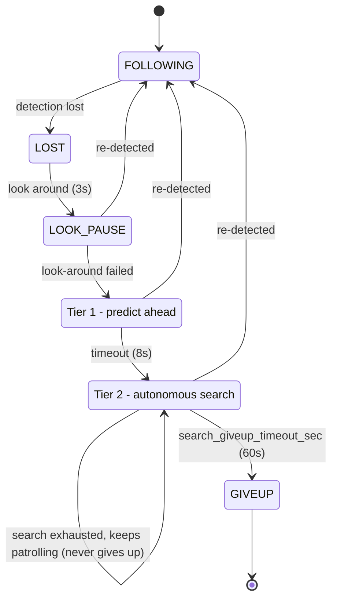
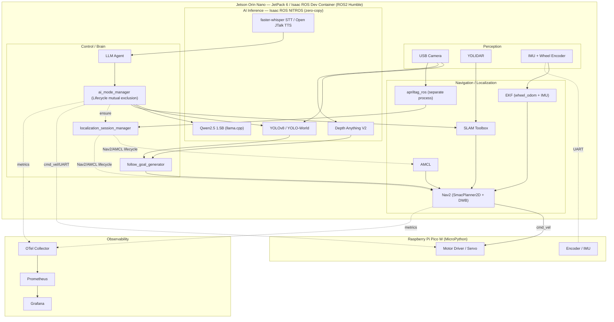

# Edge AI Robotics Platform

[🇯🇵 日本語](README.md) | [🇺🇸 English](README.en.md)

> **Making AI-powered robots reliable enough for real-world operation.**
>
> A real robot that, on a Jetson Orin Nano, runs the full loop autonomously:
> **follow a person → lose them → predict ahead from their trail → search
> autonomously → re-acquire.** Not a demo that merely runs: observability,
> safety design and incident records are wired through it — **physical AI seen
> through an operations lens.**

<!-- Robot photos (front + side). -->
<p align="center">
  
  
</p>

> **Note on language:** the robot only listens and speaks in **Japanese** — voice
> commands and replies below are shown in Japanese with an English gloss, e.g.
> 「ヘイロボ」*(Hey Robo)*.

---

## Why This Project

The robot is not the point. It exists as evidence that **three things are true of
one person at once: operations & reliability, applying AI in real work, and
building physical AI on real hardware.**

| Common enough on its own | My evidence |
|---|---|
| **Understands operations & reliability** (SRE / DBA / infrastructure) | 10+ years as an Oracle DBA and infrastructure engineer; led a 20-person DBA team. Incident response, performance management and operational automation are my home turf |
| **Can apply AI in real work** | In my day job, raising IT operations & maintenance productivity with AI, from PoC through to production rollout |
| **Can build physical AI on real hardware** | This project. Jetson + ROS2 + Nav2 + YOLO + LLM integrated from scratch and running on an actual robot |

Specialists in each of the three are plentiful; **people standing at the
intersection are rare.** Not "someone who experiments with AI" nor "someone who
builds robots", but **someone who can take edge AI all the way to production
operation** — this repository is the evidence for that position.

That is why what follows covers not only what the robot can do, but **how it
broke, how that was detected, and how it was fixed** — in equal measure.

---

## Demo

<p align="center">
  <a href="https://www.youtube.com/shorts/wOj_O3pmqlM">
    
  </a>
  <a href="https://www.youtube.com/shorts/eDrZ-v9ciB8">
    
  </a>
  <a href="https://www.youtube.com/shorts/eqMXYGakyOI">
    
  </a>
</p>

<p align="center">
  <sub><b>Left:</b> person following (YOLO + depth estimation + Nav2) &nbsp;|&nbsp; <b>Middle:</b> map-free person following (<code>local</code> mode / odom frame, no prior map required) &nbsp;|&nbsp; <b>Right:</b> wake word to scene description (STT + LLM + Cloud VLM)</sub>
</p>

<p align="center">▶ More videos on the <a href="https://www.youtube.com/@toyof-robo">YouTube channel</a></p>

### Demo Scenario

The table below is **the scenario when every capability is strung into a single
run**. Of the three videos above, the left and middle cover the "Follow" beat
only, shot under two different conditions — with and without a prior map — and
the right one covers "Open" through "Describe" (wake word to scene
description) in a single take. "Search" (open-vocabulary object search) has
not been captured on video yet.

| Beat | Command (spoken in Japanese) | Robot Action | Tech |
|---|---|---|---|
| Open | 「ヘイロボ」*(Hey Robo)* | 「はい。何の処理をしましょうか？」*("Yes, what would you like me to do?")* | STT + LLM |
| Follow | 「人についてきて」*(Follow this person)* | Starts following → avoids obstacles autonomously → keeps following | YOLO + Depth + Nav2 |
| Search | 「くまのぬいぐるみを探して」*(Find the teddy bear)* | Explores autonomously → 「見つかりました」*("Found it")* | YOLO-World |
| Describe | 「何が見える？」*(What do you see?)* | Detects the people in the room and describes the scene in natural language | Cloud VLM (Gemini) |

> Everything runs in real time on-device on a Jetson Orin Nano (8GB), except the VLM step, which uses the cloud.

---

## What This Robot Can Do

| Capability | How | Key Tech |
|---|---|---|
| Takes voice commands | 「ヘイロボ」*(Hey Robo)* → STT → LLM intent classification → mode switch | faster-whisper + Qwen2.5 1.5B |
| Follows a specified object | YOLO detection → depth estimation → Nav2 goal generation (defaults to a person; switchable by voice to any COCO object, e.g. a bottle) | YOLOv8 + Depth Anything V2 + Nav2 |
| Doesn't give up when it loses you | Predicts ahead from the tracked trail (Tier 1) → autonomous search (Tier 2) → re-acquire | Breadcrumb prediction + GVD / frontier exploration |
| Avoids obstacles autonomously | LiDAR → costmap → path re-planning | SLAM Toolbox + Nav2 DWB |
| Searches for an object | Natural-language query → zero-shot detection → autonomous exploration | YOLO-World |
| Remembers rooms via tags, recovers its pose | AprilTag detection → room resolution → AMCL initial-pose injection with the matching map (no manual RViz step) | AprilTag + AMCL + Nav2 |
| Describes what it sees | Camera frame → cloud VLM → natural-language answer | Gemini API |
| Visualizes operational state | OTel collection → time-series DB → dashboard | OpenTelemetry + Prometheus + Grafana |
| Detects and triages failures | Correlates workload × load → anomaly detection | Grafana alerts + correlation analysis |

---

## Key Numbers

**Performance**

| Metric | Value | Condition |
|---|---|---|
| YOLO inference latency | 70–128 ms (avg. ~10 Hz) | YOLOv8s, TensorRT FP16, 640x480, running concurrently with Depth Anything V2 |
| Depth inference latency | 90 ms – 1.3 s (avg. 2–3.6 Hz) | Depth Anything V2 ViT-S, TensorRT, running concurrently with YOLOv8s (high variance under GPU contention) |
| LLM first response (cold start) | ~51.0 s | Qwen2.5 1.5B, llama.cpp GPU offload, context_len=1024, when background warm-up hasn't finished (server boot → health-check pass takes another 62.5 s) |
| LLM response (warmed up) | ~1.16 s | Same as above |

**Scale & verifiability**

| Metric | Value | Notes |
|---|---|---|
| Custom ROS2 packages | 11 | `src/toyof_robot_*` |
| ROS2-free pure-logic modules | 45 | `*_logic.py`, runnable under `pytest` with no robot and no container (→ [Show Me the Code](#show-me-the-code)) |
| Automated tests | ~1,940 across 73 files | Mostly against the pure-logic modules above; excludes lint tests (flake8 / pep257 / copyright, 27 files) |
| CI | GitHub Actions | Runs the pytest suite above plus flake8 / pep257 (docstring rules) on every push |

> Measurement environment: Jetson Orin Nano 8GB, JetPack 6, Isaac ROS Dev Container
> Metrics not yet measured (target-lost rate while following, voice-command-to-action latency, continuous runtime) will be added once real numbers are available.

---

## Engineering Challenges I Solved

Technical problems encountered during hardware development, and how I investigated
and resolved each one. **The first group is "problems solved by design", the second
is "field failures I traced to root cause".**

### Problems solved by design

These three are the core of the project. In each case, more of the effort went into
**deciding how it should fail — or deciding not to build something** — than into
adding another working feature.

#### Getting a lost person back — a two-tier recovery design

A detector without ReID (person re-identification) simply ends the track the
moment it loses sight of the target. I designed this as a state machine that
escalates according to how much information is still available at the moment
of the loss.

1. **Look around (3 s)** — right after the loss is confirmed, stop in place and
   sweep the turret, prioritising the bearing where the target was last seen.
   If LiDAR shows that bearing is blocked, the sweep is pointless, so skip to
   the next tier.
2. **Tier 1: predict ahead** — extrapolate the direction of travel from the
   breadcrumb trail of measured person positions recorded while following, and
   place the Nav2 goal where the person *is heading*, not where they *were*.
3. **Tier 2: autonomous search** — if Tier 1 comes up empty, switch to
   exploration. In a mapped room it patrols anchors registered via AprilTag; in
   unknown space it picks "directions not yet seen" from a **GVD (generalized
   Voronoi diagram — a way of extracting the centreline of a corridor)**
   skeleton.

The hardest part of the design was balancing **"never give up" against "never
loop forever."** Exhausting the search does not end the run — it falls back to
patrol mode automatically — while two independent stall detectors call it off:
a local one ("sitting in the same spot and the map stops growing") and a global
one based on a moving average over the last 15 actions. The state machine lives
in a ROS2-free pure-logic module (`follow_recovery_logic.py`), so its regression
tests run under pytest without the robot.


```mermaid
stateDiagram-v2
    [*] --> FOLLOWING
    FOLLOWING --> LOST: detection lost
    LOST --> LOOK_PAUSE: look around (3s)
    LOOK_PAUSE --> FOLLOWING: re-detected
    LOOK_PAUSE --> TIER1: look-around failed
    TIER1: Tier 1 - predict ahead
    TIER1 --> FOLLOWING: re-detected
    TIER1 --> TIER2: timeout (8s)
    TIER2: Tier 2 - autonomous search
    TIER2 --> FOLLOWING: re-detected
    TIER2 --> TIER2: search exhausted, keeps patrolling (never gives up)
    TIER2 --> GIVEUP: search_giveup_timeout_sec (60s)
    GIVEUP --> [*]
```

> Lost-target rate and re-acquisition success rate are not yet measured (see
> "metrics not yet measured" at the top of this README). The diagram above
> describes the logic structure, not measured behavior.

→ Full design, all parameters, real-run validation logs → [docs/mode_details.md](docs/mode_details.md)

#### A final safety gate that does not care who issued the command

Nine different nodes publish to `/cmd_vel` (velocity commands). Adding a safety
check at each call site leaves the structural problem intact: if any single one
of them misbehaves, the same accident happens again — which is exactly what a
localization divergence caused in practice.

So the gate went into `pico_bridge_node`, the **single exit to the motors**,
where it blocks the forward component regardless of origin. If an obstacle sits
in the body-width corridor ahead, speed is scaled down in the slow zone and
`linear.x` is forced to 0 in the stop zone. **Reversing and turning in place are
always allowed** — cutting every component would strand the robot facing a wall.
No publisher had to change; one topic subscription covers every path.

"How close to a wall is acceptable" is likewise defined once
(`robot_safety_clearance_m`) and every consumer derives its own value as an
offset from that master. **Copying the number to keep values in sync is
forbidden** — doing exactly that once left the values out of step and the robot
broken for 11 days without anyone noticing. A dedicated test now pins that
invariant mechanically.

<p align="center">
  
</p>

→ Geometry-flaw detail, sequence diagrams, the 3-tier gate design → [docs/safety_architecture.md](docs/safety_architecture.md)

#### Calibrated a laser odometry source, then deliberately kept it out of the EKF

To compensate for wheel slip corrupting the robot's only translational
velocity signal (vx), I added a `laser_odom_node` that estimates translation
independently from LiDAR scans. Yaw is injected as a known quantity from the
gyroscope, reducing the search to two translational degrees of freedom — this
sidesteps the aperture problem that destabilizes conventional ICP-style laser
odometry, which solves rotation and translation simultaneously.

Offline calibration against ~1M lines of logs from three real-run sessions
gave a result that wasn't a simple pass/fail. The declared covariance turned
out to be an **~3x over-conservative** estimate of the true error (`std(z)
= 0.33` against an ideal of 1.0) — safe, but also nearly inert: at normal
driving speeds its weight share in the EKF fusion would be a median 18–22%,
meaning it would barely move the fused estimate. The one regime where it
would matter — during slip, where its weight share jumps to 81–93% — was
already covered by a **separate slip-detection axis** that zeroes the wheel
velocity outright. Feeding it into the EKF as well would let one sensor act
as both the evidence for rejecting a measurement and the measurement that
replaces it — a single point of failure, independent of accuracy.

<p align="center">
  
</p>

→ z-distribution histogram, full calibration process → [docs/engineering_decisions.md](docs/engineering_decisions.md) (Issue-10)

---

### Field failures traced to root cause

In every case the record is of **not stopping at the symptom**. The loudest log
line, and the most plausible-sounding hypothesis, usually turned out not to be the
root cause.

#### Exclusive LLM/YOLO scheduling under an 8 GB memory budget

The Jetson Orin Nano's 8 GB shared memory can't hold the LLM (~3 GB) and
the YOLO pipeline (~2 GB) at the same time. Designed and implemented
exclusive memory management using ROS2 Lifecycle + OS drop_caches.

<p align="center">
  
</p>

→ Lifecycle transition sequence diagram in detail → [docs/engineering_decisions.md](docs/engineering_decisions.md) (Issue-06)

#### Diagnosing and fixing a serial deadlock

The UART link between the Jetson and the Pico intermittently hung.
Root-caused to the kernel's serial buffer limit (4095 bytes) being hit;
resolved by redesigning the send/receive protocol.

<p align="center">
  
</p>

→ Full measured logs, communication sequence diagram → [docs/serial_deadlock_analysis.md](docs/serial_deadlock_analysis.md)

#### Diagnosing and fixing encoder-accuracy loss from ToF I2C blocking

ToF sensor I2C reads were blocking the MCU's main loop, causing dropped
encoder interrupts. Fixed by separating the tasks.

<p align="center">
  
</p>

→ [docs/tof_blocking_analysis.md](docs/tof_blocking_analysis.md)

#### Resolving LiDAR obstacle ghosts via reflection-intensity filtering

Initially assumed a floor-level step was the cause and tried a distance-based
fix, but an on-site check found no physical step at all. Directly inspecting
the reflection intensity revealed the ghost readings were an order of
magnitude weaker than real reflections (intensity 2–3 vs. 7–60+), pointing to
specular multipath reflection off the floor. Confirmed the hypothesis with
measured data and fixed it with an intensity filter instead.

<p align="center">
  
</p>

→ Scan geometry diagram, multipath concept diagram, full threshold search → [docs/lidar_intensity_ghost_analysis.md](docs/lidar_intensity_ghost_analysis.md)

#### Edge-LLM command classification accuracy — crosslingual prompting

With a Japanese system prompt, Qwen2.5 1.5B misclassified "start object
search" as `start_mapping`. Switching the **prompt** to English while
keeping user input in Japanese (crosslingual prompting) eliminated the
misclassification entirely and cut LLM decision latency from **~15 s to
~0.8 s**. On small edge LLMs, an English prompt removes semantic
interference from Japanese.

<p align="center">
  
</p>

→ [docs/engineering_decisions.md](docs/engineering_decisions.md)

---

---

## Show Me the Code

> **The source itself is not public.** What is published is the design, plus
> excerpts that show the design actually exists.

The house rule is **to keep ROS2 communication and business logic in separate
files**: `xxx_node.py` holds only pub/sub and lifecycle, while `xxx_logic.py` is
plain Python that never imports ROS2. As a result the logic side **runs under
`pytest` with no robot and no container** (40 modules, 1,617 tests).

As an example, here is the function behind "how close to a wall may we get", from
the [final safety gate](#a-final-safety-gate-that-does-not-care-who-issued-the-command)
above, together with the test that protects its invariant.
(Docstrings are in Japanese, the project's working language; the reasoning is
summarised in English below each block.)

**1. Pure logic** — `src/toyof_robot_navigation/toyof_robot_navigation/clearance_logic.py`

```python
def derive_clearance(master_m: float, delta_m: float,
                     origin_offset_m: float) -> float:
    """マスター値から、呼び出し側の基準における閾値を導出する.

    Args:
        master_m: `robot_safety_clearance_m`。base_link 中心から正面障害物
            までの最小距離 [m]。
        delta_m: その機能の差分 [m]。0.0 でマスターと同一線、正で緩く
            （＝より手前で反応）、負で厳しく振る舞う。
        origin_offset_m: 呼び出し側の測定原点が base_link からどれだけ前に
            あるか [m]。footprint前端基準なら `robot_footprint_front_m`、
            LiDAR の生レンジ基準なら `robot_lidar_offset_x_m`、地図EDT の
            ように中心基準ならば 0.0.

    Returns:
        呼び出し側の基準で比較に使える閾値 [m]。原点が閾値より前にある
        （＝計算結果が負になる）場合は 0.0 にクランプする——負の距離は
        「どんな観測値も閾値を下回らない」＝ゲートが常に無効という意味に
        なってしまい、安全機構としては最悪の壊れ方をするため.
    """
    return max(0.0, float(master_m) + float(delta_m) - float(origin_offset_m))
```

Every safety threshold is *derived* from a single master value rather than copied
next to it, because each consumer measures from a different origin (footprint edge,
raw LiDAR range, or map-EDT centre). The clamp at zero is deliberate: a negative
distance would mean "no observation can ever fall below the threshold", i.e. a gate
that is silently always disabled — the worst possible failure mode for a safety
mechanism.

**2. The test that pins the invariant** — `src/toyof_robot_navigation/test/test_clearance_ladder.py`

```python
def test_recovery_layer_is_not_stricter_than_guard(geo):
    """リカバリ層が実行安全層(GUARD)より厳しくないこと（今回壊れていた条件）.

    厳しいと「GUARD は前進を許すのに GATE_THROUGH / ESCAPE / ナッジが
    自ら諦める」帯ができ、狭所で一歩も踏み出せなくなる。途中で止まっても
    GUARD が安全に止めるので、開始判定を GUARD より厳しくする理由は無い.
    """
    guard = _guard_stop_center(geo)
    master = geo['robot_safety_clearance_m']
    for key in ('through_safe_clearance_delta_m',
                'guard_escape_clear_delta_m',
                'nudge_safe_clearance_delta_m'):
        recovery = master + geo[key]
        assert recovery <= guard + 1e-9, (
            f'{key} により リカバリ層 {recovery:.3f}m が '
            f'GUARD 停止 {guard:.3f}m より厳しい（中心基準）。'
            f'GUARD が通す場所でリカバリが諦める帯ができる'
        )
```

What this test protects is **not the values themselves but the ordering between
them.** If the recovery layer becomes stricter than the execution-safety gate, every
node still behaves exactly as commanded, the gate still fires as designed, and no
exception is raised anywhere — the only evidence is that the robot refuses to move
in tight spaces. That failure went **unnoticed for eleven days**, which is why the
relationship, not the number, is what the test fixes in place. (The same file also
fails if a config value drifts away from the physical reality declared in
`robot.urdf` or `nav2_params.yaml`.)

The rule is not "the test passes" but **"disabling the fix actually makes it fail"** —
a test that would not fail is protecting nothing.

---

## Observability — Robot SRE

> A robot that just "moves" isn't enough.
> If you can't explain *why* it stopped or *where* it's degrading, it's not usable in the field.

<!-- Grafana dashboard screenshots (overview + detail). -->
<p align="center">
  
</p>
<p align="center">
  
</p>

### Design principle: correlate workload × load

As with traditional server monitoring, "what came in" and "how much it
consumed" are visualized on the same timeline, enabling first-pass
triage during an incident.

| Axis | What's collected | Example |
|---|---|---|
| Workload | Voice commands / YOLO detections / state transitions | "Person-following started at 14:03" |
| Load | CPU / GPU / memory / ROS topic Hz | "GPU pinned at 95% from 14:03" |

### Stack

```
ROS2 nodes (OTel SDK)
  → OpenTelemetry Collector (Jetson)
  → Prometheus (PC/cloud)
  → Grafana
```

Metrics and logs live under a **closed vocabulary**: anything you want to count has
to be emitted under a registered name: unregistered metric names are dropped at
runtime, and unregistered log tags are caught by CI. This is a structural guard against monitoring that
sprawls into a dashboard nobody reads.

### Treating failures as incidents

On 2026-07-21, an exploring robot was pushed up against a wall; the resulting wheel
slip drove the covariance of its localisation estimate (AMCL) an order of magnitude
past normal (0.05–0.3) — to `yaw_var=6.63`.

The log was flooded with `REJECTED (lifecycle likely not active)`, but that was a
**symptom, not the root cause**. Only by going back to the primary data
(`/amcl_pose`) did the divergence become visible.

The fix was not to repair the broken motion, but to **add three independent layers
that detect the breakage and stop safely**. On 2026-07-24 all three fired on the
real robot and recovered without human intervention.

> Refusing to take a plausible-looking error message at face value, and going back
> to primary data, is exactly the incident-response discipline I spent ten years
> building as a DBA. The shape of the work did not change on a robot.

→ The three-layer gate → [docs/safety_architecture.md](docs/safety_architecture.md) ·
first-line triage → [docs/troubleshooting_flow.md](docs/troubleshooting_flow.md) ·
per-alert runbook → [docs/observability_runbook.md](docs/observability_runbook.md)

### Built vs. designed

"Built it" and "designed it" are not mixed here. This is where the line currently sits.

| Status | Scope |
|---|---|
| **Built, running on the robot** | OTel Collector → Prometheus → Grafana (resident under systemd on the Jetson) · three-tier drill-down dashboards · closed log/metric vocabulary enforced in CI · the three-layer safety gate (fired and auto-recovered on real hardware) |
| **Built, verified against a stub stack** | SLO / error budget (two-stage multi-window burn-rate alerts). Now four indicators — S1 (follow success rate), S2 (lost-recovery time), S4 (availability), S5 (pipeline freshness); not yet wired to real-robot metrics · liveness alerts for the main ROS2 nodes (9 alerts) · per-alert runbooks (thresholds and responses exercised only against synthetic dev data, never a real incident) |
| **Designed, not built** | Fleet control for N robots (`kubectl scale`) · Azure AKS + GitOps · Terraform IaC · closing the alert → auto-remediation loop |

**Scaling to a fleet (design)**: the OTel Collector's `service.instance_id` lets
metrics from multiple robots aggregate into a single Prometheus instance; adding a
second robot is designed to be a matter of duplicating the dashboard.

→ [docs/observability_detail.md](docs/observability_detail.md) (single-robot observability stack detail) /
[docs/robot_sre_design.md](docs/robot_sre_design.md) (fleet control-plane design doc: SLI/SLO definitions, technology choices, IaC/AKS design, with built vs. designed-only scope called out)

---

## System Architecture


```mermaid
flowchart TB
    subgraph MCU["Raspberry Pi Pico W (MicroPython)"]
        MOT["Motor Driver / Servo"]
        ENC["Encoder / IMU"]
    end

    subgraph JETSON["Jetson Orin Nano — JetPack 6 / Isaac ROS Dev Container (ROS2 Humble)"]
        subgraph PERC["Perception"]
            CAM["USB Camera"]
            LID["YDLIDAR"]
            SENS["IMU + Wheel Encoder"]
        end
        subgraph AI["AI Inference — Isaac ROS NITROS (zero-copy)"]
            YOLO["YOLOv8 / YOLO-World"]
            DEPTH["Depth Anything V2"]
            LLM["Qwen2.5 1.5B (llama.cpp)"]
            STT["faster-whisper STT / Open JTalk TTS"]
        end
        subgraph NAV["Navigation / Localization"]
            SLAM["SLAM Toolbox"]
            APRILTAG["apriltag_ros (separate process)"]
            AMCL["AMCL"]
            EKF["EKF (wheel_odom + IMU)"]
            NAV2["Nav2 (SmacPlanner2D + DWB)"]
        end
        subgraph CTRL["Control / Brain"]
            MODE["ai_mode_manager (Lifecycle mutual exclusion)"]
            LOCMGR["localization_session_manager"]
            FOLLOW["follow_goal_generator"]
            AGENT["LLM Agent"]
        end
    end

    subgraph OBS["Observability"]
        OTEL["OTel Collector"]
        PROM["Prometheus"]
        GRAF["Grafana"]
    end

    CAM --> YOLO & DEPTH & APRILTAG
    LID --> SLAM
    SENS --> EKF
    SENS -. UART .- ENC

    STT --> AGENT
    AGENT --> MODE
    MODE --> YOLO & LLM & SLAM
    MODE -. ensure .-> LOCMGR
    APRILTAG --> LOCMGR
    LOCMGR -. Nav2/AMCL lifecycle .-> AMCL & NAV2
    YOLO --> FOLLOW
    DEPTH --> FOLLOW
    EKF --> NAV2
    SLAM --> NAV2
    AMCL --> NAV2
    FOLLOW --> NAV2
    NAV2 -->|cmd_vel| MOT
    MODE -. cmd_vel/UART .-> MOT

    MODE -.metrics.-> OTEL
    NAV2 -.metrics.-> OTEL
    OTEL --> PROM --> GRAF
```

<sub>Two-tier split: Jetson Orin Nano (AI/ROS2) and Raspberry Pi Pico W (motors/sensors), connected over UART.</sub>

| Layer | Component | Role |
|---|---|---|
| Perception | USB Camera + YDLIDAR + IMU + Encoder | Environment sensing |
| AI Inference | YOLOv8 + Depth Anything V2 + Qwen2.5 | Detection, depth, language |
| Localization | AprilTag + AMCL + localization_session_manager | Room memory, pose recovery, unified Nav2/AMCL lifecycle |
| Control | Nav2 + Follow Goal Generator + LLM Agent | Path planning, following, decision-making |
| Actuation | Pico W → Motor Driver / Servo | Physical drive |
| Observability | OTel + Prometheus + Grafana | Ops monitoring |

→ [docs/architecture_detail.md](docs/architecture_detail.md)

---

## Tech Stack

| Category | Technology |
|---|---|
| Edge Device | NVIDIA Jetson Orin Nano (JetPack 6) |
| Framework | ROS2 Humble |
| AI (Vision) | YOLOv8 / Depth Anything V2 / YOLO-World / TensorRT |
| AI (Language) | Qwen2.5 1.5B (llama.cpp) / Gemini API |
| AI (Speech) | faster-whisper (STT) / Open JTalk (TTS) |
| Navigation | Nav2 (SLAM Toolbox + AMCL + EKF) |
| GPU Pipeline | Isaac ROS NITROS (zero-copy) |
| Observability | OpenTelemetry + Prometheus + Grafana |
| MCU | Raspberry Pi Pico W (MicroPython) |
| Auxiliary Sensing | Raspberry Pi 3 (fixed blind-spot camera, subagent vision, Isaac ROS-independent) |
| Container | Docker (Isaac ROS Dev Container) |
| CI/Dev | GitHub Actions (pytest + flake8/pep257) / x86 Gazebo sim (`robotcar-sim`) + stub nodes for hardware-free testing |

---

## How I Built It — agent-driven development

This project is built **together with an AI coding agent (Claude Code)**. The part
worth showing, though, is not that an AI wrote code — it is **the set of rules that
make an agent viable on a long-running project.** It is the same problem structure
as my day job (raising IT operations productivity with AI), rehearsed on a personal
project.

| Mechanism | Problem it solves |
|---|---|
| **Keep the agent's instruction file to rules and an index only** | Putting the full text of every decision in it makes it bloat until nobody reads it. Decisions live in a design-notes file; the instruction file carries a 1–3 line index |
| **Compose priority from two axes** (contribution to the goal × risk → P0–P2 / hold) | Structurally stops drift toward "whatever is technically interesting". Priority is set by contribution to the goal, never by technical merit alone |
| **Two task queues, one per execution environment** (robot / desk) | Stops scarce hardware sessions being eaten by work that needs no hardware. This rule exists because one whole session was lost that way |
| **A ledger-verification `grep` at the start of every session** | Mechanically detects rotted pointers (the tag gone, only the prose about it left). Nothing relies on anyone remembering |
| **No bug fixing during a hardware session** | Only capture repro steps and logs; root-causing and implementation are filed and deferred to a desk session. A deliberate constraint that protects hardware time |
| **Codify the ROS2 / logic split** | Keeps agent-written code verifiable under `pytest` without hardware (→ [Show Me the Code](#show-me-the-code)) |

In short, **the agent gets an operations design too**: define the goal, detect drift,
protect the expensive resource (hardware time). That is the same shape of work I have
been doing as a DBA and in SRE.

---

## Documentation

**Want to run it first?** Build and launch instructions live in
[docs/development_guide.md](docs/development_guide.md). You do not need a Jetson —
the behaviour can be reproduced in the x86 Gazebo simulation (`robotcar-sim`).

| Document | Content |
|---|---|
| [docs/architecture_detail.md](docs/architecture_detail.md) | ROS2 node graph, layered design detail, sensor fusion |
| [docs/development_guide.md](docs/development_guide.md) | Build and test procedures |
| [docs/observability_detail.md](docs/observability_detail.md) | OTel stack layout, file placement |
| [docs/robot_sre_design.md](docs/robot_sre_design.md) | Fleet control-plane design doc (SLI/SLO definitions, technology choices, IaC/AKS design; built vs. designed-only scope called out) |
| [docs/serial_deadlock_analysis.md](docs/serial_deadlock_analysis.md) | UART deadlock investigation log |
| [docs/tof_blocking_analysis.md](docs/tof_blocking_analysis.md) | I2C blocking investigation log |
| [docs/lidar_intensity_ghost_analysis.md](docs/lidar_intensity_ghost_analysis.md) | LiDAR obstacle-ghost investigation log (intensity filter) |
| [docs/engineering_decisions.md](docs/engineering_decisions.md) | Design decision log |
| [docs/robot_architecture.md](docs/robot_architecture.md) | Robot architecture detail |
| [docs/mode_details.md](docs/mode_details.md) | Internal logic, boot sequence, and parameters for each AI mode |
| [docs/safety_architecture.md](docs/safety_architecture.md) | Safety design (layered fail-safes, cmd_vel guard) |
| [docs/troubleshooting_flow.md](docs/troubleshooting_flow.md) | Troubleshooting flow (Robot SRE) |
| [docs/observability_runbook.md](docs/observability_runbook.md) | Per-alert runbook (SLO burn rate, safety-stop spikes, first response) |
| [docs/logging_map.md](docs/logging_map.md) | Which node writes what to which log — the entry point for any investigation |
| [docs/robotics_as_mcp_design.md](docs/robotics_as_mcp_design.md) | Multi-robot coordination design doc (Robotics as MCP, unimplemented) |

Note: this English README is a translation of [README.md](README.md) (Japanese, the primary source). If the two ever disagree, the Japanese version is authoritative.

---

## License

MIT License — see [LICENSE](LICENSE).
