# Edge AI Robotics Platform

[🇯🇵 日本語](README.md) | [🇺🇸 English](README.en.md)

> **AIで賢くなるロボットを、現場で安定稼働させる。**
>
> DBA / システム運用 / 可観測性のバックグラウンドを持つエンジニアが、
> ロボティクスに「運用視点」を持ち込むために個人で開発したプラットフォーム。

<!-- ロボット実機の写真（正面 + 斜めの2枚構成）。 -->
<p align="center">
  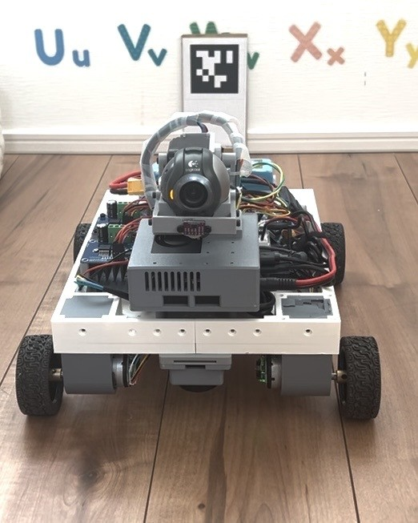
  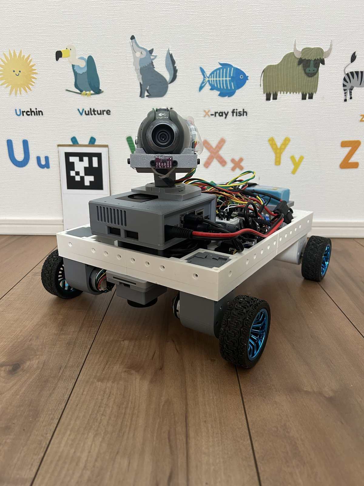
</p>

---

## Demo

<p align="center">
  <a href="https://www.youtube.com/shorts/wOj_O3pmqlM">
    
  </a>
  <a href="https://www.youtube.com/shorts/eDrZ-v9ciB8">
    
  </a>
</p>

<p align="center">
  <sub><b>左:</b> 人追従（YOLO + 深度推定 + Nav2）　｜　<b>右:</b> 地図なし人追従（<code>local</code> モード / odom フレーム、事前地図なしで動作）</sub>
</p>

<p align="center">▶ その他の動画は <a href="https://www.youtube.com/@toyof-robo">YouTubeチャンネル</a> で公開中</p>

### デモシナリオ

| シーン | 操作 | ロボットの動作 | 使用技術 |
|---|---|---|---|
| 起 | 「ヘイロボ」 | 「はい。何の処理をしましょうか？」 | STT + LLM |
| 承 | 「人についてきて」 | 追従開始 → 障害物を自律回避 → 追従継続 | YOLO + Depth + Nav2 |
| 転 | 「くまのぬいぐるみを探して」 | 自律探索 →「見つかりました」 | YOLO-World |
| 結 | 「何が見える？」 | 「男性が携帯を手に...」 | Cloud VLM (Gemini) |

> 全処理は Jetson Orin Nano (8GB) 上でリアルタイム実行（VLMのみクラウド）

---

## What This Robot Can Do

| できること | どうやって | 主要技術 |
|---|---|---|
| 音声で指示を受ける | 「ヘイロボ」→ STT → LLM判定 → モード切替 | faster-whisper + Qwen2.5 1.5B |
| 指定物体を追いかける | YOLO検出 → 深度推定 → Nav2ゴール生成（人がデフォルト、音声でペットボトルなど任意のCOCO物体に変更可） | YOLOv8 + Depth Anything V2 + Nav2 |
| 見失っても諦めない | 軌跡から先回り（Tier1）→ 自律探索（Tier2）→ 再捕捉 | breadcrumb 予測 + GVD / フロンティア探索 |
| 障害物を自律回避する | LiDAR → コストマップ → 経路再計画 | SLAM Toolbox + Nav2 DWB |
| 物体を探す | 自然言語指定 → ゼロショット検出 → 自律探索 | YOLO-World |
| タグでルームを記憶し自己位置を復元する | AprilTag検出 → room解決 → 対応マップでAMCL初期位置投入（RViz手動操作不要） | AprilTag + AMCL + Nav2 |
| 見えるものを説明する | カメラ画像 → Cloud VLM → 自然言語応答 | Gemini API |
| 運用状態を可視化する | OTel収集 → 時系列DB → ダッシュボード | OpenTelemetry + Prometheus + Grafana |
| 障害を検知・切り分けする | 仕事量×負荷の相関 → 異常検知 | Grafana アラート + 相関分析 |

---

## Key Numbers

| Metric | Value | Condition |
|---|---|---|
| YOLO推論レイテンシ | 70〜128 ms（平均 約10Hz） | YOLOv8s, TensorRT FP16, 640x480, Depth Anything V2 と同時稼働 |
| Depth推論レイテンシ | 90 ms〜1.3 s（平均 2〜3.6Hz） | Depth Anything V2 ViT-S, TensorRT, YOLOv8s と同時稼働（GPU競合時にばらつき大） |
| LLM初回応答（コールドスタート） | 約 51.0 秒 | Qwen2.5 1.5B, llama.cpp GPU offload, context_len=1024, バックグラウンドウォームアップ未完了時（サーバ起動〜ヘルスチェック成功までは別途62.5秒） |
| LLM応答（ウォームアップ済） | 約 1.16 秒 | 同上 |
| カスタムROS2パッケージ数 | 11 | `src/toyof_robot_*` |
| 総コード行数（自作部分） | 約 40,900 行 | `src/toyof_robot_*`（Python 約37,800 + YAML/C++/XML 等 約3,100、コメント・docstring・空行除く、264 files） |
| ROS2 非依存の純ロジックモジュール | 40 | `*_logic.py`。実機・コンテナなしで `pytest` 可能 |
| 自動テスト | 1,617 件 / 65 ファイル | 上記の純ロジック中心。lint 自動テスト（flake8 / pep257 / copyright）は除く |

> 計測環境: Jetson Orin Nano 8GB, JetPack 6, Isaac ROS Dev Container
> 未計測の指標（追従時の目標ロスト率・音声コマンド認識→動作開始レイテンシ・連続稼働時間）は実測でき次第追記する。

---

## Engineering Challenges I Solved

実機開発で直面した技術課題と、その調査・解決プロセスを記録しています。
**上ほどこのプロジェクトの中核**にあたる課題です。

### 見失った人をどう取り戻すか — 2段リカバリ設計

ReID（人物再同定）を持たない検出器では、一度見失った時点で追跡が終わる。
これを「失った瞬間に手元にある情報の多さ」に応じて段階的に手を打つ状態機械として設計した。

1. **見渡し（3秒）** — ロスト確定直後にその場で停止し、最後に見えた方位を優先して砲塔を掃引する。
   その方位が LiDAR で塞がっていれば無駄なので、スキップして次段へ。
2. **Tier1: 軌跡先回り** — 追従中に記録した人の実測位置の軌跡（breadcrumb）から進行方向を外挿し、
   「人が居た場所」ではなく「これから行く場所」へ Nav2 ゴールを置く。
3. **Tier2: 自律探索** — Tier1 が空振りしたら探索へ移行する。地図がある部屋では
   AprilTag で登録済みのアンカーを巡回し、未知環境では **GVD（一般化ボロノイ図 — 通路の中心線を
   抽出する手法）** の骨格から「まだ見ていない方向」を選ぶ。

設計で最も難しかったのは **「諦めない」と「無限ループしない」の両立** だった。
探索し尽くしても即終了せず巡回モードへ自動で切り替える一方、
「同じ場所に居座っていて新規に地図が増えない」ローカル停滞と、直近15アクションの
移動平均で見るグローバル停滞という独立した2つの判定で打ち切る。
状態機械は ROS2 非依存の純ロジック（`follow_recovery_logic.py`）に切り出してあり、
実機なしで pytest による回帰テストを回せる。

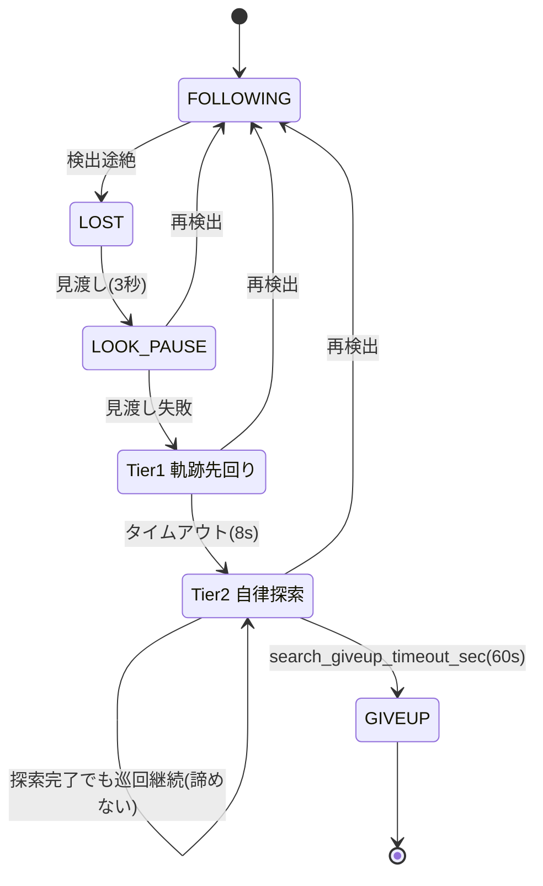

> 追従ロスト率・再捕捉成功率は現時点で未計測（本README冒頭「未計測の指標」参照）。上図はロジック構造の設計図。

→ 詳細設計・全パラメータ・実機検証ログ → [docs/mode_details.md](docs/mode_details.md)

### 発生源を問わない最終安全ゲート

`/cmd_vel`（速度指令）を publish するノードは 9 箇所ある。個々の呼び出し箇所に安全チェックを
足していく方式では「どれか1つが暴走すれば同じ事故が再発する」構造が残る
（実際に自己位置推定の発散で踏んだ）。

そこで **モーターへの唯一の出口** である `pico_bridge_node` に、発生源を問わず
前進成分だけを止めるゲートを置いた。車体幅ぶんのコリドー（走行帯）に障害物があれば
減速帯で速度を絞り、停止帯に入れば `linear.x=0` に落とす。
**後退とその場旋回は常に通す**（全成分を止めると壁の前で脱出不能になるため）。
publisher 側の変更はゼロで、1トピックを購読するだけで全経路に効く。

さらに「壁にどこまで近づいてよいか」は設定ファイル 1 箇所（`robot_safety_clearance_m`）を
マスターとし、各機能はそこからの差分計算で値を導出する。**数値をコピーして揃えるのを禁止** したのは、
以前それをやって値がずれ、11日間気付かずに壊れていたためで、この不変条件は専用テストが
機械的に固定している。

<p align="center">
  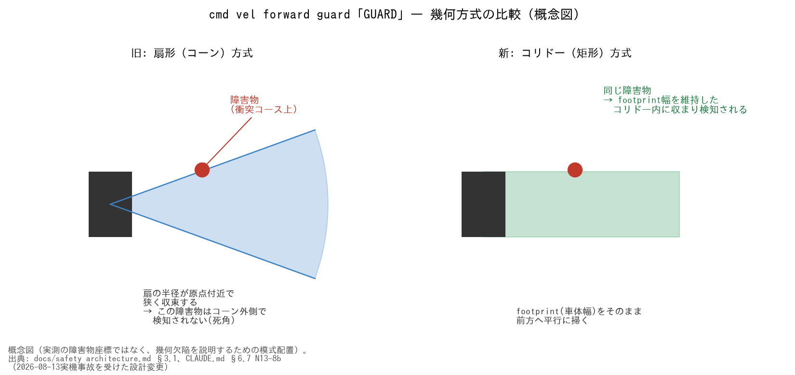
</p>

→ 幾何欠陥の詳細・シーケンス図・3層ゲートの設計 → [docs/safety_architecture.md](docs/safety_architecture.md)

### 8GBメモリ制約下でのLLM/YOLO排他制御

Jetson Orin Nanoの8GB共有メモリでLLM（~3GB）とYOLOパイプライン（~2GB）を
同時に載せられない問題に対し、ROS2 Lifecycle + OS drop_cachesによる
排他的メモリ管理を設計・実装した。

<p align="center">
  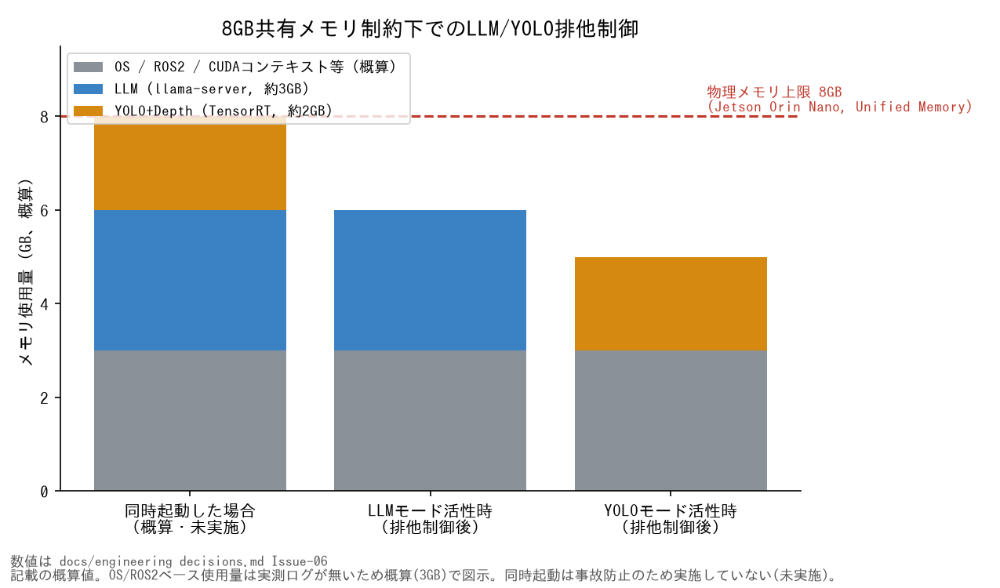
</p>

→ Lifecycle遷移シーケンス図の詳細 → [docs/engineering_decisions.md](docs/engineering_decisions.md) (Issue-06)

### シリアル通信デッドロックの特定と解消

Jetson ↔ Pico間のUART通信が不定期にハングする事象が発生。
カーネルのシリアルバッファ上限（4095 bytes）への到達が原因と特定し、
送受信プロトコルの再設計で解消した。

<p align="center">
  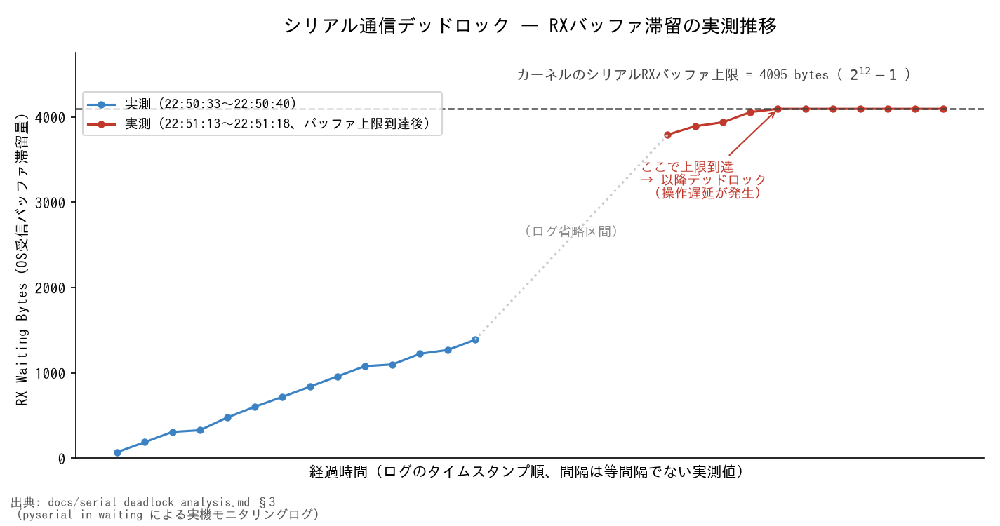
</p>

→ 実測ログ全文・通信シーケンス図 → [docs/serial_deadlock_analysis.md](docs/serial_deadlock_analysis.md)

### ToF I2Cブロッキングによるエンコーダ精度劣化の特定と解消

ToFセンサのI2C読み取りがMCUのメインループをブロックし、
エンコーダ割り込みの取りこぼしが発生。タスク分離により解消。

<p align="center">
  
</p>

→ [docs/tof_blocking_analysis.md](docs/tof_blocking_analysis.md)

### LiDAR強度(intensity)による障害物ゴーストの解消

床の段差が原因だと仮定して距離ベースの対策を試したが、現地確認で物理的な段差は
存在しないと判明。反射強度を直接調べたところ、ゴースト方向は本物の反射より
桁違いに弱い値（強度2〜3 vs 7〜60台）であることを発見し、intensityフィルタで解消。
床面の鏡面反射による多重経路(マルチパス)が原因という仮説を実測データで裏付けた。

<p align="center">
  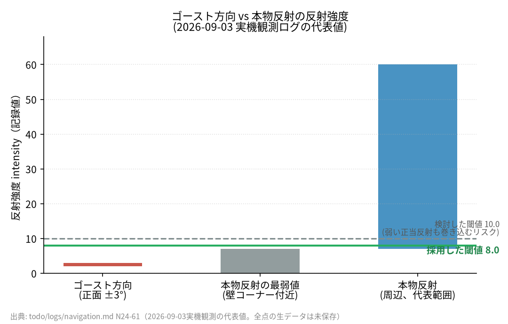
</p>

→ スキャンジオメトリ図・多重経路概念図・閾値探索の全過程 → [docs/lidar_intensity_ghost_analysis.md](docs/lidar_intensity_ghost_analysis.md)

### レーザーオドメトリを較正した結果、あえてEKFへ統合しなかった判断

車輪スリップ時に汚染される並進速度（vx）を補うため、LiDARスキャンから独立に
並進を推定する `laser_odom_node` を新設した。回転はジャイロから既知として
外部注入し、探索を並進2自由度だけに縮退させることで、一般的なICP系レーザー
オドメトリが抱える「回転と並進の同時推定による不安定化（アパーチャ問題）」を
そもそも避ける設計にした。

実機3セッション・約100万行のログをオフラインで較正した結果は単純な合否では
なかった。申告した共分散は実誤差の**約3倍の過大申告**（`std(z)=0.33`、理想1.0）
で安全側ではあったが、EKFへ統合した場合の平常時の重み占有率は中央値18〜22%に
留まり、**入れてもほとんど何も変わらない**ことが分かった。意味のある効果が出る
スリップ時（重み81〜93%）は、車輪の異常を検出して速度を0へ落とす**別のスリップ
検知の第3軸**として既に回収済みだったため、EKFへの統合はあえて見送った——1つの
センサが「異常の検出根拠」と「検出後の主測定」を兼ねると単一障害点になるという、
精度とは別軸の設計判断による。

<p align="center">
  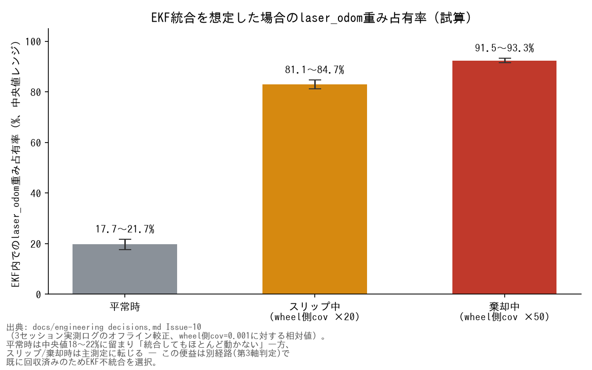
</p>

→ z分布ヒストグラム・較正の全過程 → [docs/engineering_decisions.md](docs/engineering_decisions.md) (Issue-10)

### エッジLLMのコマンド分類精度 — Crosslingual Prompting

Qwen2.5 1.5B（日本語プロンプト）では「物体検索開始」が `start_mapping` に誤分類されていた。
日本語入力のまま**英語プロンプト**に切り替えたところ（Crosslingual Prompting）、
誤分類がゼロになり、LLM 判定時間も **~15s → ~0.8s** に大幅短縮した。
小規模エッジ LLM では、英語プロンプトが日本語のセマンティック干渉を排除する。

<p align="center">
  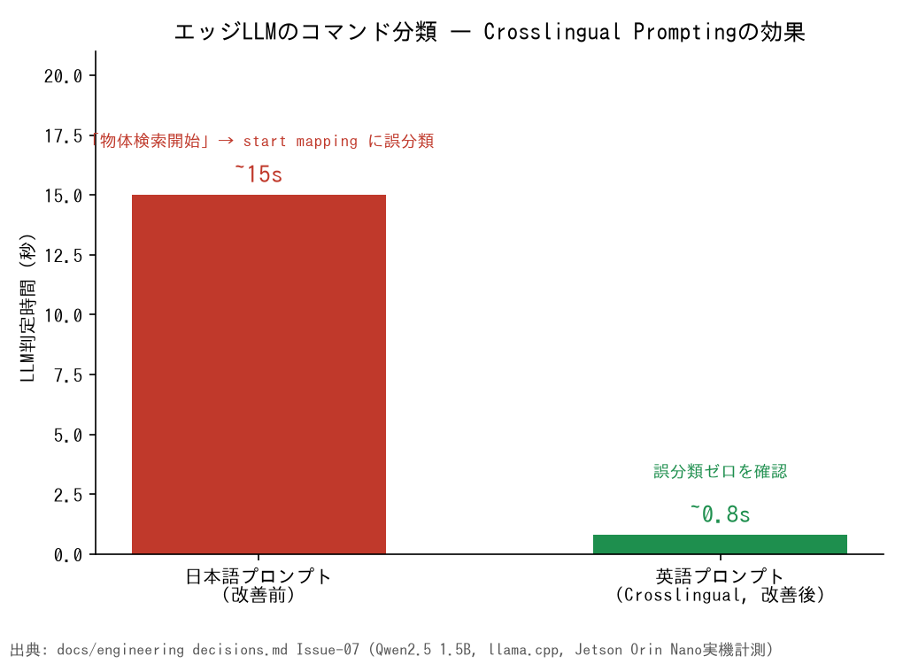
</p>

→ [docs/engineering_decisions.md](docs/engineering_decisions.md)

---

## Observability — Robot SRE

> ロボットは「動く」だけでは足りない。
> 「なぜ止まったか」「どこが劣化しているか」を説明できなければ、現場では使えない。

<!-- Grafanaダッシュボードのスクリーンショット（概要 + 詳細の2枚）。 -->
<p align="center">
  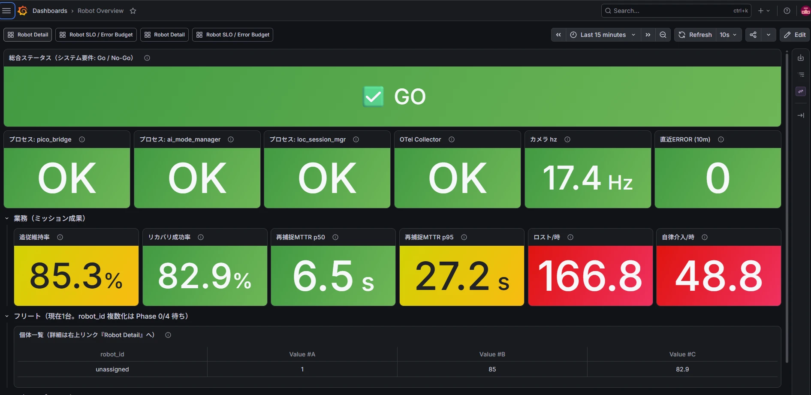
</p>
<p align="center">
  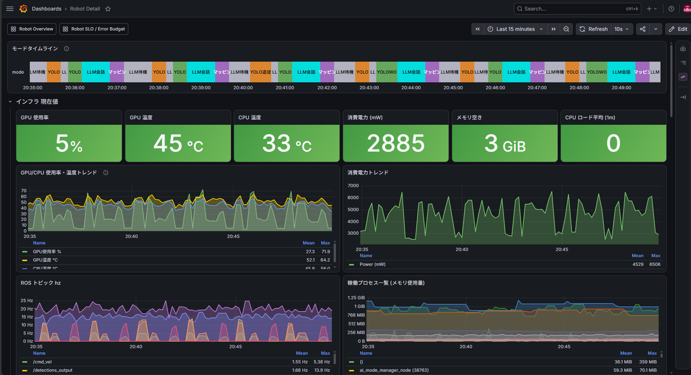
</p>

### 設計思想: 仕事量 × 負荷の相関

従来のサーバ監視と同じく、「何が来たか」と「どのくらい消費したか」を
同一タイムラインで可視化し、障害時の一次切り分けを可能にする。

| 軸 | 収集対象 | 例 |
|---|---|---|
| 仕事量 | 音声コマンド / YOLO検出 / 状態遷移 | 「14:03に人追従開始」 |
| 負荷 | CPU / GPU / メモリ / ROS topic hz | 「14:03からGPU 95%に張り付き」 |

### スタック

```
ROS2ノード (OTel SDK)
  → OpenTelemetry Collector (Jetson)
  → Prometheus (PC/クラウド)
  → Grafana
```

### フリート運用への拡張性

OTel Collectorの `service.instance_id` により、
複数台のロボットからのメトリクスを同一Prometheusに集約可能。
2台目のロボット追加時にダッシュボードの横展開で対応できる設計。

→ [docs/observability_detail.md](docs/observability_detail.md)

---

## System Architecture

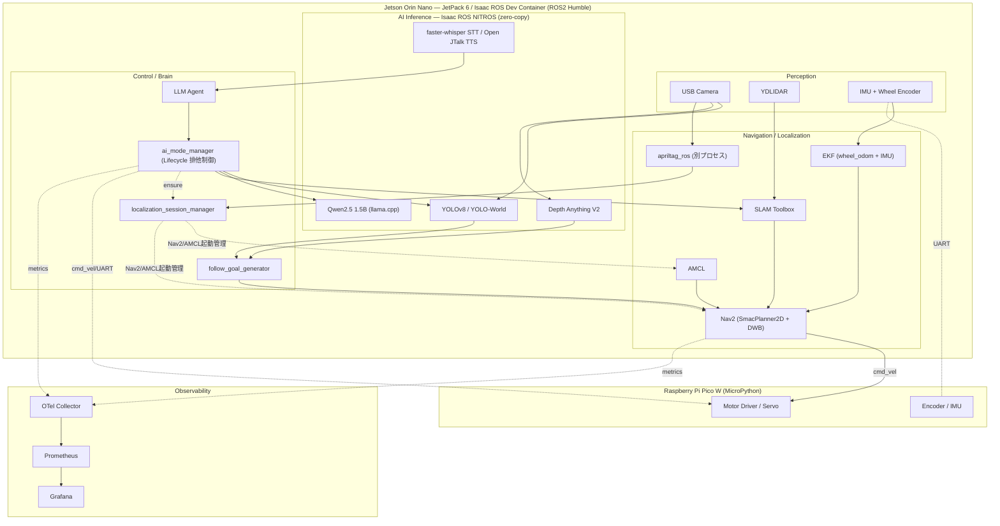

<sub>Jetson Orin Nano (AI/ROS2) と Raspberry Pi Pico W (モーター/センサー) の 2 層分離構成。UART で通信。</sub>

| Layer | Component | Role |
|---|---|---|
| Perception | USB Camera + YDLIDAR + IMU + Encoder | 環境認識 |
| AI Inference | YOLOv8 + Depth Anything V2 + Qwen2.5 | 検出・深度・言語 |
| Localization | AprilTag + AMCL + localization_session_manager | ルーム記憶・自己位置復元・Nav2/AMCL一元管理 |
| Control | Nav2 + Follow Goal Generator + LLM Agent | 経路計画・追従・判断 |
| Actuation | Pico W → Motor Driver / Servo | 物理駆動 |
| Observability | OTel + Prometheus + Grafana | 運用監視 |

→ [docs/architecture_detail.md](docs/architecture_detail.md)

---

## Tech Stack

| Category | Technology |
|---|---|
| Edge Device | NVIDIA Jetson Orin Nano (JetPack 6) |
| Framework | ROS2 Humble |
| AI (Vision) | YOLOv8 / Depth Anything V2 / YOLO-World / TensorRT |
| AI (Language) | Qwen2.5 1.5B (llama.cpp) / Gemini API |
| AI (Speech) | faster-whisper (STT) / Open JTalk (TTS) |
| Navigation | Nav2 (SLAM Toolbox + AMCL + EKF) |
| GPU Pipeline | Isaac ROS NITROS (zero-copy) |
| Observability | OpenTelemetry + Prometheus + Grafana |
| MCU | Raspberry Pi Pico W (MicroPython) |
| Container | Docker (Isaac ROS Dev Container) |
| CI/Dev | x86 Gazebo sim (`robotcar-sim`) + stub nodes for hardware-free testing |

---

## About Me

10年以上のOracle DBA / インフラ運用経験を持つエンジニアです。
障害対応、性能管理、可観測性、運用自動化を強みとしています。
20名規模のDBAチームリーダー経験あり。

ロボットをエッジコンピューティングシステムと捉え、
これまでの運用知見をロボティクスに融合することを目指しています。

---

## Documentation

| Document | Content |
|---|---|
| [docs/architecture_detail.md](docs/architecture_detail.md) | ROS2ノードグラフ、レイヤード設計詳細、センサーフュージョン |
| [docs/development_guide.md](docs/development_guide.md) | ビルド手順、テスト手順 |
| [docs/observability_detail.md](docs/observability_detail.md) | OTelスタック構成、ファイル配置 |
| [docs/serial_deadlock_analysis.md](docs/serial_deadlock_analysis.md) | UART通信障害の調査記録 |
| [docs/tof_blocking_analysis.md](docs/tof_blocking_analysis.md) | I2Cブロッキング障害の調査記録 |
| [docs/lidar_intensity_ghost_analysis.md](docs/lidar_intensity_ghost_analysis.md) | LiDAR障害物ゴースト誤検出の調査記録（intensityフィルタ導入） |
| [docs/engineering_decisions.md](docs/engineering_decisions.md) | 設計判断の記録 |
| [docs/robot_architecture.md](docs/robot_architecture.md) | ロボットアーキテクチャ詳細 |
| [docs/mode_details.md](docs/mode_details.md) | 各AIモードの内部ロジック・起動シーケンス・パラメータ |
| [docs/safety_architecture.md](docs/safety_architecture.md) | 安全設計（多層フェイルセーフ・cmd_velガード） |
| [docs/troubleshooting_flow.md](docs/troubleshooting_flow.md) | 障害切り分けフロー（Robot SRE） |
| [docs/robotics_as_mcp_design.md](docs/robotics_as_mcp_design.md) | マルチロボット連携の設計書（Robotics as MCP、未実装） |

---

## License

MIT License — 詳細は [LICENSE](LICENSE) を参照。
