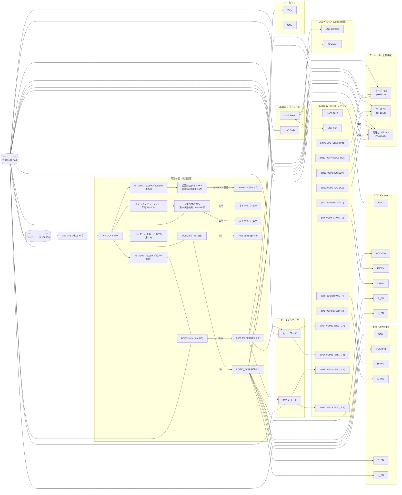

# Architecture Detail

ROS2ノードグラフ、レイヤード設計詳細、センサーフュージョン、LLMコマンド判定の詳細。

---

## レイヤードアーキテクチャ

このロボットは **レイヤードアーキテクチャ** で設計している。

```
Perception Layer (YOLO / LiDAR / IMU / Encoder / ToF)
│
▼
Control Layer (Nav2 / Follow Goal Generator / Turret Tracker)
│
▼
Actuation Layer (Pico Bridge → Motor / Servo)
```

詳細設計: [`docs/robot_architecture.md`](robot_architecture.md)

---

## ROS2 Node Graph

### 音声対話 + 排他制御（`ai_core_managers.launch.py`）

```
[マイク]
  → speech_io_node ─────────────────────────────────────→ [スピーカー]
        │ /speech/user_text            /speech/speak_command │
        ▼                                                     │
  llm_agent_node (LifecycleNode)  ←──────────────────────────┘
        │ /state_manager/command
        ▼
  ai_mode_manager_node ── ros2 lifecycle set ──→ llm_agent_node    (LLM モード)
                                             ├──→ yolo_follow_node  (YOLO モード)
                                             └──→ yoloworld_node    (YOLO-World 探索モード)
  yolo_follow_node ─── ストップワード → /state_manager/command ("activate:llm")
```

#### LLM コマンド判定 — キーワードとツール一覧

LLM ツール判定は 2 段階 JSON 方式（モデル非依存）。各ツールに `keywords` を設定することで STT 認識テキストとのマッチ精度を向上させている。`enabled: false` のツールは LLM プロンプトから除外され実行されない。

| キーワード | ツール | 状態 |
|---|---|---|
| ストップ | stop | 有効 |
| 人追従 | follow_person | 有効 |
| 物体検索 | search_object | 有効 |
| カメラ説明 | describe_camera | 有効 |
| 地図作成 | start_mapping | 有効 |
| カメラ保存 | save_objects | 有効 |
| 基本移動 | move | **無効** |
| 基本旋回 | turn | **無効** |

STT（faster-whisper）の `initial_prompt` にも各キーワードを含む発話例を設定し、音声認識段階での語彙ヒントとして機能させている。

**2026-07-13: `Maps_to_remembered` は `search_object` に統合され廃止。** 「地図記憶移動」「記憶している場所」
「覚えている場所」「〜のところに行って」等の記憶想起フレーズは全て `search_object` にルーティングされる。
`search_object` ハンドラ（`robot_agent.py`）は `target_object` について `memory_query()`（room単位の
`objects.yaml`）を先に確認し、ヒットすればカメラ探索（YOLO-World）を行わず
`ensure_localization_established(request_kind="map_required")` でNav2/AMCL確立を待ってから
記憶座標へ直接Nav2移動する。ヒットしなければ従来通り`activate:yoloworld`で新規に索敵する。
記憶か新規かの判定はLLMではなくランタイム側（`memory_query`）が行うため、プロンプトの
disambiguationルールも単一の`search_object`ルールに統合されている。
未実装のTODO: 記憶座標到着後にカメラで対象の存在を再確認し、無ければ周辺探索へフォールバックする
（現状は記憶座標を無条件に信頼）。詳細 → `todo/ai_core.md`。

### 視覚追従（`yolo_object_follow.launch.py` / `yolo_follow_node` 経由）

```
v4l2_camera
  ├─→ yolo_encoder → yolo_tensorrt → yolo_decoder → /detections_output
  └─→ depth_encoder → depth_tensorrt → ai_spatial_estimator → /ai/target_spatial

/detections_output
  → object_tracking_info_node → /object_tracking/info
        ├─→ follow_goal_generator_node ──→ NavigateToPose (Nav2) ──→ /cmd_vel
        └─→ turret_tracker_node ──→ /pico/servo_target

/cmd_vel + /pico/servo_target
  → pico_bridge_node → Pico W (UART) → Motor / Servo
```

### ベースシステム（`robot_bringup.launch.py`）

```
YDLIDAR ──→ /scan ──→ scan_filter ──┬─→ /scan_body_filtered ──→ 安全チェック(cmd_vel直接駆動)
                                     └─→ /scan_target_filtered ──→ SLAM / Nav2

IMU ──→ imu_filter ──→ imu_yaw_aligner ──→ /imu/data_aligned ──┐
Pico W ──→ pico_bridge_node ──→ /pico/rev_*                     │
                │                                                 │
                ▼                                                 │
         wheel_odom_node ──→ /wheel_odom ─────────────────────────┘
                                              │
                                              ▼
                                    EKF Node ──→ /odometry/filtered ──→ Nav2
```

---

## センサーフュージョン

**並進はホイールエンコーダ・回転はジャイロの完全分業**（Issue-21 / N21-2）。
IMU は `imu0_differential:false` の下では絶対方位を供給できない仕様のため、
姿勢を「測定」として融合するのをやめ、速度だけを入れて EKF に積分させる設計へ
切り替えた（詳細な構造欠陥の分析 → `docs/engineering_decisions.md` Issue-02
その後の変化、CLAUDE.md §6.9）。

```
Wheel Odometry (vx のみ)   ──┐
                              ├──→ EKF (robot_localization) ──→ /odometry/filtered
IMU (vyaw のみ)             ──┘
```

pose (x, y, yaw) はどちらのソースも融合しない。ホイール側の pose 出力・TF配信は
撤去済みで、値を持たないことは `UNKNOWN_COV=1e6` で明示的に宣言する
（0 を黙って出すと下流が「原点」と読んでしまう＝REP-105違反）。

### 速度依存の距離補正

4WD 構成による滑りを補正するため、速度帯に応じて2点を線形補間する
（`blend_dist_scale()`、N21-3b）。

```yaml
# wheel_odom.yaml（抜粋）
v_scale_low: 0.10        # 低速閾値 (m/s)
v_scale_high: 0.30       # 高速閾値 (m/s)
dist_scale_low: 0.988    # 低速時の距離補正係数
dist_scale_high: 1.144   # 高速時の距離補正係数
effective_tread: 0.523   # 車輪差→角速度（スリップ検知がジャイロと比較する専用、姿勢には使わない）
```

旋回方向の補正（旧 `yaw_scale_low/high`）は姿勢を積分しなくなったため撤去済み。

---

## ハードウェア構成

### システム全体

```
USB Camera (on Turret)
│
▼
Jetson Orin Nano
(Isaac ROS / YOLO / ROS2 / Nav2)
│
│ UART (USB Serial)
▼
Raspberry Pi Pico W
(Motor / Servo / ToF / Encoder)
│
├── PWM → BTS7960 Motor Driver → 4WD Motors
├── PWM → Pan-Tilt Servo (Turret)
├── I2C → VL53L0X ToF Sensor
└── GPIO → Quadrature Encoder ×4
```

### コンポーネント役割

| Component | Role |
|---|---|
| NVIDIA Jetson Orin Nano Developer Kit | AI inference / ROS2 control / Nav2 |
| Raspberry Pi Pico W | Motor / Servo / ToF / Encoder firmware |
| USB Camera | Vision sensor (on turret) |
| YDLIDAR Tmini-Plus | 2D LiDAR (SLAM / Navigation) |
| ICM-20948 IMU | 9-axis IMU (EKF fusion) |
| BTS7960 Motor Driver ×2 | High-current H-bridge |
| JGB37 Encoder Gear Motor ×4 | Robot drive (110RPM, 12V) |
| VL53L0X ToF Sensor | Distance measurement (turret mounted) |
| Pan-Tilt Servo | Camera turret |
| Yowoo 4S LiPo 14.8V 3000mAh | Power source |

### 電源構成

バッテリー（9〜16.8V）からメインヒューズ・メインスイッチを経て、系統別に保護・分配する。
Jetson系統は逆流防止ダイオード付きで直結、モータ系統は大型DCDCで12Vに安定化、ロジック・サーボ系統は5V、センサ・エンコーダ系統は3.4Vに降圧する。GNDは共通バスで結合する。



### 安全設計

| Layer | Mechanism | Timeout |
|---|---|---|
| ROS2 (pico_bridge_node) | cmd_vel watchdog | 500 ms |
| MCU (Pico firmware) | UART command watchdog | 500 ms |
