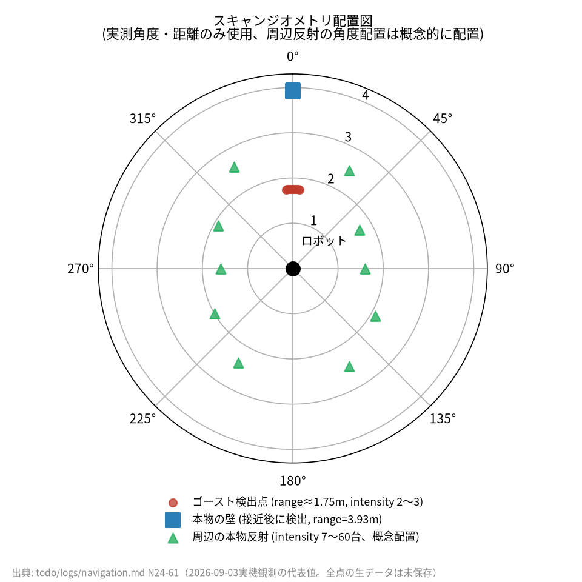
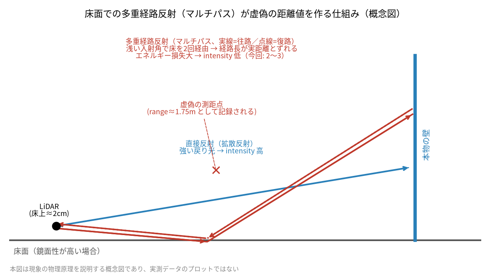

# 床の段差ゴースト誤検出 — LiDAR反射強度(intensity)フィルタによる解消

**〜「段差の高さ」から「床面の鏡面反射」への仮説転換と、intensityによる定量的な切り分け〜**

## 1. 事象 (Issue)

mapping モード（SLAM + 自律探索）でロボットを走行させると、実際には何もない床の上に
**障害物ゴースト**（実在しない壁）がコストマップ上に出現し、探索を阻害する事象が発生した。

* **発見:** 2026-09-03、Jetson 実機バッテリー駆動での mapping standalone 継続観測中。
* **観測:** 正面（0°、±5°）方向、range ≈ 1.75m の位置に壁状の障害物が繰り返し出現。
* ロボットをその方向へ近づけると、ゴーストは消え、奥にある本物の壁（3.93m）が見えるように変化した
  — つまり「固定された壁」ではなく、**特定の距離・角度でだけ現れる**測定値だった。

```
[観測データ: ゴースト出現時のスキャン]
方向: 正面 0°（±5°の範囲）
検出距離: range ≈ 1.75 m
ロボット接近後: ゴースト消失、奥の本物の壁 3.93 m のみ検出
```

この種の「実在しない障害物がコストマップに焼き込まれる」事象は、SLAM の地図品質と
Nav2/GVD 自律探索の両方を破壊的に劣化させる。地図が一度壁で塞がれると、
探索ロジックはその先を「未到達」と判断し続け、実際には通行可能な空間を切り捨ててしまう。

観測されたジオメトリ（角度・距離）を図示すると次のようになる。

<p align="center">
  
</p>

<sub>ゴースト検出点（赤、range≈1.75m）と、接近後に見えた本物の壁（青、range=3.93m）は
実測角度・距離。周辺の緑三角（本物の反射、intensity 7〜60台）は記録に残る強度値のみを
角度非依存で示す概念配置であり、実測した角度分布ではない。</sub>

## 2. 仮説設定 (Hypothesis)

### 初期仮説 A: 段差の物理的な高さ問題（既知の類似事象 Issue-5 の再発）

本プロジェクトには既知の類似事象がある（`todo/navigation.md` の
「Issue-5: 廊下の 1〜2cm 段差を LiDAR が障害物と認識し隣室へ侵入できない」節）:
LiDAR のマウント高さが床上わずか **2cm** であるため、
廊下と部屋の境目にある 1〜2cm の敷居・框を「壁」として誤検出する。

LiDAR は2D平面上をスキャンするため、そのスキャン面の高さに物理的な段差があれば、
段差の縁がそのまま「障害物」として計測される。これは光学的な誤検出ではなく、
**実際に何かがそこにあり、それを正しく測距してしまっている**という点で今回の事象とは性質が異なる。

今回もこの延長線上の事象だろうという仮定のもと、当初は次の仮説で調査を始めた。

| # | 仮説 | 対策候補 |
|---|------|----------|
| A | 段差の物理的な高さが原因（Issue-5 と同種） | 有効測距レンジの上限を狭める（遠距離ほどビームが発散し段差表面をかすりやすい） |
| B | 床面での鏡面反射（多重経路） | 反射強度（intensity）による判定 |

## 3. 検証 (Validation)

### 検証1: 有効レンジ制限（仮説 A）

**方法:** 手動 SLAM（`mode:=slam`、GVD 自動探索は無効化し teleop で操作）でロボットを実際に
ゴースト出現地点まで走らせ、`max_effective_range_m`（`scan_filter_node` の新規パラメータ、
この距離を超える点を無効化する）を 1.5 → 2.0 → 1.8m と変えながら SLAM を再起動して確認した。

**結果:**

* 1.5m: ゴーストは消えるが、探索可能な範囲自体が大きく削られ地図が「歯抜け」になる。
* 2.0m: 別の（2つめの）段差ゴーストを新たに検知してしまう。
* 1.8m: 依然として地図が歯抜けになるトレードオフが残る。

**判定:** 距離のみに基づく制限では、「ゴーストを消す」ことと「本物の遠距離障害物を保持する」
ことを両立できない。**閾値をどこに置いても副作用が出る** — 距離という次元自体が
この問題を分離するのに適していない可能性が高いと判断した。

### 検証2: 現地確認による仮説の転換

決定打になったのは、ロボットではなく**人間が実際にゴースト出現地点まで歩いて確認した**ことだった。

> 床の段差だと思っていたが、実際に行ってみると物理的な段差・敷居は何もない床だった。

この観測により、仮説 A（段差の物理的な高さ）は**棄却**された。同時に、
「距離の問題ではなく、床面での光の反射（鏡面反射・多重経路）ではないか」という
仮説 B へ転換した。Issue-5（実在する敷居の誤検出）とは見た目の症状が似ているが、
**原因は物理的な形状ではなく光学的な反射特性**という点で別種の事象である。

### 検証3: 反射強度（intensity）による定量的な切り分け

`sensor_msgs/LaserScan` は `ranges`（距離）と並んで `intensities`（各点の反射強度）を持つ。
これを直接調べることで、ゴーストと本物の反射を区別できるかを検証した。

**分析方法:** `ros2 topic echo` は配列出力を `'...'` で省略してしまうため、全点の
`range`/`intensity` を確認する用途には使えなかった。代わりに `LaserScan` を
`qos_profile_sensor_data`（センサーデータ用のベストエフォート QoS。信頼性重視の
デフォルト QoS では publisher 側と一致せず購読できない）で直接購読し、
`ranges`/`intensities` を角度ごとに CSV へ書き出す専用スクリプトをその場で用意して
ゴースト出現の瞬間のスキャンを取得した。以下は同種の検証で使う手法の再現例である
（実機で使った専用スクリプトそのものは保存されておらず、`todo/logs/navigation.md`
N24-61 に残る記録に基づく再構成）。

```python
"""LaserScan の 1 スキャンを角度・距離・強度の CSV に書き出す検証用スクリプト例。"""
import csv
import math
import rclpy
from rclpy.node import Node
from rclpy.qos import qos_profile_sensor_data
from sensor_msgs.msg import LaserScan


class ScanDumper(Node):
    def __init__(self):
        super().__init__('scan_dumper')
        self.create_subscription(
            LaserScan, '/scan', self._on_scan, qos_profile_sensor_data)
        self._done = False

    def _on_scan(self, msg: LaserScan):
        if self._done:
            return
        with open('/tmp/scan_dump.csv', 'w', newline='') as f:
            writer = csv.writer(f)
            writer.writerow(['angle_deg', 'range_m', 'intensity'])
            for i, (r, inten) in enumerate(zip(msg.ranges, msg.intensities)):
                angle_deg = math.degrees(msg.angle_min + i * msg.angle_increment)
                writer.writerow([f'{angle_deg:.2f}', r, inten])
        self._done = True
        self.get_logger().info('scan_dump.csv 書き出し完了')
```

**結果（実測ログの記録値）:**

```
[実測データ: ゴースト出現時の1スキャン]
正面（±3°）      : intensity 2〜3
周辺の本物の反射   : intensity 7〜60台以上
```

<p align="center">
  
</p>

**桁違いに弱い**という明確な signature を確認した。`ranges` と `intensities` の
配列長は一致しており、下流（slam_toolbox / obstacle_layer を含む）は
intensity を一切参照していないことも確認した — つまり強い反射も弱い反射も
同じ「有効な距離」として無差別に地図へ焼き込まれていた。

**判定:** 仮説 B **確定**。距離ではなく反射強度がゴーストと本物を分ける軸である。

> **データについての注記:** 全走査点（360°分）の生 CSV はこのリポジトリには
> 保存されていない。上記グラフおよび本文の数値は `todo/logs/navigation.md` N24-61
> に一次記録として残る**代表値**（ゴースト方向2〜3、壁コーナー最弱値7、周辺反射
> 7〜60台以上、閾値探索10.0/8.0）のみを用いており、それ以外の分布・データ点は
> 作成していない。

## 4. 学術的背景 — なぜ床は「壁」に化けるのか

### 4.1 LiDAR の測距原理と intensity の意味

本機に搭載している YDLIDAR T-mini Plus は **ToF（Time of Flight）方式** の2D LiDAR である。
レーザーパルスを発射し、対象物で反射して受光素子（フォトダイオード）に戻ってくるまでの
飛行時間から距離を算出する。このとき同時に、**受光素子がどれだけ強いエネルギーの
反射光を受け取ったか**を表す値が `intensity` として出力される。

| 項目 | 値 |
|---|---|
| 測距方式 | ToF（Time of Flight） |
| 測距範囲 | 0.05〜12 m |
| 走査周波数 | 6〜12 Hz（本機は 10 Hz 運用） |
| レンジ計測周波数 | 4000 Hz |
| 角度分解能 | 0.54° |
| intensity 出力 | あり（16bit、本プロジェクト `intensity_bit: 16`） |

`intensity` は「距離」とは独立な情報で、**その1点の測距値がどれだけ信頼できるか**を
表す副次指標として機能する。ToF方式に限らず多くのLiDARが持つこの値は、
ノイズ・多重反射・境界での回折など「測距はできたが怪しい」点を後段で弾くための
標準的な手がかりである。

### 4.2 反射強度を決める要因 — アルベド・入射角・鏡面性

反射光の強度は主に次の3要因で決まる。

1. **アルベド（反射率）**: 表面が明るく粗いほど反射光は強い（白い壁 > 黒い布）。
2. **距離**: 反射光のエネルギーは距離の2乗に反比例して減衰する（逆二乗則）。
3. **入射角と表面の鏡面性**: 布や壁紙のような粗い面は**拡散反射（diffuse reflection）**が
   支配的で、入射角によらずある程度の光がどの方向にも散らばって戻ってくる
   （ランバート反射に近い）。一方、フローリングやワックスがけされた床のような
   **鏡面性の高い面**では、光は入射角と反射角が等しくなる一方向にほぼ集中して
   反射する（鏡面反射／specular reflection）。センサーがその「一方向」の外にいれば、
   反射光はほとんど受光素子に戻らない。

### 4.3 なぜ「床」が「壁」に見えるのか — 浅い入射角と多重経路

2D LiDAR は水平面上のみをスキャンする。本機のマウント高さは床上わずか **約2cm**
（Issue-5 で診断済み）であり、レーザービームは非常に**浅い入射角**で床面をかすめる。

浅い入射角では、たとえ拡散反射する面でも直接反射で戻る光は弱く、代わりに
**多重経路（マルチパス）反射** — 床面や周囲の物体を複数回経由して迂回的に
戻ってくる反射光 — の寄与が相対的に大きくなる。この経路は本来の直線距離とは
異なる経路長を経ているため、ToF が測る「飛行時間」は実際の対象物までの距離とは
無関係な値になり、**あたかもそこに物体があるかのような虚偽の距離値**を作り出す。
今回観測された「本物の壁の手前 1.75m に、近づくと消える壁が見える」という現象は、
この多重経路反射がもたらす典型的な虚像（ゴースト）である。

<p align="center">
  
</p>

<sub>本図は現象の物理原理を説明する概念図であり、実測した光路データのプロットではない。</sub>

一方でこの経路は**直接反射に比べて必然的にエネルギー損失が大きい**
（複数回の反射・散乱を経るため）。これが、ゴースト方向の intensity が
本物の反射より桁違いに低い（2〜3 vs 7〜60台以上）という今回の実測結果の
物理的な裏付けになっている。**距離という軸では区別できない現象が、
強度という軸では明確に分離できた**のは、この経路の違いに起因する。

## 5. 対策 (Remediation)

反射強度が識別軸になることが判明したため、距離ベースの案（検証1）を不採用とし、
強度フィルタを実装した。

### 実装

`scan_filter_logic.py`（ROS2 非依存の純ロジック、`toyof_robot_vehicle`）に
2関数を実装し、`scan_filter_node.py` から box filter 直後・GUARD/SLAM 双方の
分岐点より前で適用する。

```python
def apply_intensity_filter(
    self,
    ranges: List[float],
    intensities: List[float],
    min_intensity: float,
) -> List[float]:
    """min_intensity 未満の点を INVALID_RANGE(inf) へ置換する。"""
    if min_intensity <= 0.0:
        return list(ranges)          # 0以下でロールバック（フィルタ無効）
    if len(intensities) != len(ranges):
        return list(ranges)          # 長さ不一致はフェイルオープン
    r = np.asarray(ranges, dtype=np.float64)
    inten = np.asarray(intensities, dtype=np.float64)
    result = r.copy()
    result[np.isfinite(r) & (inten < min_intensity)] = INVALID_RANGE
    return result.tolist()
```

検証1で試した距離ベースの `apply_range_limit()` も、ロールバック手段として
既定無効のままコードに残置した（`max_effective_range_m: 0.0`）。

**除外方式の設計判断**: 除外した点は `0` や `range_max` ではなく `inf` に置換する。
`sensor_msgs/LaserScan` の仕様上 `range_max` ちょうども「有効な実測」として
扱われるため、そこに書くと slam_toolbox のレイキャストや Nav2 コストマップの
clearing が「その方向は range_max まで自由空間」と誤読し、実在しない自由空間と
その縁の実在しない障害物を新たに作ってしまう（`INVALID_RANGE` の設計理由、
`scan_filter_logic.py` 冒頭コメント参照）。`inf` は範囲外の値として
全 ROS コンシューマが一様に「情報なし」として扱う。

### 実機での閾値探索

`ros2 param set` によるライブ変更 → SLAM 層を SIGINT で正常終了・再起動し
クリーンな地図で確認、を繰り返して閾値を探索した。

| 閾値 (`min_scan_intensity`) | 結果 |
|---|---|
| 10.0 | ゴーストは大きく減少したが、同一走査内で本物の壁のコーナー付近の反射が強度7まで下がる場面が実測データにあり、正当な弱い反射も巻き込むリスクがあると判断 |
| **8.0** | ゴーストと正当な最弱反射の間の保守的な境界。実機で「かなりいい」と確認 → **採用** |

## 6. 結果 (Result)

| 指標 | 対策前 | 対策後（`min_scan_intensity=8.0`） |
|---|---|---|
| 床面ゴースト（正面 1.75m の虚偽障害物） | 繰り返し出現 | 消失を確認 |
| 距離ベース制限（検証1）との比較 | 遠距離ほど発散するビームへの対処のみ、閾値をどこに置いても副作用（歯抜け／別ゴースト検出） | 距離に依らず直接判定でき、副作用なし |
| 正当な弱反射（強度7程度の壁コーナー等）の保持 | — | 保持（閾値8.0は7を超える） |
| 回帰テスト | — | `apply_range_limit()` 4件 + `apply_intensity_filter()` 4件、計8件追加 |
| `colcon test`（`toyof_robot_vehicle`） | — | 255 tests / 0 errors / 0 failures / 1 skipped |

### 恒久化

`scan_filter.yaml` に運用既定値を設定（コード側の `declare_parameter` 既定は
ロールバック優先で `0.0` のまま、yaml で上書き）。

```yaml
# N24-61: 床の段差/鏡面反射の誤検出対策
min_scan_intensity: 8.0
max_effective_range_m: 0.0   # 距離ベース案は不採用のためロールバック用に無効のまま残置
```

閾値確定前は `ros2 param set` の即時反映のため毎コールバックでパラメータを
読み直す実装にしていたが、閾値確定後は他の全パラメータと同じ `__init__` 時
キャッシュ方式へ戻した（実機チューニング中だけ許容する一時的な実装パターン）。

### 未確認の相互作用

同日別タスク（N24-59）で追加した「GUARD/ナッジが確定ブロックした瞬間の
ライブスキャン点を、free 領域も上書きして確定占有として地図へ焼き込む」機能との
相互作用は、明示的な実機確認がまだ済んでいない。ゴーストが GUARD の
矩形コリドー判定にも混入していた場合、本フィルタ導入前は確定ブロック機能を
経由して**ゴースト由来の誤った確定占有が地図へ永続化されるリスク経路**が
存在した。intensity フィルタが先段（box filter 直後）で弾くため、通常は
ゴースト自体が GUARD 側にも届かなくなり緩和される見込みだが、これは
まだ設計上の推測であり実機での確認が今後の課題である。

## 7. 根本原因のまとめ

```
LiDAR マウント高さが床上約2cm（Issue-5で既知の物理制約）
│
▼
レーザービームが浅い入射角で床面をかすめる
│
▼
鏡面性の高い床材で直接反射が弱く、多重経路（マルチパス）反射が相対的に優勢化
│
▼
実際の距離と無関係な飛行時間 → 虚偽の distance 値（例: 1.75m）を生成
│
▼
intensity は桁違いに弱い（2〜3）が、下流のどのコンシューマも intensity を見ていない
│
▼
強い反射も弱い反射も同じ「有効な距離」として地図へ焼き込まれる
│
▼
実在しない壁がコストマップ / SLAM 地図に出現し、探索を阻害
```

## 8. エンジニアとしての知見

1. **「距離」で説明がつかない現象は、まず測定原理に立ち返って別の軸を疑う。**
   検証1（距離ベースの閾値探索）が閾値をどこに置いても副作用を生んだ時点で、
   「距離という次元自体がこの現象を分離するのに適していない」と気づくべきだった。
   ToF方式のセンサーは距離以外にも intensity という直交する情報を持っており、
   一次元の閾値調整で行き詰まったら「そもそも別の観測量で切り分けられないか」を
   先に検討する価値がある。

2. **現場に行くことが最も安く最も確実な仮説検証になることがある。**
   ログ解析やパラメータの微調整を重ねるより先に、人間が実際に現地へ行って
   「そこに物理的な段差があるか」を目視確認したことが、仮説の転換点になった。
   ロボット工学に限らず、既知の類似事象（Issue-5）への安易な帰属は
   検証をショートカットしてしまうリスクがある。

3. **副次指標（intensity）は、下流が使っていなくても捨てずに残す価値がある。**
   本プロジェクトではこれまで intensity をどのコンシューマも参照していなかったが、
   センサーが最初から提供していた情報を活用するだけで、距離ベースの対処法より
   頑健な解決策が得られた。設定で有効・無効を切り替えられるセンサー出力は、
   後から使い道が見つかることがある。

4. **フィルタの閾値は「効果」と「巻き込み被害」の両方を実測してから決める。**
   閾値10.0は「効果はある」だけで採用してしまうと、正当な弱い反射（強度7程度の
   壁コーナー）を継続的に失っていた可能性がある。ゴースト側・正当反射側
   両方の実測分布を確認してから、その間に閾値を置く判断をした。

---

## 参考

| ドキュメント | 内容 |
|-------------|------|
| `todo/navigation.md` Issue-5 | 類似の障害物誤検出事象（廊下の段差の物理的な高さ問題、原因は本件と異なる） |
| [`tof_blocking_analysis.md`](tof_blocking_analysis.md) | 類似のセンサー起因障害の分析（ToF I2Cブロッキング） |
| `todo/logs/navigation.md` N24-61 | 本件の詳細な実機検証ログ（時系列の生ログ含む） |
| `src/toyof_robot_vehicle/toyof_robot_vehicle/scan_filter_logic.py` | 実装（`apply_intensity_filter()` / `apply_range_limit()`） |
