# モード詳細説明

各 AI モードの**内部ロジック・起動シーケンス図・パラメータ**のリファレンス。

> 動作確認コマンド（テスト手順）は [`development_guide.md`](development_guide.md) を参照。

---

## mapping モード — SLAM + フロンティア探索による自律地図作成

### 手動起動手順（3ステップ）

```bash
# ターミナル1: 第1層（カメラ・センサー）
source install/setup.bash
bash bringups/bringup_hardware.sh

# ターミナル2: 第3層（AI頭脳。mapping_node もここで登録される）
source install/setup.bash
ros2 launch toyof_robot_bringup ai_core_managers.launch.py

# ターミナル3: フロンティア探索開始
ros2 topic pub --once /state_manager/command std_msgs/String "{data: 'activate:mapping'}"
```

探索完了後は自動で地図を保存し、LLM モードへ復帰する。

途中停止したい場合:

```bash
ros2 topic pub --once /speech/user_text std_msgs/String "{data: '止まって'}"
```

### スタンドアロン起動（mapping のみ直接デバッグ）

`ai_mode_manager_node` / `speech_io_node` を起動せず、mapping_node だけを直接 activate して動かすモード。

```bash
# ターミナル1: 第1層
source install/setup.bash
bash bringups/bringup_hardware.sh

# ターミナル2: mapping のみ直接起動（lifecycle_manager が自動で configure→activate）
source install/setup.bash
ros2 launch toyof_robot_bringup ai_core_managers.launch.py standalone:=true mode:=mapping


```

通常起動との違い:

| 項目 | 通常（aicore 経由） | standalone |
|---|---|---|
| 起動ノード | 全 LifecycleNode + ai_mode_manager + speech_io | mapping_node のみ |
| activate のトリガー | `/state_manager/command` pub | lifecycle_manager が自動実施 |
| 探索完了後 | `deactivate:mapping` publish → LLM 復帰 | プロセス自動終了（Ctrl+C 不要） |
| TTS | あり（speech_io_node が喋る） | なし（/speech/speak_command は誰も受け取らない） |
| 途中停止 | `ros2 topic pub /speech/user_text ... 止まって` | 同じトピックで可（mapping_node 自身が購読している） |

### 起動から終了までのロジック（通常 — aicore 経由）

```
[activate:mapping を publish]
        │
        ▼
ai_mode_manager_node が受信
  └─ 現在のモード（LLM等）を deactivate → cleanup
  └─ drop_caches（メモリ解放）
  └─ mapping_node を configure → activate
        │
        ▼
【on_configure】mapping_lifecycle_node
  ├─ /map, /speech/user_text の subscribe 作成
  └─ サブプロセスで autonomy.launch.py mode:=slam_nav を起動
        │
        ├─ 6秒後:  slam_toolbox 起動（/map と map→odom TF を提供）
        └─ 14秒後: Nav2 起動（/navigate_to_pose アクションサーバー）
        │
        │  ros2 node list で /slam_toolbox と /bt_navigator が出るまでポーリング
        │  （タイムアウト 40 秒）
        ▼
【on_activate】
  └─ フロンティア探索スレッド（_exploration_loop）をバックグラウンドで開始
        │
        ▼
【初期 360° スキャン _do_initial_scan】（initial_scan_enabled=true・T-23-9）
  └─ 超信地旋回（その場旋回・angular.z のみ、linear.x=0）で 360° 見渡す
     ├─ 開始地点は安全前提のため位置ズレ最小の超信地旋回を採用
     └─ オドメトリ Yaw の変化量を積算し 2π に達したら停止 → 初期マップを構築
        │
        ▼
【探索ループ】  /map（OccupancyGrid）を受信して繰り返す
  1. detect_frontiers()   [frontier_explorer_logic.py]
     ├─ grid を解析: 0=free, -1=unknown, 100=障害物
     └─ "free かつ4近傍に unknown が1つ以上ある" セル → フロンティア候補
     │
     └─ (I6-3) 0 件のとき → detect_openings() フォールバック
          ├─ フロンティアセルを cv2.dilate で gap_bridge_cells 幅結合
          ├─ 連結成分ごとに PCA 主軸スパン長（開口幅）を算出
          └─ min_opening_length 以上の成分を Frontier として返す

  2. pick_nearest_frontier()   [frontier_explorer_logic.py]
     ├─ 距離フィルタ（frontier_min_dist〜frontier_max_dist）
     ├─ 永久除外リスト（permanent_excluded）から 0.5 m 以内をスキップ（T-29）
     ├─ 最近傍かつ同距離帯（width_tiebreak_band）内では幅広を優先（T-27）
     └─ pull-back（T-23-7）: 重心は壁際になりやすいためロボット側へ 0.35 m
        引き寄せる（距離が 0.35×1.5=0.525 m 以上のときのみ適用）

  3. 【Phase 1】開けた中継地点へのホップ（pre_dist > waypoint_step_max のとき）（T-26/T-29）
     ├─ pick_safe_waypoint() で未探索方向の開けた中間地点 (wx,wy) を算出
     ├─ _navigate_to(wx, wy) → 到達したら _pivot_survey()（超信地 360° 旋回）
     │   到達失敗 → _reaim_for_retry() でリトライ地点へ誘導
     └─ survey 後: _centroid_still_frontier(cx,cy) でフロンティア重心が残存か再判定（T-29）
          ├─ 残存しない → Phase 2 スキップ（survey で解消済みとみなして次ループへ）
          └─ 残存する → Phase 2 へ進む

  4. 【Phase 2】フロンティア重心への直接進入（T-29）
     ├─ _navigate_to(cx, cy) → 成功: phase2_fail をリセット・_pivot_survey()
     └─ 失敗: phase2_fail[key]++ → frontier_retry_limit（既定4）回で永久除外
          └─ permanent_excluded に (cx,cy) を追加・次フロンティアへ

  5. フロンティアなしが frontier_max_no_target（既定3）回連続 → 探索完了
     ストップワード（「止まって」「ストップ」等）→ 即座に停止
        │
        ▼
【終了処理 _finish_exploration】
  ├─ TTS「地図の作成が完了しました」
  ├─ /slam_toolbox/serialize_map_and_state → .posegraph + .data（再ローカライズ用）
  ├─ /slam_toolbox/save_map              → .pgm + .yaml（Nav2 global costmap 用）
  │   保存先: /workspaces/isaac_ros-dev/map/explored_map.*
  └─ /state_manager/command に "deactivate:mapping" を publish
        │
        ▼
ai_mode_manager_node が受信
  └─ mapping_node を deactivate → cleanup
  └─ SLAM サブプロセスを SIGINT → SIGKILL で終了
  └─ 自動で "activate:llm" を publish → LLM モードへ復帰
```

### 起動から終了までのロジック（スタンドアロン）

```
[standalone:=true mode:=mapping で launch]
        │
        ▼
mapping_node が unconfigured で起動
nav2_lifecycle_manager（autostart=true）が自動で configure → activate を呼ぶ
        │
        ▼
【on_configure / on_activate】← 通常と同じ処理
  └─ autonomy.launch.py mode:=slam_nav 起動 → フロンティア探索スレッド開始
        │
        ▼
【探索ループ】← 通常と同じ処理
        │
        ▼
【終了処理 _finish_exploration】
  ├─ 地図保存（通常と同じ）
  └─ standalone=true のため "deactivate:mapping" は publish しない
     代わりに rclpy.shutdown() → プロセス自動終了
        │
        ▼
on_cleanup で SLAM サブプロセスを SIGINT → SIGKILL で終了
（LLM 復帰なし・プロセスが落ちて終わり）
```

### 主要パラメータ（`ai_core_params.yaml` > `mapping_node:` セクション）

| パラメータ | デフォルト | 意味 |
|---|---|---|
| `slam_max_wait_sec` | 40.0 s | SLAM + Nav2 起動待ちタイムアウト |
| `frontier_min_dist` | 0.8 m | フロンティアの最短距離（小さすぎる動きを除外） |
| `frontier_max_dist` | 4.0 m | フロンティアの最遠距離（遠すぎるゴールを除外） |
| `nav_goal_timeout_sec` | 60.0 s | 1ゴールあたりのナビゲーションタイムアウト |
| `map_save_path` | `map/explored_map` | 保存先パス（拡張子なし） |
| `stuck_recovery_threshold` | 3 | 連続ナビ失敗でスタック判定し信地旋回回復を発動 |
| `recovery_search_radius` | 1.0 m | 回復先（開けた地点）を探す最大距離 |
| `recovery_open_window` | 7 | open スコア計算ウィンドウサイズ（セル数） |
| `recovery_angular_speed` | 0.5 rad/s | 回復・初期スキャンの回転速度 |
| `recovery_tread_width` | 0.270 m | トレッド幅 T。信地旋回 v=(T/2)\|ω\| の計算用 |
| `frontier_pullback_dist` | 0.35 m | フロンティアゴールをロボット側へ引き寄せる距離 |
| `initial_scan_enabled` | `true` | SLAM 開始直後の 360° 初期スキャン有効化 |
| `standalone` | `false` | `true` 時は探索完了後にプロセス自動終了（`standalone:=true` で自動設定） |

### 主要パラメータ追記（シミュレーション対応）

| パラメータ | デフォルト | 意味 |
|---|---|---|
| `use_sim` | `false` | `true` 時は autonomy.launch.py mode:=slam_nav を `use_sim_time:=true` で起動する |

### 関連ファイル

| ファイル | 役割 |
|---|---|
| `src/toyof_robot_ai_control/toyof_robot_ai_control/mapping_lifecycle_node.py` | SLAM 起動・探索ループ管理 |
| `src/toyof_robot_ai_control/toyof_robot_ai_control/frontier_explorer_logic.py` | フロンティア検出・選択ロジック（ROS2 非依存） |
| `src/toyof_robot_bringup/launch/autonomy.launch.py` | SLAM/Nav2 起動（`mode:=slam_nav` で SLAM Toolbox + Nav2 セット、旧 slam_with_nav.launch.py を統合。[[navigation]] Issue-12） |
| `src/toyof_robot_bringup/config/mapper_params_online_async.yaml` | SLAM Toolbox パラメータ |
| `src/toyof_robot_bringup/config/nav2_params.yaml` | Nav2 パラメータ |

---

## 自動地図作成 — 内部ロジック詳解

### アーキテクチャ概要

自動地図作成は **3 層に分離** されている。

| 層 | ファイル | 責務 |
|---|---|---|
| Lifecycle 管理層 | `mapping_lifecycle_node.py` | ROS2 通信・サブプロセス管理・ループ駆動 |
| 探索戦略アダプタ | `gvd_explorer_strategy.py` / `frontier_explorer_strategy.py` | ゴール提案・退役記憶・完了判定 |
| 純粋幾何ロジック | `gvd_explorer_logic.py` / `frontier_explorer_logic.py` | OccupancyGrid 解析（ROS2 非依存） |

ノードは `GridObservation`（マップ・現在位置）を戦略に渡し、`ExploreDecision`（ゴール座標・スキャン指示）を受け取って駆動するだけ。選定・退役・完了判定はすべてアダプタ内部に閉じている。

**探索が見る地図と Nav2 が見る地図は別系統（N24-54）**: `mapping_lifecycle_node` の探索ロジック
（GVD/Frontier）は生の `/map` をそのまま解析する（未知セルへゴールを置く挙動は不変）。
一方 Nav2 の costmap（衝突判定・経路計画）は `map_harden_node` が `/map` から「車体幅より狭い
隙間に挟まれた未知セル」だけを占有化 or ソフトコスト化して発行する `/map_hardened` を参照する
（`autonomy.launch.py` の `map_harden:=false` でロールバック、詳細 → CLAUDE.md §6.4 N24-54/55）。

---

### Lifecycle 状態遷移

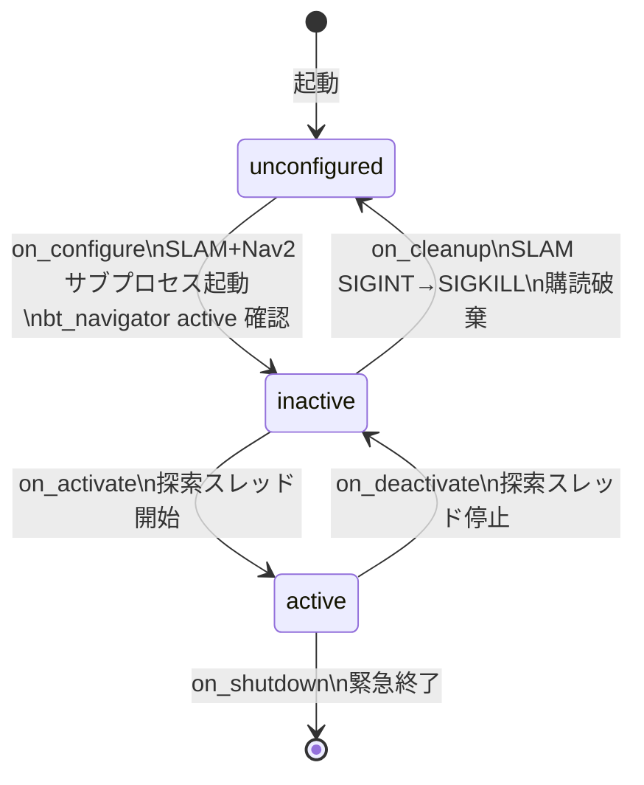

`on_configure` は SLAM Toolbox と Nav2 がフル起動するまでブロックする（最大 `slam_max_wait_sec=40s`）。
`/slam_toolbox` → `/bt_navigator` → `bt_navigator が active` の順に確認して初めて SUCCESS を返す。

---

### 探索メインループ — PROPOSE / DRIVE / RECORD サイクル

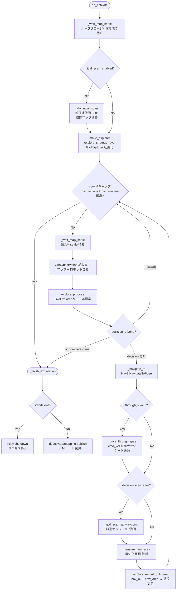

---

### GVD ベース探索ロジック（デフォルト戦略）

`explore_strategy='gvd'`（デフォルト）の場合、`GvdExplorer` が以下の手順でゴールを提案する。

#### GVD スケルトン生成

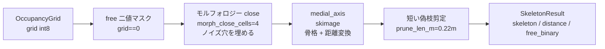

`medial_axis` は free 領域の「中心線」を計算する。各骨格セルに障害物までの距離（クリアランス）が付与される。

#### ゲート検出

骨格上の **鞍点**（クリアランスが局所的に最小になる点）がドア・通路の「入口」に相当する。

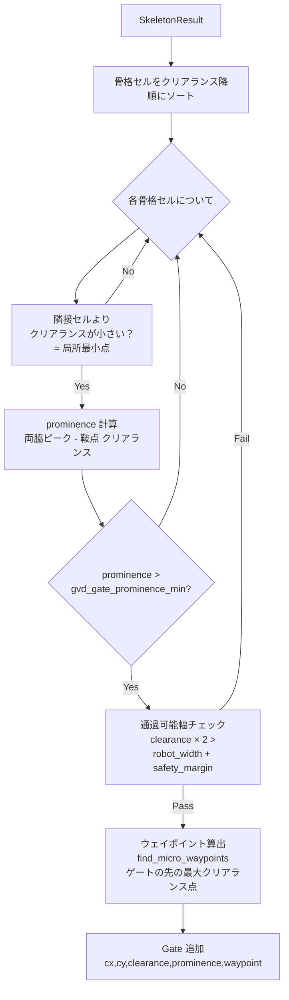

#### ゲート選択と退役

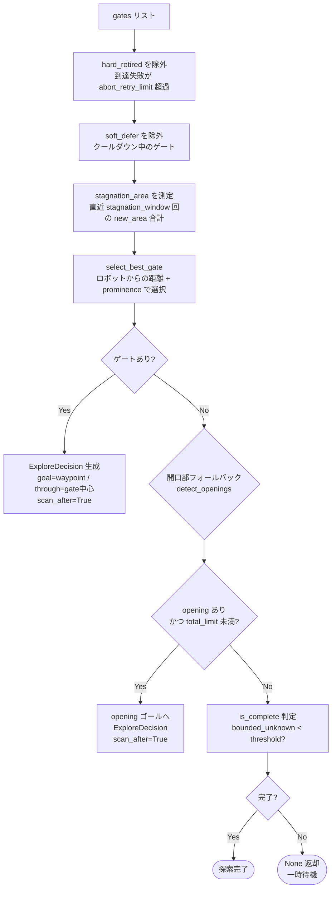

#### 退役ルール

| 状況 | 退役方式 | 解除条件 |
|---|---|---|
| `nav_ok=False` が `abort_retry_limit`(=2) 回 | `hard_retired` （永久除外） | なし |
| `new_area` が `stagnation_window`(=3) 回連続で小さい | `soft_defer` + クールダウン | クールダウン時間経過後に再試行 |

#### エリア停滞判定（`is_complete()`、P8-4/P8-7/P8-9〜P8-11）

「候補が完全にゼロ」（`_no_gates_count`/`_no_target_count` が `gvd_stagnation_window`(=3) 回連続）
に加え、新規エリアがほぼ増えないケースを検知する独立した2種類の停滞判定を持つ。

| 判定 | 条件 | 用途 |
|---|---|---|
| ローカル判定 | 直近クラスタ中心（`_area_stagnation_anchor`）から `gvd_area_stagnation_radius_m`（既定2.0m）以内に居座ったまま `gvd_area_stagnation_limit`（既定6）回連続で新規エリアが `gvd_area_stagnation_min_m2`（既定0.05m²）未満 | 同一クラッタに繰り返しはまるケースを検知。遠方の新規候補へ挑戦した場合はカウントを数え直す |
| グローバル判定 | 直近 `gvd_area_stagnation_global_limit`（既定15）件の new_area 移動平均が `gvd_area_stagnation_global_avg_m2`（既定0.05m²）未満 | 場所を転々としながらもマップ全体で僅かにしか進まないケース（ローカル判定は効かない）を捕捉 |

いずれも `record_outcome()` で **source を問わず**（`gvd_gate` だけでなく `micro`/`opening`/`frontier` も）記録する。

---

### フロンティア検出ロジック（GVD フォールバック / frontier 戦略共通）

GVD でゲートが見つからないとき（あるいは `explore_strategy='frontier'` のとき）にフロンティア検出が使われる。

#### detect_frontiers — 通常フロンティア

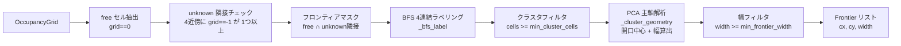

#### detect_openings — gap-bridge フォールバック（I6）

フロンティアが断片化して 0 件になるケース（疎な LiDAR リターン）向け。

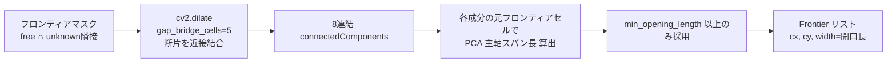

#### pick_nearest_frontier — ゴール選択

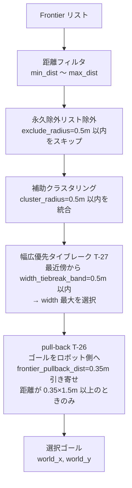

---

### 初期 360° スキャン

SLAM 開始直後はマップが空のためフロンティアが出ない。`_do_initial_scan` でその場旋回して初期マップを構築する。

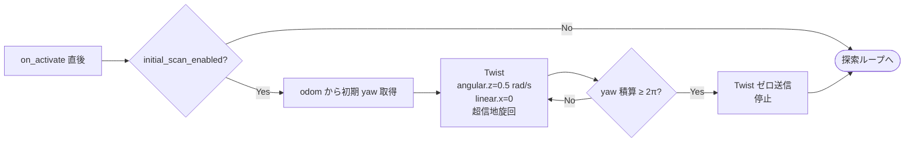

旋回方式は T-28 で**超信地旋回（linear.x=0）に統一**。片輪固定はオドメトリ並進誤差が積算されてマップが歪むため廃止。

---

### ゲート通過ロジック（_drive_through_gate）

Nav2 の `NavigateToPose` はゴール地点が壁際やゲート敷居に近いと ABORT → リカバリ BT（Spin+BackUp）が走り、オドメトリが破壊されることがある。`_drive_through_gate` はこれを回避するために **cmd_vel 直進** でゲートを通り抜ける。

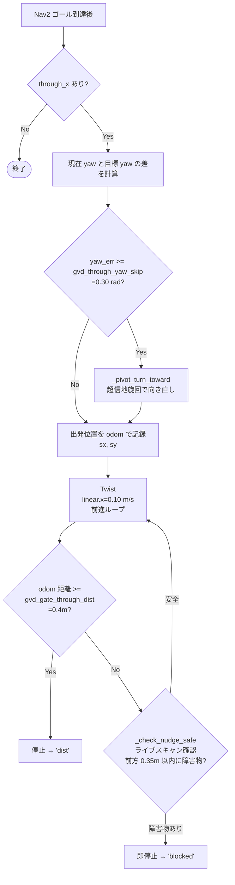

---

### スタック回復ロジック

連続ナビゲーション失敗が `stuck_recovery_threshold`(=3) 回に達するとスタックと判定し、開けた場所へ脱出する。

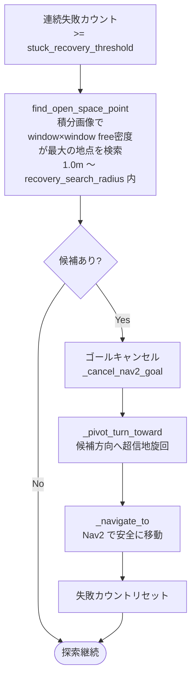

---

### 地図保存フロー

探索完了・ストップワード検出後に2種類の形式で保存する。

```mermaid
flowchart TD
    A([_finish_exploration]) --> B[TTS 発話\n地図の作成が完了しました]
    B --> C[/slam_toolbox/serialize_map_and_state\n.posegraph + .data 形式\n再ローカライズ用]
    C --> D[/slam_toolbox/save_map\n.pgm + .yaml 形式\nNav2 global costmap 用]
    D --> E[TTS 地図の保存が完了しました]
    E --> F{standalone?}
    F -- Yes --> G[rclpy.shutdown\nプロセス終了]
    F -- No --> H[deactivate:mapping publish]
    H --> I[ai_mode_manager が受信\nmapping cleanup → activate:llm]
    I --> J([LLM モードへ復帰])
```

保存先は `map_save_path`（デフォルト: `/workspaces/isaac_ros-dev/map/explored_map`）。

---

## AprilTag 自己位置推定

タグを固定ランドマーク（room の識別子）として使い、RViz の手動「2D Pose Estimate」なしに
Nav2 の初期姿勢を自動投入する。設計・スキーマ（`tag_db.yaml` / `room_db.yaml` /
`rooms/<name_id>/objects.yaml` の3テーブル正規化）・全体ユースケース・実機検証ログの詳細は
[`todo/apriltag_localization.md`](../todo/apriltag_localization.md) を参照。ここでは
起動手順と内部フローのみ扱う。

### SLAMモード（タグ登録・room単位の地図作成）

`mapping` モードは `mapping_lifecycle_node` が launch引数に関わらず常に
`apriltag_node`（`apriltag_ros`、CPU版）+ `tag_map_recorder_node` を自前で並行起動する
（T-AT-6-18、2026-07-14。旧 `use_apriltag` launch引数は撤去済み）。
タグ物理サイズは実測 75mm（`tag_size:=0.075`）。

```bash
source install/setup.bash
ros2 launch toyof_robot_bringup ai_core_managers.launch.py \
  standalone:=true mode:=mapping tag_size:=0.075
```

**確認:**
```bash
cat /workspaces/isaac_ros-dev/map/tag_db.yaml       # tag36h11_XX: {name_id, x, y, z, yaw}
ls /workspaces/isaac_ros-dev/map/rooms/             # room_0/map.yaml, objects.yaml 等
```

```
[mode:=mapping]
        │
        ▼
mapping_lifecycle_node の on_configure
  ├─ SLAM + Nav2 起動（通常の mapping と同じ）
  ├─ apriltag_node 起動（/apriltag/image_rect + /apriltag/camera_info を購読、常に起動、T-AT-6-18）
  ├─ tag_map_recorder_node 起動（/apriltag/detections 購読、auto_save=true、常に起動）
  └─ turret恒等TF起動（static_transform_publisher、後述「既知の罠」対策）
        │
        ▼
探索ループ中、タグが視野に入るたび
  tag_map_recorder_node が map→tag TF を lookup
    ├─ 既登録タグが同時視認 → 同じ name_id を継承
    └─ 未登録 → 新しい name_id を生成（room_db.yaml にも自動登録）
  → tag_db.yaml へ書き込み（decision_margin 品質フィルタ通過分のみ）
        │
        ▼
探索完了・地図保存（_finish_exploration → _save_map → _finalize_map_room、通常と同じ）
  ├─ タグが確定していれば explored_map.* を map/rooms/<name_id>/ へ自動コピー
  │  （room_map_save_logic.rewrite_image_field() で map.yaml の image: も追随修正）
  └─ タグが最後まで一度も確定しなければ、日時ベースの name_id
     （unmapped_YYYYMMDD_HHMMSS）で map/unmapped/<name_id>/ へ保存する
     （tag_db.yaml には登録しない、T-AT-6-18、詳細 → `todo/apriltag_localization.md` T-AT-6-18）
```

> **既知の罠（実機で発覚・対策済み）:** `turret_tracker_node` は yolo/yoloworld モードでのみ
> 起動され、mapping モードでは起動されない。そのため `turret_base_link→turret_link` の
> 関節TFが誰からも発行されず camera 側TFツリーが `base_link` から孤立し、
> `tf2.ConnectivityException` でタグ座標の取得に失敗する不具合があった
> （T-AT-2-3/T-AT-3-5、2026-07-10実機確認）。mapping モードの起動パスでは pan=0/tilt=0固定の
> 恒等変換 `static_transform_publisher` を `mapping_lifecycle_node` が常に併走させて対策済み
> （T-AT-6-18で launch ファイル側から本ノードの自前起動へ移管）。

### 既存 room の再マッピング（地図の作り直し）

タグを外さずに `mapping` を再実行するだけで、対応する room の地図は自動的に上書きされる。
`tag_map_recorder_node` が探索中に既存タグを検出すると同じ `name_id` と認識するため、
事前に `tag_db.yaml` や `map/rooms/<name_id>/` を手動で消す必要はない。家具の模様替え等で
地図だけ作り直したいケースの標準手順（T-AT-6-22、2026-07-21実績）。

```bash
source install/setup.bash
ros2 launch toyof_robot_bringup ai_core_managers.launch.py \
  standalone:=true mode:=mapping tag_size:=0.075
```

探索中にロボットが既存タグ（例: `tag36h11_0`）を検出すると、探索完了時に
`map/rooms/<name_id>/map.pgm`+`.yaml` が新しい地図で自動上書きされ、`tag_db.yaml` の
タグ座標も新しい測定値で更新される。

**注意点（T-AT-6-22の教訓）:**
- 開始前に前セッションのオーファンプロセス（`localization_session_manager_node` 等）が
  残っていないか確認してから着手する
- 途中で中断・やり直しする場合は Nav2/SLAM/タグ登録サブプロセスを確実に SIGTERM/SIGKILL
  で止め、`tag_db.yaml` を `git checkout` でロールバックしてから再試行する（中断のたびに
  不整合な座標が書き込まれるリスクがあるため）
- `slam_toolbox` の `serialize_map_and_state`（.posegraph保存）が30秒でタイムアウトする
  ことがあるが、pgm/yaml の占有格子地図自体は正常保存されAMCLナビゲーションには影響しない

詳細・生ログ → `todo/apriltag_localization.md` T-AT-6-22

### Nav2モード（タグ視野内でRViz手動指定なしに自己位置確立）

タグ登録済み（`tag_db.yaml` にエントリあり）の状態で以下を実行すると、
「タグ探索 → room解決 → 対応マップでNav2本起動 → 自己位置確立」まで自動で完走する。

```bash
cd /workspaces/isaac_ros-dev
source install/setup.bash
bash bringups/bringup_nav2_with_apriltag.sh
```

**確認:**
```bash
ros2 topic echo /amcl_pose --once     # タグ由来の初期姿勢に近い自己位置が出力される
```

```
[bringup_nav2_with_apriltag.sh]
        │
        ▼
Phase A: 一時的な SLAM + AprilTag 探索（Nav2 は未起動、CPU競合回避のため段階起動）
  ├─ slam_toolbox 単体起動（map→odom TF 提供）
  ├─ apriltag_node 起動
  ├─ turret_base_link→turret_link 恒等変換 static_transform_publisher 起動
  └─ tag_localization_manager_node 起動（slam_to_nav モード）
        ├─ SEARCHING: 静止のままタグ検出を試行（search_timeout_sec）
        ├─ SPIN: その場旋回探索（max_spin_deg、Nav2不要・軽量）
        └─ EXPLORE: 360°未検出なら frontier 探索へ移行（ここで初めて Nav2 を追加起動）
        │
        │  タグ発見 → T_map_base 算出（tag_db 座標 × base→tag TF）
        │           → /tmp/apriltag_pose.yaml へ保存 → プロセス終了
        ▼
room解決: 保存された name_id から map/rooms/<name_id>/map.yaml を決定
        │
        ▼
Phase B: 解決したマップで Nav2 本起動
  ├─ autonomy.launch.py mode:=nav map:=<解決パス>
  ├─ /tmp/apriltag_pose.yaml の姿勢を /initialpose へ投入
  └─ /amcl_pose のcovariance収束を待機 → 走行可能状態
```

**主要パラメータ**（`bringup_nav2_with_apriltag.sh` 冒頭の環境変数）:

| パラメータ | デフォルト | 意味 |
|---|---|---|
| `TAG_SIZE` | 0.165（要 `0.075` 実測値で上書き推奨） | AprilTag 物理サイズ（m） |
| `PHASE_A_TIMEOUT` | 120 s | タグ探索の最大待機秒数 |
| `LOCALIZATION_TIMEOUT` | 60 s | Phase B の AMCL 収束待ち上限 |
| `search_timeout_sec`（manager node） | 10.0 s | 静止検出を試みてから旋回を始めるまでの猶予 |
| `max_spin_deg`（manager node） | 360.0° | Phase 1 旋回の上限角度 |

> **既知の罠（実機で発覚・対策済み）:** SLAMモードと同じ TF ツリー断絶バグが
> `bringup_nav2_with_apriltag.sh`/`bringup_slam_with_apriltag.sh` にも存在した
> （こちらは `turret_tracker_node` に加え `mapping_lifecycle_node` 自体も起動しない
> スタンドアロンシェルスクリプトのため、同じ恒等変換TFの対策が別途必要だった）。
> 両スクリプトの Phase A（`apriltag_node` 起動直後）に対策済み。
> また `tag_localization_manager_node` はタグ発見後 `_shutdown_requested` を立てるだけでは
> `rclpy.spin()` のイベントループを確実に抜けられず、プロセスが残留してスクリプト側の
> Phase A 待機ループが誤ってタイムアウト判定する不具合があった（2026-07-10修正: `main()` を
> `while rclpy.ok() and not node._shutdown_requested: rclpy.spin_once(...)` の明示的
> ポーリングループへ変更）。
> 現状の AMCL 収束待ちは `/amcl_pose` の存在確認のみで共分散値の閾値判定をしていない
> （`todo/apriltag_localization.md` T-AT-3-7、フォローアップ予定）。ロボットが完全静止の
> ままだと共分散（例: x_var/y_var ≈ 0.25〜0.27）が閾値0.05まで縮まりきらない場合がある
> （AMCL の一般的な挙動で、始動時ウィグル動作の追加等で改善余地あり）。

### 関連ファイル

| ファイル | 役割 |
|---|---|
| `src/toyof_robot_localization/toyof_robot_localization/tag_localization_manager_node.py` | Nav2モード: タグ探索・T_map_base算出・/initialpose投入 |
| `src/toyof_robot_localization/toyof_robot_localization/tag_map_recorder_node.py` | SLAMモード: タグ検出→tag_db.yaml書き込み・name_id自動付与 |
| `src/toyof_robot_localization/toyof_robot_localization/tag_localization_logic.py` | ROS2非依存ロジック（DB読み書き・pose計算・グルーピング） |
| `bringups/bringup_nav2_with_apriltag.sh` | Nav2モード bringup（Phase A/B 2段階起動） |
| `bringups/bringup_slam_with_apriltag.sh` | SLAMモード bringup（レガシー系統、mapping standaloneでも代替可） |

---

## localization_session_manager_node — 地図確立（Nav2/AMCL）の一元管理

`yolo`（`recovery_mode:=on`）/`yoloworld` は共に「地図が確立された状態」を要求するが、
以前（T-AT-6-1）は各モードが自分の `on_configure`/`on_cleanup` で個別にタグ前スキャン→
Nav2起動／Nav2killを行っていた。そのため **AIモードを1回切り替えるたびに Nav2/カメラ/CUDA
コンテキストが毎回作り直され**、VRAM断片化の蓄積によるクラッシュ（T-26-1、実機で無関係な
場所を自律走行してしまう事故に発展）を招いていた。

`localization_session_manager_node`（`toyof_robot_ai_control`）はこれを解消する設計で、
**Nav2/AMCL の生死管理を専用の常駐 Lifecycle ノードに一元集約**し、AIモード切替を跨いで
保持する（T-AT-6-4）。`ai_mode_manager` の排他ローテーション対象外で、起動直後に自己
`trigger_configure()`/`trigger_activate()` する（他ノードからの明示起動は不要）。

### アプリ層セッション状態

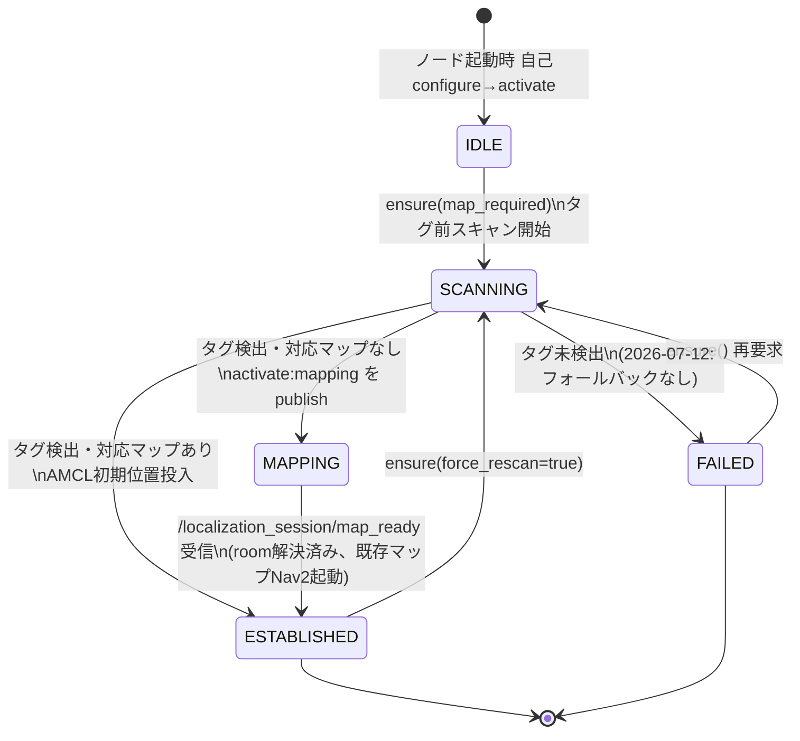

状態遷移の純ロジックは `localization_session_logic.py`（ROS2非依存、pytest対象）に
`decide_on_ensure()` / `decide_on_prescan_result()` / `decide_on_mapping_complete()` として
実装されている。副作用（タグ前スキャン・Nav2起動）は `nav_launch_selector.py` の
`run_tag_prescan()` / `select_nav_plan()` / `start_existing_map_nav()` を
`localization_session_manager_node`（ROS2側）が呼んで担当する。

### インターフェース

| 種別 | 名前 | 役割 |
|---|---|---|
| サービス（提供） | `/localization_session/ensure`（`EnsureLocalizationSession.srv`） | 地図確立要求。**fire-and-accept**（確立完了は待たない）。呼び出し元は下記 `status` を polling して `ESTABLISHED`/`FAILED` の終端を待つ（mapping は数分かかりうるため、サービスを長時間ブロックしない設計） |
| トピック（発行） | `/localization_session/status`（`LocalizationSessionStatus.msg`, transient_local） | `state`/`name_id`/`map_path`/`map_mode`/`established`/`detail` |
| トピック（購読） | `/localization_session/map_ready`（`std_msgs/String`, payload=name_id） | mapping完了ハンドオフ。`mapping_lifecycle_node._save_map()` が room 解決済みで publish（T-AT-6-13） |

### ai_mode_manager_node の地図確立ゲート（T-AT-6-9）

`_transition_to()` は configure 前に地図確立ゲートを持つ。

| 項目 | 内容 |
|---|---|
| `_MAP_REQUIRED_ALWAYS` | `{"yoloworld"}` — 常に地図必須 |
| `_MAP_REQUIRED_CONDITIONAL` | `{"yolo": "recovery_mode"}` — `yolo_follow_lifecycle_node` の `recovery_mode` パラメータが `true` の場合のみ必須（`ros2 param get` で動的取得） |
| 判定失敗時 | **現行モードには一切手を付けず遷移を中止**（TTS通知のみ）。地図確立に失敗しても既存の動作中モードを不必要に落とさないための意図的な設計判断 |
| ensure 待機タイムアウト | 10 秒（サービス未接続・レスポンス未到達も遷移中止扱い） |

`yolo_follow_lifecycle_node`/`yoloworld_lifecycle_node` 自身も `on_configure` で
`localization_session_client.ensure_localization_established()`（サブプロセス越しの
サービス呼び出し）を呼ぶ。通常モードでは `ai_mode_manager` が既にensure済みのため即座に
`ESTABLISHED` が返るだけだが、standalone モード（`ai_mode_manager` 不在）では
この呼び出し自体がensure要求元になる。**ローカル追従（`yolo` の `recovery_mode:=off`）は
変更なし**（地図不要のため従来通り自前で Nav2 ローカルモードを起動/kill する）。

> **タグ未検出時は `FAILED` にしない（T-AT-6-18、2026-07-14。2026-07-12の「要確認C」は撤回）。**
> `FAILED` にした結果、タグ運用をしていない環境で `yolo recovery_mode:=on`/`yoloworld` の
> 地図確立自体が失敗し、ロストリカバリ・探索が一切使えなくなる回帰が生じたため方針転換した。
> タグ未検出時は `STATE_MAPPING`（name_id未確定）へ入り新規SLAMを自動開始する
> （タグ登録ノードは launch引数に関わらず `mapping_lifecycle_node` が常に並行起動するため、
> 旧来あった `use_apriltag:=true` 起動限定の制約は解消済み）。セッション中にタグを検出できれば
> 通常のroom化フローに合流し、最後まで検出できなければ `map/unmapped/<日時>/` へ地図だけ
> 保存した上で `ESTABLISHED` にする。詳細 → `todo/apriltag_localization.md` T-AT-6-18。

### 関連ファイル

| ファイル | 役割 |
|---|---|
| `src/toyof_robot_ai_control/toyof_robot_ai_control/localization_session_manager_node.py` | 常駐 Lifecycle ノード本体（サービス/トピック・Nav2プロセス管理） |
| `src/toyof_robot_ai_control/toyof_robot_ai_control/localization_session_logic.py` | セッション状態機械（ROS2非依存、pytest対象） |
| `src/toyof_robot_ai_control/toyof_robot_ai_control/localization_session_client.py` | 各AIモードから呼ぶクライアントヘルパー（`ensure_localization_established()`） |
| `src/toyof_robot_ai_control/toyof_robot_ai_control/nav_launch_selector.py` | タグ前スキャン・既存マップ判定・Nav2起動の副作用実装 |
| `src/toyof_robot_ai_control/toyof_robot_ai_control/ai_mode_manager_node.py` | 地図確立ゲート（`_is_map_required()`/`_ensure_localization_session()`） |

---

## yolo モード — YOLOv8 人追従（+ ロスト時リカバリー）

### スタンドアロン起動手順

> **必須: 起動前に重複ノードがないことを確認する**（Nav2 / turret_tracker の 2 重起動でタレット暴走・車輪無応答になる）

```bash
# 起動前チェック（コンテナ内で実行）
source install/setup.bash
ros2 node list | grep -E 'bt_navigator|behavior_server|turret_tracker|follow_goal_generator'
# → 何も出なければ OK。出た場合は孤立プロセスを PGID ごと kill する（後述）
```

#### recovery_mode:=off（従来動作・ロストで停止）

```bash
# ターミナル1: 第1層のみ（Nav2 なし）
source install/setup.bash
bash bringups/bringup_hardware.sh          # センサー・カメラのみ。Nav2 を含まないこと

# ターミナル2: yolo standalone
source install/setup.bash
ros2 launch toyof_robot_bringup ai_core_managers.launch.py \
  standalone:=true mode:=yolo
# → yolo_follow_lifecycle_node が Nav2(local-only) + YOLO を自動起動・activate
```

#### recovery_mode:=on（Tier1 先回り + Tier2 SLAM 探索）

```bash
# ターミナル1: 第1層のみ（Nav2 なし・SLAM なし）
source install/setup.bash
bash bringups/bringup_hardware.sh          # センサー・カメラのみ

# ターミナル2: yolo standalone + recovery
source install/setup.bash
ros2 launch toyof_robot_bringup ai_core_managers.launch.py \
  standalone:=true mode:=yolo recovery_mode:=on 2>&1 | tee /tmp/yolo_recovery.log
# → yolo_follow_lifecycle_node が SLAM + Nav2(slam_nav) + YOLO を自動起動・activate
# → goal_frame=map。ロスト時 Tier1(先回り) → Tier2(フロンティア探索)
```

#### 起動確認ポイント

```bash
# recovery_mode と goal_frame が正しく設定されているか
ros2 topic echo /follow/recovery_state   # FOLLOWING / TIER1 / TIER2 / GIVEUP

# 追従状態
ros2 topic echo /object_tracking/info --once

# Nav2 ゴール
ros2 topic echo /object_tracking/goal_pose --once
```

### 通常起動との違い

| 項目 | 通常（aicore 経由） | standalone |
|---|---|---|
| 起動ノード | 全 LifecycleNode + ai_mode_manager + speech_io | yolo_follow_node のみ |
| activate のトリガー | `/state_manager/command activate:yolo` | lifecycle_manager が自動実施 |
| 追従終了後 | ストップワード → `activate:llm` で LLM 復帰 | プロセス自動終了 |
| TTS | あり | なし |
| recovery_mode デフォルト | `off`（ai_core_params.yaml） | 引数で明示指定（`off` デフォルト） |

### 孤立プロセスの kill 手順

```bash
# launch.py のサブプロセスは PID 単体ではなく PGID で kill する
PGID=$(ps -o pgid= -p <PID> | tr -d ' ')
kill -KILL -$PGID

# yolo 系全停止の例
for pid in $(ps aux | grep -E 'yolo_follow|yolo_object_follow|turret_tracker|follow_goal_generator' \
  | grep -v grep | awk '{print $2}'); do
  pgid=$(ps -o pgid= -p $pid 2>/dev/null | tr -d ' ')
  [ -n "$pgid" ] && kill -KILL -$pgid 2>/dev/null
done
```

**standalone セッションを完全に終了する場合**（続けて別の standalone モードを起動しない場合）は
上記に加えて `camera_perception.launch.py`/`ai_perception_container` の刈り取りが必要（T-34,
`ai_core.md`）。`yolo_follow_lifecycle_node` は Ctrl+C 終了時、次の standalone モードがカメラ
映像なしで起動しないよう意図的にこのプロセスを再起動してから終了するため（T-28設計）、後続の
モード遷移が無いと孤児として残り続ける。

```bash
bash bringups/stop_standalone.sh
```

### 起動シーケンス（on_configure 内部）

Nav2/AMCL の生死管理は `localization_session_manager_node`（前述）に一元化されている
（T-AT-6-4/6-9）。`recovery_mode:=on` は**自分では SLAM/Nav2 を起動しない**。

```
standalone:=true mode:=yolo recovery_mode:=on の場合:

lifecycle_manager_standalone
  → configure yolo_follow_node
      ├─ ai_perception_container を kill（既存あれば）
      ├─ camera_perception.launch.py を起動（v4l2_camera + NITROS）
      ├─ ensure_localization_established() で localization_session_manager_node に
      │   地図確立(ESTABLISHED)を要求し、終端(ESTABLISHED/FAILED)まで待つ
      │     ├─ 通常モード（aicore経由）: ai_mode_manager が configure 前に
      │     │   既にensure済みのため、ここでは即座に ESTABLISHED が返るだけ
      │     ├─ standalone モード（ai_mode_manager 不在）: この呼び出し自体が
      │     │   ensure 要求元（タグ前スキャン→Nav2起動が実際にここで走る）
      │     └─ FAILED → on_configure が FAILURE を返し起動中止
      └─ yolo_object_follow.launch.py を起動
            YOLO TensorRT ロード → /detections_output
            object_tracking_info_node → /object_tracking/info
            follow_goal_generator_node (recovery_mode=True, goal_frame=map,
              map_mode=<確立済みセッションのmap_mode>, trail_follow=true既定)
            turret_tracker_node
  → activate yolo_follow_node
      追従開始。/follow/recovery_state: FOLLOWING
      ロスト後 1.5s → TIER1（先回り Nav2 ゴール。trail_follow=true ならゴールを
        軌跡(breadcrumb)上の対象手前 dist_offset 点に置く。T-27）
      Tier1 タイムアウト 8s → TIER2（map_mode=slam: フロンティア/GVD探索、
        map_mode=existing: 部屋巡回 or 壁沿い巡回。後述「Tier2は諦めない」）
      Tier2 タイムアウト（search_giveup_timeout_sec 既定60s）→ GIVEUP
        → (standalone: プロセス終了 / 通常: 追従継続待機)

recovery_mode:=off の場合（変更なし）:
  地図不要のため localization_session を使わず、従来通り自前で
  Nav2 ローカルモード（odom フレーム）を起動/kill する。
```

### 追従パラメータ（follow_goal_generator_node、主要なもの）

| パラメータ | デフォルト | 意味 |
|---|---|---|
| `trail_follow` | `true` | Nav2ゴールを対象の現在位置ではなく、記録済み軌跡(breadcrumb)上で対象から `dist_offset` 手前の点に置く（T-27）。対象通過済み＝自由空間のためゴールが対象自身のLiDAR反射に乗らず `no valid path found` を回避。軌跡が短い（起動直後・対象静止）ときは直接追従へ自動フォールバック。純ロジック: `follow_recovery_logic.trail_follow_goal()`（pytest対象） |
| `map_mode` | `slam` | Tier2 探索バックエンド切替。`slam`: `GvdExplorer`/`FrontierExplorer`（未知領域への隣接が前提）。`existing`: `tag_db.yaml` に部屋アンカーが2件以上なら `RoomPatrolExplorer`（部屋を直接巡回, P7-3）、0〜1件（＝選ぶ余地がない）なら `PatrolExplorer`（既定 `wall_follow`、地図の縁を巡回, N11-7, T-27-5） |
| `goal_mode` | `continuous` | `continuous`: 毎周期ゴールを再計算・再送。`lock_once`: 初回の有効検出でゴールを1回だけ確定送信し、Nav2完了まで再計算しない（静止物体向け, T-23） |
| `search_giveup_timeout_sec` | 60.0 s | Tier2 探索の最終タイムアウト（下記「諦めない」挙動の唯一の終端） |

いずれの `map_mode` でも、Tier2 探索エンジン生成時に `FollowRecoveryLogic.search_anchor()`
（Tier1突入時の予測ゴール＝人が向かった先）を `room_bias_x/y` / `patrol_bias_x/y` として渡し、
「人が向かった予測部屋・地点を優先」して巡回する（T-27-5）。

### リカバリー状態機械（見渡し → Tier1 → Tier2 → 再捕捉）

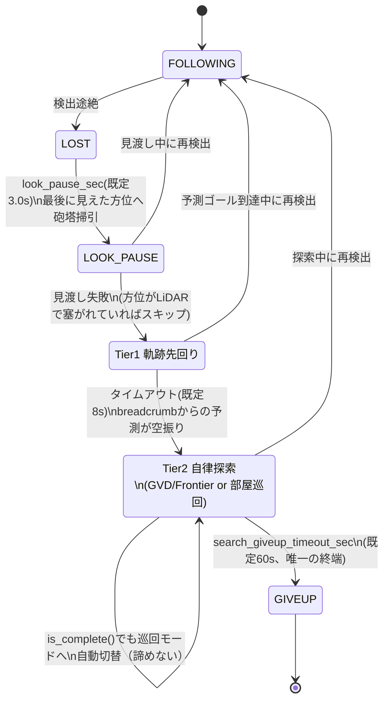

「諦めない」（Tier2が探索し尽くしても巡回へ自動切替）と「無限ループしない」
（`search_giveup_timeout_sec` という単一の終端）を両立させているのがこの状態機械の要点。
ローカル停滞（半径2.0m以内で新規面積が増えない）とグローバル停滞（直近15アクションの
移動平均）という独立した2つの停滞判定が `is_complete()` 側の巡回切替を支えるが、
最終的にループを閉じる条件は上図の `GIVEUP` 一本に集約されている。

> 追従ロスト率・再捕捉成功率などの定量指標は現時点で未計測（README「未計測の指標」参照）。
> 上図は `follow_recovery_logic.py` のロジック構造を表す設計図であり、実測データに基づく統計ではない。

### Tier2 探索は「諦めない」（P8-2）

GVD/Frontier が `is_complete()==True`（地図を探索し尽くした）を返しても、Tier2 はそこで
終了しない。人は移動しているため「探索完了」と「発見不能」は別物という設計判断
（2026-07-07）で、完了を検知すると自動的に `PatrolExplorer`（既知マップの巡回）へ切り替え、
`search_anchor()` に近い順で再訪する。最終的な諦めは `search_giveup_timeout_sec`
（時間切れ）のみに一本化されている。ロスト継続中に Tier2 へ再突入するケース
（誤検知による対象の見え隠れ含む）に備え、`_tier2_reset(preserve_explorer=True)` で
探索エンジンの退役記憶（`_tier2_explorer` 等）を保持したまま次の Tier2 突入に引き継ぐ
（P8-4〜P8-11, T-27-5）。詳細・実機検証ログ → `todo/object_tracking_recovery.md` P8-2〜P8-11。

### 関連ファイル

| ファイル | 役割 |
|---|---|
| `src/toyof_robot_ai_control/toyof_robot_ai_control/yolo_follow_lifecycle_node.py` | メイン Lifecycle ノード |
| `src/toyof_robot_ai_control/toyof_robot_ai_control/follow_goal_generator_node.py` | Nav2 ゴール生成・Tier 制御 |
| `src/toyof_robot_ai_control/toyof_robot_ai_control/follow_recovery_logic.py` | Tier 状態機械・先回り点算出（ROS2非依存） |
| `src/toyof_robot_bringup/config/follow_v0.yaml` | 追従パラメータ（Tier1/2 タイムアウト等） |
| `todo/object_tracking_recovery.md` | 実装ロードマップ・検証ログ |

### VRAM 解放戦略（T-16-6）

`on_configure` で既存 `ai_perception_container` プロセスを kill（`ps aux` で PID 特定 → SIGINT）
→ `camera_perception.launch.py` をフレッシュ起動 → YOLO ロード。
`on_cleanup` では YOLO SIGINT → `camera_perception` プロセスグループ SIGINT
（→ `ai_perception_container` 死亡・CUDA コンテキスト完全解放・VRAM ~3200 MiB 解放）
→ `camera_perception.launch.py` 再起動（LLM モード中のスナップショット用）。
ストップワード検出時は `/cmd_vel` ゼロ速度 → `activate:llm` の順で処理。

---

## llm モード — llm_agent_node

`llm_agent_node` は **LifecycleNode**。`on_configure` で llama-server 起動（最大 90s）。
ウェイクワード `ヘイロボ` 検出後 60s 間はウェイクワード不要。`prompt_lang` パラメータ
（`"en"` / `"ja"`、デフォルト `"en"`）でコマンド判定プロンプトの言語を動的切り替え可能
（`ros2 param set /llm_agent_node prompt_lang ja`）。`search_object` で `target_object` が
未指定の場合は TTS「何を探しますか？」と聞き返し、次の発話を対象として YOLO-World を
起動するインタラクティブフローを持つ。

- `camera_snapshot_service_node`（常駐）は `/snapshot/camera/take`（Trigger）サービスを提供。`describe_camera` コマンドから呼ばれ `/tmp/snapshot.jpg` を保存する
- `robot_agent.py` の `describe_camera` は `GEMINI_API_KEY` 環境変数が必要。`.env` ファイルで設定し docker run の `--env-file` で渡す

---

## yoloworld モード — YOLO-World + Depth Anything V2 物体探索

`yoloworld_lifecycle_node` は **サブプロセス管理のみ** を担う薄いシェルノード。
PyTorch / CUDA リソースはすべて `yoloworld_worker_main.py`（同パッケージ）が保有する。
`on_configure` で worker を `subprocess.Popen` + `setsid` で起動し
`/tmp/yoloworld_worker_ready` の出現を待つ（max 120s）。`on_cleanup` でプロセスグループを
`SIGTERM→SIGKILL` で終了 → CUDA コンテキストが完全解放されるため続く llama-server が
VRAM を確保できる。検出完了時は worker が `deactivate:yoloworld` を、タイムアウト /
キャンセル時は `activate:llm` を直接 publish する。

**連続追従モード**（`follow_mode` パラメータ / `ai_core_managers.launch.py` の
`yoloworld_follow_mode`、**既定 `true`**）: yoloworld を「検出バックエンド」に縮退し
共有 follow スタックを再利用する統合（Phase3 Stage3b）。`follow_mode:=true` のとき worker は
`YOLOWORLD_FOLLOW_MODE=true` で起動し、発見後も座標保存・deactivate せず
`/object_tracking/info` ＋ `/ai/target_spatial`（center_error=x, depth=z）を出し続ける
（内蔵 Phase2 探索は無効）。`yoloworld_lifecycle_node` は worker・turret・SLAM に加え
共有 `follow_goal_generator_node`（`goal_frame=map` / `recovery_mode=on` / `min_confidence=0.3`）を
サブプロセス起動し、Nav2 追従＋Tier1/2 ロストリカバリーを行う。
`yoloworld_follow_mode:=false` で旧ワンショット探索（発見→座標保存→移動）に戻せる。
サブプロセスの起動/停止は `process_utils.py`（`start_shell_process` / `stop_process_group`）で
yolo_follow と共通化されている。

- `yoloworld_worker_main.py` が `ultralytics`（YOLO-World）と `depth_anything_v2` を使用。依存パッケージは `runtime/` 配下のボリュームマウント領域に配置済み。PYTHONPATH は `Dockerfile.robotcar` で設定済み
- **YOLO-World の CLIP エンコーダは英語テキストのみ有効**。日本語クラス名では検出不可。`robot_agent.py` の `search_object` ハンドラが LLM で英語翻訳し `context["target_object_en"]` に保存する。`yoloworld_lifecycle_node` は `target_object_en` を `set_classes()` に渡す（TTS・ログは日本語 `target_object` を使用）

### 座標確定ポリシー（capture、T-25-1 / T-27-6）

search_object（yoloworld）専用の座標確定フロー。`yoloworld_lifecycle_node` は
`follow_goal_generator_node` に常時 `capture_on_detect:=true` を渡す。
`capture_verify_on_arrival` パラメータ（**既定 `true`**）が有効な間は2段階で確定する。

1. 初回安定検出では即確定せず、`dist_offset` 手前まで接近するゴールを1回だけ送信する
   （`goal_mode=lock_once` と同型の1回性ゴール送信）。
2. Nav2到達後に再度安定検出・再測定し、新旧座標差が `capture_verify_tol_m`（既定0.3m）以内
   なら確定。超えていれば `capture_verify_max_retries`（既定1回）まで補正ゴールを再送する。
   Nav2失敗時は粘らず直近の推定座標で確定する（無限リトライ回避）。

判定ロジックは `distance_estimator.capture_verify_decision()`（ROS2非依存、pytest対象）。
遠方からの1回きりの深度推定だけで座標を確定していた旧実装（対象への接近前に確定するため
captured座標が実際の位置よりかなり手前にずれる問題があった）は `capture_verify_on_arrival:=false`
で復元できる。確定後は `ai_mode_manager_node._save_object_memory()`/`_navigate_to_coords()`
の既存フローがそのまま最終座標でDB更新する。

### 色検証フィルタ（color_verification_logic.py、T-27-6）

**YOLO-World は色をほぼ無視する**（confidenceでは色の誤認識を区別できない）。実機で
テキストクエリ `"blue toy car"` に対し赤いおもちゃの車が conf 0.9超（青い車自身より高スコア）
でマッチした事例があった。`min_confidence` を上げても解決しない（暗所では本物の対象も
conf 0.5台に留まるため、閾値を上げるとむしろ本物を取りこぼす）。

対策として検出後の色検証フィルタを追加（`color_verify` パラメータ、既定 `true`、env
`YOLOWORLD_COLOR_VERIFY`）: `extract_color_keyword()` が英語ターゲット文字列から色キーワードを
抽出、`color_match_ratio()` が検出bbox内HSV画像のうち目標色相に一致する有効画素（彩度・明度が
一定以上）の割合を返す。`yoloworld_worker_main.py._yolo_step()` は confidence 降順の候補を
順に見て `color_verify_decision()`（比率が `color_verify_min_ratio` 既定0.15以上）も通る
最初の1件を採用する。

**既知の残課題**: bbox は物体の正確な輪郭マスクではなく矩形のため、対象物のすぐ隣・背景に
別の色の物体があるとそのピクセルが混入し誤ってPASSしうる（実機で「赤い箱＋隣接する青い
おもちゃの山」を誤検出。bbox中心寄りだけを見るクロップ処理などの改善は未実装、
`todo/ai_core.md` T-27-6参照）。

---

## Gazebo シミュレーション環境

実機ハードウェアなしで SLAM + Nav2 + マッピングロジックを検証するための環境。
AI / 音声 / 視覚系は起動しない。

### アーキテクチャ

```
【実機】
  hardware_bringup.launch.py      ← ydlidar / pico_bridge / imu / EKF
    + ai_core_managers.launch.py standalone:=true mode:=mapping

【シミュレーション】
  sim_hardware_bringup.launch.py  ← Gazebo gzserver + RSP + odom/scan ブリッジ
    + ai_core_managers.launch.py standalone:=true mode:=mapping use_sim_time:=true
        └ mapping_node（use_sim=true）が autonomy.launch.py mode:=slam_nav を
          use_sim_time:=true で起動
```

Gazebo プラグインが実機ノードを代替する:

| 実機ノード | Gazebo の代替 | トピック |
|---|---|---|
| `ydlidar_ros2_driver_node` | ray sensor plugin | `/scan_target_filtered`（直接 publish） |
| `pico_bridge_node` + `wheel_odom_node` | diff_drive plugin | `/cmd_vel`、`/odom`、`odom→base_link` TF |
| `ekf_filter_node` | topic_tools relay | `/odom` → `/odometry/filtered` |

### 起動手順

```bash
# ── Docker コンテナ起動 ──────────────────────────────────────────

# ヘッドレス（このPC / CI 向け）
docker compose -f docker/sim/docker-compose.yml run --rm sim

# GUI あり（自宅WSL / X11転送環境向け）
xhost +local:docker
docker compose -f docker/sim/docker-compose.yml --profile gui run --rm sim-gui

# ── コンテナ内でビルド（初回） ───────────────────────────────────
colcon build --packages-select \
  toyof_robot_interfaces toyof_robot_bringup toyof_robot_ai_control \
  --symlink-install
source install/setup.bash

# ── Terminal 1: sim ハードウェア層 ──────────────────────────────
ros2 launch toyof_robot_bringup sim_hardware_bringup.launch.py
# GUI 起動したい場合:
ros2 launch toyof_robot_bringup sim_hardware_bringup.launch.py gui:=true

# ── Terminal 2: mapping（スタンドアロン）───────────────────────
ros2 launch toyof_robot_bringup ai_core_managers.launch.py \
  standalone:=true mode:=mapping use_sim_time:=true

# ── (任意) Terminal 3: teleop で手動確認 ──────────────────────
ros2 run teleop_twist_keyboard teleop_twist_keyboard

# ── (任意) Terminal 4: RViz2 で /map / /scan_target_filtered を可視化
ros2 run rviz2 rviz2
```

### フラグの命名規則

| 層 | 引数/パラメータ名 | 理由 |
|---|---|---|
| launchファイル（ノードへ直接渡す） | `use_sim_time` | ROS2/Nav2 の標準名 |
| ロジック層（`mapping_lifecycle_node.py` 等） | `use_sim` | launchとの境界で変換 |

`ai_core_managers.launch.py` が境界: `use_sim_time` 引数 → `mapping_node` に `use_sim` パラメータとして渡す。

### 関連ファイル（新規追加分）

| ファイル | 役割 |
|---|---|
| `docker/sim/Dockerfile` | Gazebo Classic 11 + slam-toolbox + nav2 を含む x86 向けイメージ |
| `docker/sim/docker-compose.yml` | ヘッドレス / GUI 両対応の compose 定義 |
| `src/toyof_robot_bringup/urdf/robot_sim.urdf.xacro` | Gazebo プラグイン付きロボットモデル（実機 URDF は変更しない） |
| `src/toyof_robot_bringup/worlds/simple_room.world` | 部屋A + 廊下（0.8m） + 部屋B のテスト world |
| `src/toyof_robot_bringup/launch/sim_hardware_bringup.launch.py` | Gazebo 起動・ロボットスポーン・odom/scan ブリッジ |

---
