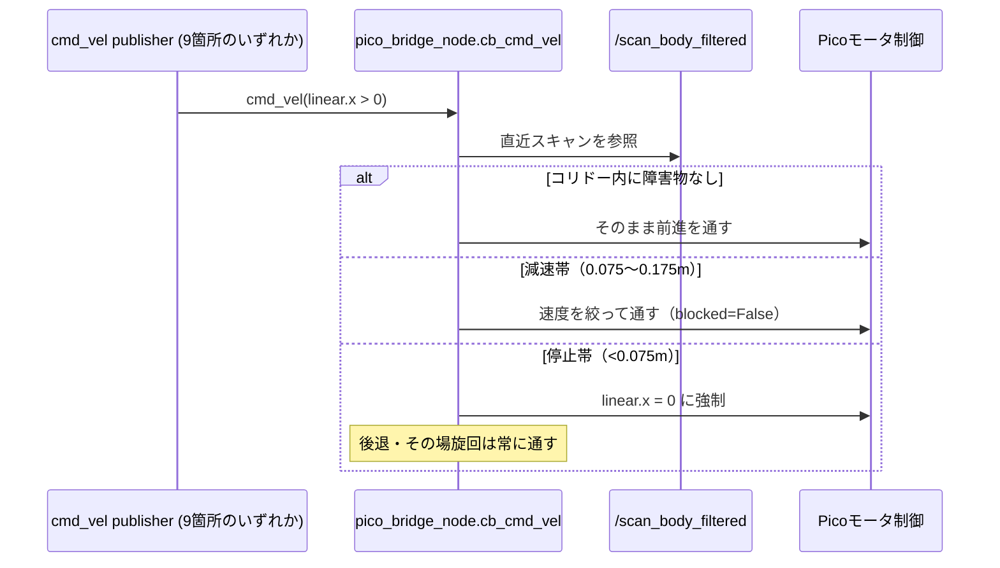

# Safety Architecture

本ドキュメントはロボットの **安全設計**を説明する。

---

# 1 Safety Philosophy

設計原則

```
Fail Safe
```

通信やソフト異常時は

```
robot stop
```

を行う。

---

# 2 Safety Layers

本ロボットは **多層安全設計**。

```
AI Layer
Control Layer
Motor Layer
```

---

# 3 Layer 1 (ROS Safety)

ノード

```
pico_bridge_node
```

機能

```
cmd_vel watchdog
cmd_vel forward guard「GUARD」（コリドー方式、N13-8b、2026-08-13）
```

設定（コリドー方式、footprint 前端基準。旧扇形方式のパラメータはロールバック用に
`cmd_vel_guard_use_corridor:=false` で残置のみ）

```
watchdog_sec = 0.5
cmd_vel_guard_use_corridor          = true
cmd_vel_guard_corridor_half_width_m  = 0.15   # footprint半幅
cmd_vel_guard_corridor_front_offset_m = 0.035
cmd_vel_guard_corridor_min_points   = 2       # 単発ノイズ点での急停止防止
cmd_vel_guard_corridor_rear_offset_m = 0.295
cmd_vel_guard_scan_timeout_sec = 1.0
```

**N23-1（2026-08-27）: stop/slow clearance は固定パラメータではなく、マスター
`robot_safety_clearance_m`（`robot_geometry.yaml`、現在 **0.24**、base_link中心基準）
から実行時に導出する。**

```
stop_clearance_m = derive_clearance(robot_safety_clearance_m,
                                     cmd_vel_guard_stop_delta_m=0.0,
                                     robot_footprint_front_m=0.165)
                  = 0.24 + 0.0 − 0.165 = 0.075 m

slow_clearance_m = derive_clearance(robot_safety_clearance_m,
                                     cmd_vel_guard_slow_delta_m=0.10,
                                     robot_footprint_front_m=0.165)
                  = 0.24 + 0.10 − 0.165 = 0.175 m
```

**数値をコピーして揃えるのは禁止**（以前それをやって値がずれ、11日間気付かずに
壊れていた実例がある）。壁との距離をどこかで変えたくなったらマスター1本だけを
変更する。不変条件は `test_clearance_ladder.py` が機械的に固定している。

処理

```
timeout → L:0,R:0 (UART送信)
```

## 3.1 cmd_vel forward guard「GUARD」（発生源非依存の最終安全層・コリドー方式）

`/cmd_vel` へ直接 publish するノードは9箇所（follow_goal_generator / yolo_follow /
yoloworld / robot_agent / person_follower / mapping_lifecycle / apriltag_servo /
tag_localization_manager ＋ Nav2 velocity_smoother ＋ teleop）あり、個々の呼び出し
箇所へ安全チェックを足すだけでは「どこか1つが暴走すれば同じ事故が再発する」構造が
残る（実例: T-AT-6-21 AMCL共分散発散インシデント）。

モーターへの唯一の出口である `pico_bridge_node`（sim では `pico_stub_node`）の
`cb_cmd_vel` で、発生源を問わず前進成分（`linear.x > 0`）のみをゲートする。
`/scan_body_filtered`（自車体のみ除去・追従対象は残すスキャン、詳細 →
`docs/robot_architecture.md` §3）を見て、**footprint をそのまま前方へ掃いた矩形
（コリドー、半幅0.15m）**内に障害物があれば `linear.x=0` に落とす。**後退・その場旋回は
常に通す**（全成分を止めると壁の前で脱出不能になるため）。

**旧・扇形（コーン）方式からの移行経緯（N13-8b）**: 扇形は原点で1点に収束するため、
衝突コースの障害物が停止判定を受ける前にコーンから外れて消える幾何欠陥があった
（2026-08-13実機で柱に左前方が接触したまま約91秒前進し続けた事故）。footprintを
そのまま前方へ掃いた矩形に置き換えることで、ぶつかるものが最後まで視野に残るように
した。正面の障害物についての停止距離は旧方式と厳密に等価（回帰テストで固定）。
`evaluate()`（コーン方式）は無変更で残置（ロールバック用）。ロジックは
`cmd_vel_guard_logic.py`（ROS2非依存、pytest）。配線は publisher 側の変更ゼロで、
`pico_bridge_node` が1トピック購読するだけ。詳細 → `todo/navigation.md` N13-8b。

<p align="center">
  
</p>

`/cmd_vel` を publish する9箇所すべてが同じゲートを一度だけ通る構造は、次のシーケンス図の通り。



## 3.2 GUARD の持続ブロック検知（N13-4）

GUARD が一瞬止めるだけでは「壁に張り付いたまま前進を送り続ける」状態を止められない。
`guard_block_min_sec`（既定1.0秒、時間基準デバウンス）以上ブロックが持続したら
アクティブな Nav2 ゴールをキャンセルし、連続 `guard_block_giveup_count`（既定5）に
達したらロボット全体を安全停止する。同一ウェイポイントへの連続ブロックは
`PatrolGuardSkipTracker`（`guard_block_patrol_skip_count` 既定2）でスキップする
（GVD/Frontier探索は対象外）。実機E2E確認済み。詳細 → CLAUDE.md §6.7 N13-4。

## 3.3 3層の安全ゲート（T-AT-6-21）

`follow_goal_generator_node` に集約された、GUARDより上位の3種類の安全ゲート
（純ロジック `localization_safety_logic.py`、ROS2非依存・pytest対象）。
2026-07-21実機での事故連鎖（狭所ゲート押し込み→壁押し付け→ホイールスリップ→
wheel_odom誤差蓄積→AMCLパーティクルフィルタ発散→Nav2連続REJECT→waypoint高速空回り）
を受けて設計。

| ゲート | 検知条件 | 対応 |
|---|---|---|
| (A) AMCL共分散発散 | `/amcl_pose` の x/y/yaw分散が上限を `amcl_diverge_consecutive`（既定3）回連続で超過 | cmd_velゼロ → Tier2/GATE_THROUGH即時停止 → TTS通知 → `activate:llm` |
| (B) cmd_vel直接駆動時のNav2競合抑止 | GATE_THROUGH/Tier2ノッジの入口 | `cancel_active_goal()` を明示実行してからcmd_velを叩く。前方LiDARチェック（`_check_through_safe()`）＋走行距離停滞検知（`drive_progress_stalled()`）でスリップを即中止 |
| (C) Nav2連続REJECTスパム停止 | REJECTが `nav_reject_giveup_count`（既定5）連続 | `nav_reject_backoff_sec`（既定2.0秒）でTier2再提案を抑止し、上限到達でNav2不健全と判定し安全停止 |

**ゲートA発火後の自力復帰（T-AT-6-23）**: 「止めっぱなし」にせず、様子見3秒 →
`/amcl/request_nomotion_update` 5回 → 低速その場旋回、の順で自力復帰を試みる
（`amcl_recovery_enabled` でロールバック可）。全域再ローカライズは意図的に未実装。

**ESCAPE が旋回ゲートに阻まれた場合のフォールバック（N13-9d-2）**: 前進ノッジ→後退→
安全停止の順に切り替える（`escape_rotation_block_sec` 既定1.0秒）。

詳細 → CLAUDE.md §6.7、`todo/apriltag_localization.md` T-AT-6-21 / T-AT-6-23。

## 3.4 知覚メッセージ完全途絶の即時安全停止（P8-13）

`follow_goal_generator_node` の `on_timer()` 冒頭で最優先に評価するゲート。
`is_lost()`（最終可視時刻ベースの判定）では検知できない「知覚コンテナ自体が
クラッシュして発行が丸ごと止まる」ケースを、`perception_timeout_sec`（既定
**2.0秒**）を超えてメッセージが届かなくなった時点で捕まえて安全停止する。
上記3層ゲート（A〜C）より前段のチェックとして働く。

---

# 4 Layer 2 (MCU Safety)

Pico側

```
WD_MS = 500
```

条件

```
command timeout
```

処理

```
stop_all()
```

---

# 5 Hardware Stop

PWM停止

```
duty = 0
```

結果

```
motor stop
```

---

# 6 Failure Scenarios

| Failure           | 対応            |
| ----------------- | ------------- |
| ROS crash         | watchdog stop |
| serial disconnect | pico watchdog |
| invalid command   | ignore        |

---

# 7 Redundant Stop Mechanism

停止は **2系統**

```
ROS watchdog
+
MCU watchdog
```

---
