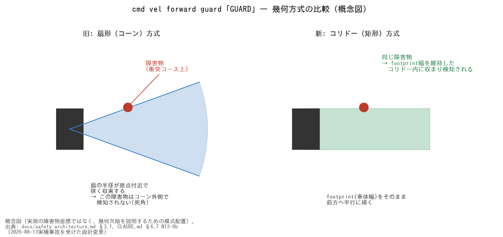
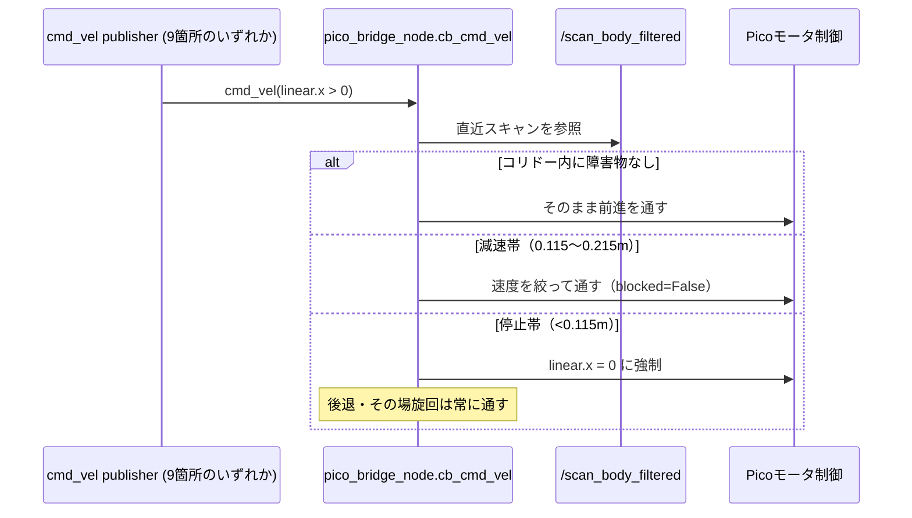

# Safety Architecture

本ドキュメントはロボットの **安全設計**を説明する。

---

# 1 Safety Philosophy

設計原則

```
Fail Safe
```

通信やソフト異常時は

```
robot stop
```

を行う。

---

# 2 Safety Layers

本ロボットは **多層安全設計**。

```
AI Layer
Control Layer
Motor Layer
```

---

# 3 Layer 1 (ROS Safety)

ノード

```
pico_bridge_node
```

機能

```
cmd_vel watchdog
cmd_vel forward guard「GUARD」（コリドー方式、N13-8b、2026-08-13）
```

設定（コリドー方式、footprint 前端基準。旧扇形方式のパラメータはロールバック用に
`cmd_vel_guard_use_corridor:=false` で残置のみ）

```
watchdog_sec = 0.5
cmd_vel_guard_use_corridor          = true
cmd_vel_guard_corridor_half_width_m  = 0.18   # footprint半幅0.15m + 側方マージン0.03m（2026-09-11時点）
cmd_vel_guard_corridor_front_offset_m = 0.035
cmd_vel_guard_corridor_min_points   = 2       # 単発ノイズ点での急停止防止
cmd_vel_guard_corridor_rear_offset_m = 0.295
cmd_vel_guard_scan_timeout_sec = 1.0
```

**N23-1（2026-08-27）: stop/slow clearance は固定パラメータではなく、マスター
`robot_safety_clearance_m`（`robot_geometry.yaml`、base_link中心基準）
から実行時に導出する。** マスターは以降のユーザー指示で段階的に余裕を積んでおり、
2026-09-11時点（mapping再実施前の安全マージン確保）で **0.28**（N23-1: 0.24 →
N23-1b 2026-09-09: 0.26 → 2026-09-11: 0.28）。側方マージンも同様に
`cmd_vel_guard_corridor_half_width_m` 0.15→0.17→**0.18**、
`nudge_safe_side_margin_m` 0.0→0.02→**0.03** と積まれている。

```
stop_clearance_m = derive_clearance(robot_safety_clearance_m,
                                     cmd_vel_guard_stop_delta_m=0.0,
                                     robot_footprint_front_m=0.165)
                  = 0.28 + 0.0 − 0.165 = 0.115 m

slow_clearance_m = derive_clearance(robot_safety_clearance_m,
                                     cmd_vel_guard_slow_delta_m=0.10,
                                     robot_footprint_front_m=0.165)
                  = 0.28 + 0.10 − 0.165 = 0.215 m
```

**数値をコピーして揃えるのは禁止**（以前それをやって値がずれ、11日間気付かずに
壊れていた実例がある）。壁との距離をどこかで変えたくなったらマスター1本だけを
変更する。不変条件は `test_clearance_ladder.py` が機械的に固定している。

処理

```
timeout → L:0,R:0 (UART送信)
```

## 3.1 cmd_vel forward guard「GUARD」（発生源非依存の最終安全層・コリドー方式）

`/cmd_vel` へ直接 publish するノードは9箇所（follow_goal_generator / yolo_follow /
yoloworld / robot_agent / person_follower / mapping_lifecycle / apriltag_servo /
tag_localization_manager ＋ Nav2 velocity_smoother ＋ teleop）あり、個々の呼び出し
箇所へ安全チェックを足すだけでは「どこか1つが暴走すれば同じ事故が再発する」構造が
残る（実例: T-AT-6-21 AMCL共分散発散インシデント）。

**⚠ `foxglove_bridge`（N-VIZ-1）経由の外部クライアントも同じ入口を通る。** `hardware_bringup.launch.py`
が既定 `true` で常時起動する WebSocket ブリッジ（Lichtblick 単一画面UI用）は、既定
`foxglove_allow_control:=true` で同じ WiFi にいる誰でも `/cmd_vel` を publish できる**無認証**の
経路になる（2026-09-19、CPU/メモリ実測前にユーザー判断で許容）。**この経路にも GUARD は等しく効く**
——ただしそれは安全装置であって認証ではない。信用できないネットワークでは `foxglove_allow_control:=false`
（観測専用）または `foxglove_bridge:=false` でロールバックする。物理的な非常停止の代わりにはならない点は
teleop 等の既存経路と同じ。詳細 → `docs/design_notes.md` §6.13。

モーターへの唯一の出口である `pico_bridge_node`（sim では `pico_stub_node`）の
`cb_cmd_vel` で、発生源を問わず前進成分（`linear.x > 0`）のみをゲートする。
`/scan_body_filtered`（自車体のみ除去・追従対象は残すスキャン、詳細 →
`docs/robot_architecture.md` §3）を見て、**footprint をそのまま前方へ掃いた矩形
（コリドー、半幅0.18m＝2026-09-11時点）**内に障害物があれば `linear.x=0` に落とす。
**後退・その場旋回は常に通す**（全成分を止めると壁の前で脱出不能になるため）。

**旧・扇形（コーン）方式からの移行経緯（N13-8b）**: 扇形は原点で1点に収束するため、
衝突コースの障害物が停止判定を受ける前にコーンから外れて消える幾何欠陥があった
（2026-08-13実機で柱に左前方が接触したまま約91秒前進し続けた事故）。footprintを
そのまま前方へ掃いた矩形に置き換えることで、ぶつかるものが最後まで視野に残るように
した。正面の障害物についての停止距離は旧方式と厳密に等価（回帰テストで固定）。
`evaluate()`（コーン方式）は無変更で残置（ロールバック用）。ロジックは
`cmd_vel_guard_logic.py`（ROS2非依存、pytest）。配線は publisher 側の変更ゼロで、
`pico_bridge_node` が1トピック購読するだけ。詳細 → `todo/navigation.md` N13-8b。

<p align="center">
  
</p>

`/cmd_vel` を publish する9箇所すべてが同じゲートを一度だけ通る構造は、次のシーケンス図の通り。


```mermaid
sequenceDiagram
    participant Pub as cmd_vel publisher (9箇所のいずれか)
    participant Bridge as pico_bridge_node.cb_cmd_vel
    participant Scan as /scan_body_filtered
    participant Motor as Picoモータ制御

    Pub->>Bridge: cmd_vel(linear.x > 0)
    Bridge->>Scan: 直近スキャンを参照
    alt コリドー内に障害物なし
        Bridge->>Motor: そのまま前進を通す
    else 減速帯（0.115〜0.215m）
        Bridge->>Motor: 速度を絞って通す（blocked=False）
    else 停止帯（<0.115m）
        Bridge->>Motor: linear.x = 0 に強制
        Note over Bridge: 後退・その場旋回は常に通す
    end
```

## 3.2 GUARD の持続ブロック検知（N13-4）

GUARD が一瞬止めるだけでは「壁に張り付いたまま前進を送り続ける」状態を止められない。
`guard_block_min_sec`（既定1.0秒、時間基準デバウンス）以上ブロックが持続したら
アクティブな Nav2 ゴールをキャンセルし、連続 `guard_block_giveup_count`（既定5）に
達したらロボット全体を安全停止する。同一ウェイポイントへの連続ブロックは
`PatrolGuardSkipTracker`（`guard_block_patrol_skip_count` 既定2）でスキップする
（GVD/Frontier探索は対象外）。実機E2E確認済み。詳細 → CLAUDE.md §6.7 N13-4。

**GUARD起因の安全停止からの自力復帰（N24-87、実装済み・実機検証は未実施＝N24-87b）**: 上記の
安全停止は、ゲートA（AMCL共分散発散）には T-AT-6-23 の自力復帰があるのに GUARD 側にだけ無い、
という非対称を抱えていた（発火後プロセス再起動まで永久に動かない）。`GuardRecoveryPlanner`
（`localization_safety_logic.py`）が ①前方が `guard_recovery_clear_hold_sec`（3.0秒）**連続**で
開いている ②自己位置が健全、の AND で再武装する。**知覚の生死は復帰条件に含めない**（途絶して
いるなら追従自体が成立せず停止が正しい＝§3.4 P8-13 の担当）。予算は「一か所あたり」
（`guard_recovery_same_place_radius_m` 1.0m 以内を同じ場所とみなし `guard_recovery_max_attempts_per_place`
3回まで）。**⚠ 復帰条件①の判定に `/cmd_vel_guard/blocked` は使わない**——GUARD は cmd_vel 受信時に
しか評価しないため、停止中は前方が実際には開いていても値が更新されず古いままになりうる。ライブ
LiDAR スキャンを直接見て判定する。復帰余地があるうちは追従モードを畳む `activate:llm` を送らない
（送ると復帰先そのものが消える）。ロールバックは `guard_recovery_enabled: false`。詳細 →
CLAUDE.md §6.7 N24-87。

## 3.3 3層の安全ゲート（T-AT-6-21）

`follow_goal_generator_node` に集約された、GUARDより上位の3種類の安全ゲート
（純ロジック `localization_safety_logic.py`、ROS2非依存・pytest対象）。
2026-07-21実機での事故連鎖（狭所ゲート押し込み→壁押し付け→ホイールスリップ→
wheel_odom誤差蓄積→AMCLパーティクルフィルタ発散→Nav2連続REJECT→waypoint高速空回り）
を受けて設計。

| ゲート | 検知条件 | 対応 |
|---|---|---|
| (A) AMCL共分散発散 | `/amcl_pose` の x/y/yaw分散が上限を `amcl_diverge_consecutive`（既定3）回連続で超過 | cmd_velゼロ → Tier2/GATE_THROUGH即時停止 → TTS通知 → `activate:llm` |
| (B) cmd_vel直接駆動時のNav2競合抑止 | GATE_THROUGH/Tier2ノッジの入口 | `cancel_active_goal()` を明示実行してからcmd_velを叩く。前方LiDARチェック（`_check_through_safe()`）＋走行距離停滞検知（`drive_progress_stalled()`）でスリップを即中止 |
| (C) Nav2連続REJECTスパム停止 | REJECTが `nav_reject_giveup_count`（既定5）連続 | `nav_reject_backoff_sec`（既定2.0秒）でTier2再提案を抑止し、上限到達でNav2不健全と判定し安全停止 |

**ゲートA発火後の自力復帰（T-AT-6-23）**: 「止めっぱなし」にせず、様子見3秒 →
`/amcl/request_nomotion_update` 5回 → 低速その場旋回、の順で自力復帰を試みる
（`amcl_recovery_enabled` でロールバック可）。全域再ローカライズは意図的に未実装。

**ESCAPE が旋回ゲートに阻まれた場合のフォールバック（N13-9d-2）**: 前進ノッジ→後退→
安全停止の順に切り替える（`escape_rotation_block_sec` 既定1.0秒）。

詳細 → CLAUDE.md §6.7、`todo/apriltag_localization.md` T-AT-6-21 / T-AT-6-23。

## 3.4 知覚メッセージ完全途絶の即時安全停止（P8-13）

`follow_goal_generator_node` の `on_timer()` 冒頭で最優先に評価するゲート。
`is_lost()`（最終可視時刻ベースの判定）では検知できない「知覚コンテナ自体が
クラッシュして発行が丸ごと止まる」ケースを、`perception_timeout_sec`（既定
**2.0秒**）を超えてメッセージが届かなくなった時点で捕まえて安全停止する。
上記3層ゲート（A〜C）より前段のチェックとして働く。

## 3.5 SLAM自己位置ジャンプ検知ゲート（N24-83、実装済み・実機未検証）

T-AT-6-21 のゲートA（AMCL共分散発散）は AMCL 起動時のみ有効で、SLAM/mapping
モード（AMCL未起動）中の自己位置推定には対応する安全ゲートが無かった
（2026-09-11、mapping standalone探索中にSLAM推定姿勢の無音のズレをユーザーが
RVizで目視発見。ログ・既存の安全ゲートいずれにも異常値が記録されていなかった）。

`mapping_lifecycle_node` の `MapOdomJumpMonitor`（`slam_jump_detect_logic.py`、
`toyof_robot_navigation`、ROS2非依存）が既存の2Hzポーズサンプリングに相乗りし、
直近 `window_sec`（3.0秒）の窓で「mapフレームでの変位」と「odomフレーム
（EKF、短期的には信頼できるdead-reckoning）での変位」を比較する。両者の差
（excess）が `jump_threshold_m`（**0.5m**）を `jump_consecutive_limit`
（**2回**）連続で超えたら「実際の移動では説明できないmap側の飛び」と判定し
探索を安全停止する。

- **検知できるのは並進成分だけ**（既知の限界）: 剛体変換は距離を保存するため、
  map→odom が回転だけ飛んだ場合は静止中 excess=0 で見逃す。
- **発火時は地図を保存しない**（`_finish_exploration()` が保存経路・tagステージング
  コミットの両方を飛ばす）。ジャンプ検知＝手元の地図が壊れているということなので、
  通常保存すると壊れた地図で既存の地図を上書きしてしまうため。代償として誤検知すると
  走行1回ぶんの地図を失う。
- 全域再ローカライズの自動化は T-AT-6-21 ゲートAと同じ理由で意図的に未実装（操作者の
  判断に委ねる）。
- ロールバックは `slam_jump_detect_enabled: false`。閾値（0.5m/2回/3秒）は較正データ
  無しの暫定値で、実機検証は未実施。

詳細 → CLAUDE.md §6.7 N24-83、`docs/design_notes.md` N24-83、`todo/navigation.md` N24-83。

## 3.6 EKF/wheel_odom 自身の共分散発散を検知する安全ゲート（N24-88、実装済み・実機未検証）

`yolo`/AMCL 経路（SLAM/mapping ではない）には、wheel_odom/EKF 自身の発散を検知する安全ゲートが
無かった。T-AT-6-21 ゲートAは AMCL 自身の共分散発散を見るだけで、N24-83（§3.5）は
`mapping_lifecycle_node` 限定で map/odom フレームの乖離を見るだけであり、どちらも
「wheel_odom/EKF という入力そのものの内部発散」は見ていない。2026-09-16 のバッテリー駆動
セッションで、`[GUARD]` 前進停止が続く一方 `angular.z` は維持される仕様（N13系）のため不感帯
補償(KICK/STALL)とSLIP DETECTEDが約1分間断続的に発生し続け、`/odometry/filtered` の推定が
大きくずれて共分散が発散した事象を受けて設計。

`EkfDivergenceMonitor`（`localization_safety_logic.py`）は T-AT-6-21 ゲートAの `AmclHealthMonitor`
と同型のデバウンス方式で発散を検知するが、決定的に異なる設計判断が1つある: **EKF は dead
reckoning のため外部の絶対補正を持たず、健全なサンプルが来ても自然に収束しない。** そのため
「健全なサンプルが来たら自動で復帰」は実装せず、**一度確定した発散は明示的に `reset()` するまで
解除されない**。復帰の実行は `EkfRecoveryPlanner` が担い、成否を判定せず
①（手狭なら）開けた方向へ短く移動 → ②静止して `ekf_recover_cooldown_sec`（3.0秒、ZUPTが効く時間を
作る）待つ → ③ `/request_nomotion_update` を規定回数叩く、という固定シーケンスを1回実行して
必ず完了に達する（問題が続けば次のサイクルで再度検知する）。移動フェーズは既存のESCAPE機構
（`escape_spin`→`escape_nudge_fwd`）をGUARDゲート済み `cmd_vel` で再利用するため、EKFの自己位置
健全性に依存せず安全（GUARDはライブLiDARで判定、EKFのpose推定は使わない）。

新規パラメータ: `ekf_divergence_enabled`（既定true）/ `ekf_divergence_x_var_max`・
`ekf_divergence_y_var_max`（既定50.0、**実機未較正の暫定値**）/ `ekf_divergence_consecutive`
（既定3）/ `ekf_recover_cooldown_sec`（既定3.0）。ロールバックは `ekf_divergence_enabled: false`。

詳細 → CLAUDE.md §6.7 N24-88、`docs/design_notes.md` §6.7 N24-88、`todo/navigation.md` N24-88。

---

# 4 Layer 2 (MCU Safety)

Pico側

```
WD_MS = 500
```

条件

```
command timeout
```

処理

```
stop_all()
```

---

# 5 Hardware Stop

PWM停止

```
duty = 0
```

結果

```
motor stop
```

---

# 6 Failure Scenarios

| Failure           | 対応            |
| ----------------- | ------------- |
| ROS crash         | watchdog stop |
| serial disconnect | pico watchdog |
| invalid command   | ignore        |

---

# 7 Redundant Stop Mechanism

停止は **2系統**

```
ROS watchdog
+
MCU watchdog
```

---
