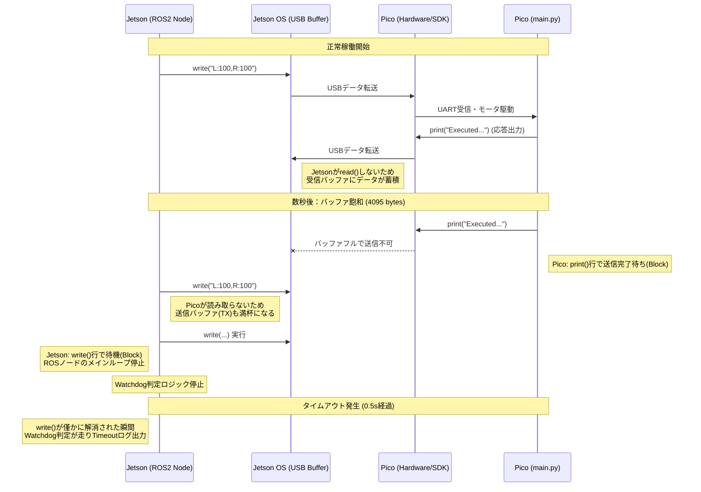

# ロボット制御通信におけるデッドロック解析と解消

**〜シリアル通信バッファの挙動可視化によるリアルタイム性改善〜**

## 1. 事象 (Issue)

Jetson Orin Nano（ROS 2）からRaspberry Pi Pico（MicroPython）へシリアル通信でモータ指示を送るシステムにおいて、以下の致命的な不具合が発生。

* **操作遅延:** `teleop_twist_keyboard` 等での指示から数秒遅れてロボットが動く、または止まらない。
* **Watchdogの誤爆:** ノード内のソフト・ウォッチドッグが頻繁に作動し、制御が中断される。

> **[LOG: ウォッチドッグ発火時のROS 2ノード出力サンプル]**
> ```text
> [INFO] [Timestamp] [motor_driver_node]: Sent: L:100,R:100
> [WARN] [Timestamp] [motor_driver_node]: Watchdog Timeout: Sending Stop Command
> [INFO] [Timestamp] [motor_driver_node]: Sent: L:0,R:0
> ... (ここに実際のログを貼り付け)
> 
> ```
> 
> 

## 2. 仮説設定 (Hypothesis)

当初は「Picoの処理能力不足」を疑ったが、解析を進める中で通信プロトコルの非対称性に着目。

* **仮説A:** Picoの受信バッファ溢れ（マイコン側の負荷）。
* **仮説B:** 通信帯域の不足。
* **仮説C (真の要因):** **OS受信バッファ飽和による双方向デッドロック。** Jetson側がPicoのデバッグログ（`print`）を読み捨てていないため、Linux OSの受信バッファが満杯になり、Pico側の送信処理が物理的にブロックされ、結果として受信も停止している。

## 3. 情報取得 (Data Acquisition)

`pyserial` の `in_waiting` プロパティを利用した監視スクリプトを作成し、OSレベルの滞留バイト数をリアルタイム計測。

* **観測指標:** `in_waiting`（OS受信バッファ内の未読データ量）
* **観測結果:** 指示を送り続けると、RXバッファが特定の数値で頭打ちになる現象を特定。

> **[DATA: シリアル監視スクリプトによるバッファ滞留推移データ]**
> ```text
> --- Monitoring /dev/ttyACM0 (115200bps) ---
> Timestamp       | RX Waiting (Bytes) | TX Waiting (Bytes)
> -------------------------------------------------------
> 22:50:29        | 0                  | 0
> 22:50:29        | 0                  | 0
> 22:50:30        | 0                  | 0
> (省略)
> 22:50:32        | 0                  | 0
> 22:50:33        | 0                  | 0
> 22:50:33        | 72                 | 0
> 22:50:34        | 188                | 0
> 22:50:34        | 308                | 0
> 22:50:35        | 328                | 0
> 22:50:35        | 478                | 0
> 22:50:36        | 603                | 0
> 22:50:36        | 719                | 0
> 22:50:37        | 839                | 0
> 22:50:37        | 959                | 0
> 22:50:38        | 1079               | 0
> 22:50:38        | 1099               | 0
> 22:50:39        | 1224               | 0
> 22:50:39        | 1268               | 0
> 22:50:40        | 1388               | 0
> 
> (省略)
> 
> 22:51:13        | 3792               | 0
> 22:51:13        | 3892               | 0
> 22:51:14        | 3937               | 0
> 22:51:14        | 4057               | 0
> 22:51:15        | 4095               | 0                            ★ここで4095に到達し以降継続。このタイミングから操作遅延が発生する。
> 22:51:15        | 4095               | 0
> 22:51:16        | 4095               | 0
> 22:51:16        | 4095               | 0
> 22:51:17        | 4095               | 0
> 22:51:17        | 4095               | 0
> 22:51:18        | 4095               | 0
> 
> (省略)
> 
> ```
> 
> 
> ※ $2^{12}-1 = 4095$ バイトという数値から、Linuxカーネルのシリアルバッファ上限に達していることが判明。

## 4. 検証 (Validation)

事象発生時にOSバッファを強制的に空にする「バッファクリーナー」を別プロセスで実行し、挙動の変化を観察。

```
tools/serial_cleaner.py
```

* **結果:** クリーナーを実行するうと、RXバッファが常に0付近となり、ロボットの制御遅延およびウォッチドッグの誤爆が完全に消失。

> **[DATA: バッファクリーナ実行ログ]**
> ```text 
> --- Serial Buffer Cleaner Started: /dev/ttyACM0 ---
> Reading and discarding data to prevent buffering...
> Press Ctrl+C to stop.
> 
> [22:51:58] Flushed 469 bytes. Content: !!! Watchdog Timeout: Motors  Stopped (507ms) !!!
> Executed: L:100, R:100
> Executed: L:100, R:100
> Executed: L:100, R:100
> Executed: L:100, R:100
> Executed: L:100, R:100
> Executed: L:0, R:0
> Executed: L:100, R:-100
> Executed: L:100, R:-100
> Executed: L:100,Executed: L:100, R:100
> Executed: L:100, R:100
> Executed: L:0, R:0
> Executed: L:-100, R:100
> Executed: L:-100, R:100
> Executed: L:-100, R:100
> Executed: L:-100, R:100
> Executed: L:-100, R:100
> Executed: L:0, R:0
> [22:51:58] Flushed 50 bytes. Content: !!! Watchdog Timeout: Motors Stopped (507ms) !!!
> ```

> **[DATA: バッファ滞留推移データ]**
> ```text 
> --- Monitoring /dev/ttyACM0 (115200bps) ---
> Timestamp       | RX Waiting (Bytes) | TX Waiting (Bytes)
> -------------------------------------------------------
> 22:51:55        | 4095               | 0
> 22:51:55        | 4095               | 0
> 22:51:56        | 4095               | 0
> 22:51:56        | 4095               | 0
> 22:51:57        | 4095               | 0
> 22:51:57        | 4095               | 0  ★このタイミングでバッファクリーナーを実行開始。以降は0付近で推移。
> 22:51:58        | 0                  | 0
> 22:51:58        | 0                  | 0
> 22:51:59        | 0                  | 0
> 22:52:00        | 0                  | 0
> 22:52:00        | 0                  | 0
> 22:52:01        | 0                  | 0
> 22:52:01        | 0                  | 0


* **結論:** 「Picoがログを吐く → Jetsonが読まない → OSバッファ満杯 → Picoの送信処理がブロック → Picoのメインループ停止 → Jetsonの送信も詰まる」という連鎖的なデッドロックを確認。

## 5. 通信シーケンス図 (Communication Flow)

デッドロック発生時のプロセス間相互作用を可視化。



## 6. 結果判定と対策 (Conclusion & Remediation)

### 実装した対策

1. **Pico側の冗長なログ出力の削除:** 通信トラフィックの最小化。
2. **Jetson側での明示的なバッファフラッシュ:** コマンド送信前に必ず `ser.read(ser.in_waiting)` を実行し、OS受信バッファを常にクリーンに保つロジックを実装。

> **[CODE: 対策後の主要コードスニペット]**
> ```python
> # 修正後のバッファ読み捨て処理
> def scheduled_serial_write(self):
>     if self.ser.in_waiting > 0:
>         _ = self.ser.read(self.ser.in_waiting) # 受信バッファを空にする
>     ... (送信処理)
> 
> ```
> 
> 

### エンジニアとしての知見

「送るだけ」の単方向設計が、低レイヤーの物理制約によってシステム全体のリアルタイム性を破壊するリスクを実体験として学んだ。**「違和感に対して統計的なデータ（4095バイト）を突き合わせる」**アプローチの有効性を再確認した。
