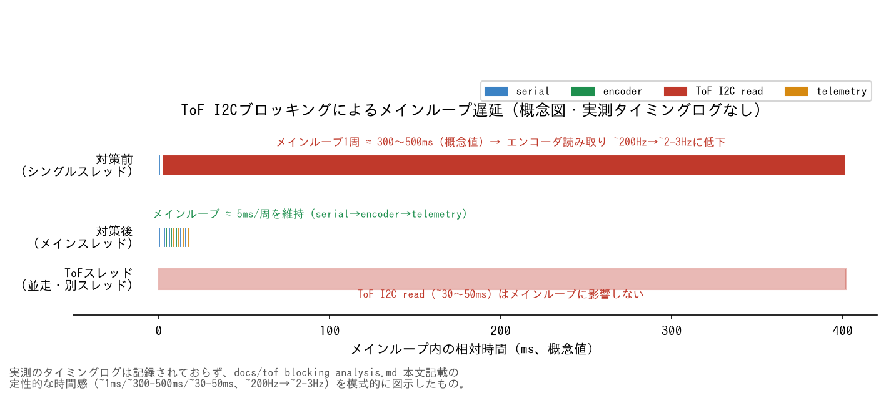

# 砲塔導入後のエンコーダ精度劣化 — ToFブロッキング解析

**〜マイコンメインループのブロッキング特定によるリアルタイム性回復〜**

## 1. 事象 (Issue)

砲塔（Pan-Tilt サーボ + VL53L0X ToF センサー）を導入した後、
ホイールエンコーダの計測精度が **約 50%** に劣化した。

* **導入前:** 1m 直進時のエンコーダ推定距離 ≈ 0.95m（補正後）
* **導入後:** 1m 直進時のエンコーダ推定距離 ≈ 0.48m（同じ補正パラメータ）

```
[DATA: 導入前後のエンコーダ計測値の比較]

■ 導入前 (YYYY-MM-DD)
  テスト走行: 1.0m 直進
  エンコーダ推定: [DATA] m

■ 導入後 (YYYY-MM-DD)
  テスト走行: 1.0m 直進
  エンコーダ推定: [DATA] m
  ≈ 50% の精度低下
```

この劣化により:

* SLAM の地図品質が大幅に低下。
* Nav2 のゴール到達精度が破壊的に悪化。
* 追従動作が不安定化。

## 2. 仮説設定 (Hypothesis)

砲塔導入と同時期に変わった要素を切り分ける。

| # | 仮説 | 理由 |
|---|------|------|
| A | **電源不安定** | Pico 経由でエンコーダ電源を供給しており、サーボ + ToF 追加による電力不足 |
| B | **物理的な配線問題** | 砲塔追加時にエンコーダ配線が緩んだ or ノイズ増加 |
| C | **ファームウェア変更の影響** | ToF 用のコードを事前に導入しており、そのロジックが影響 |

## 3. 検証 (Validation)

### 検証1: 電源問題の切り分け（仮説 A）

**方法:** 砲塔導入前のハードウェア構成に物理的に戻す（サーボ・ToF を取り外し）。

```
[DATA: ハードウェア切り戻し後の計測]
テスト走行: 1.0m 直進
エンコーダ推定: [DATA] m
```

**結果:** 性能が改善しなかった。

**判定:** 仮説 A **棄却**。電源ではない。

---

### 検証2: 配線問題の切り分け（仮説 B）

**方法:** エンコーダ配線の再接続・確認。

**結果:** 接続に問題なし。

**判定:** 仮説 B **棄却**。

---

### 検証3: ファームウェア断面の切り戻し（仮説 C）

**方法:** Pico のファームウェアを砲塔導入 **前** の断面に戻す。

```
[DATA: ファーム切り戻し後の計測]
テスト走行: 1.0m 直進
エンコーダ推定: [DATA] m  ← 改善を確認
```

**結果:** **精度が回復した。**

**判定:** 仮説 C **確定**。ファームウェアの変更が原因。

---

### 検証4: 原因の特定

ファームウェアの差分を確認したところ、以下の構造が判明:

**問題のコード構造（簡略化）:**

```python
# main.py (Pico firmware) - 問題のあるバージョン

TOF_ENABLED = True

def main_loop():
    while True:
        handle_serial_command()      # シリアルコマンド受信・モーター制御
        read_encoders()              # エンコーダ読み取り

        if TOF_ENABLED:
            tof_distance = tof_sensor.read()  # ★ I2C 通信でブロック
            # センサー接続時: ターンアラウンドタイム分待機 (~30-50ms)
            # センサー未接続時: タイムアウトまで待機 (~数百ms)

        send_telemetry()             # テレメトリ送信
```

**問題の本質:**

```
メインループ 1周のタイムライン

[正常時 (ToF無効)]
├─ serial ─┤─ encoder ─┤─ telemetry ─┤
|<──────────── ~5ms ─────────────────>|

[問題時 (ToF有効 + センサー未接続)]
├─ serial ─┤─ encoder ─┤──── tof_read (BLOCKING) ────┤─ telemetry ─┤
|<─────────────────── ~300-500ms ────────────────────────────────>|
```

ToF の `read()` が I2C 通信でブロッキングし、メインループ全体が待機。

結果として:

* エンコーダの読み取り頻度が **~200Hz → ~2-3Hz** に低下。
* パルスの取りこぼしが多発し、計測精度が約 50% に劣化。

<p align="center">
  
</p>

> 実測のタイミングログ自体は記録されていない（当時 `[DATA]` として残された箇所は
> 未計測のまま）。上図は本文に記載の定性的な時間感（~1ms / ~300-500ms / ~30-50ms、
> ~200Hz→~2-3Hz）を模式的に図示した概念図であり、実測波形ではない。

## 4. 通信シーケンス図

```
┌──────────────────────────────────────────────────────────┐
│          Pico Main Loop (シングルスレッド)                 │
│                                                          │
│  ┌────────┐ ┌────────┐ ┌───────────────┐ ┌──────────┐  │
│  │Serial  │→│Encoder │→│ ToF Read(I2C) │→│Telemetry │  │
│  │ ~1ms   │ │ ~1ms   │ │ ★BLOCKING     │ │ ~1ms     │  │
│  │        │ │        │ │ ~300-500ms    │ │          │  │
│  └────────┘ └────────┘ └───────────────┘ └──────────┘  │
│                                                          │
│  ループ1周 ≈ 300-500ms → エンコーダ ~2-3Hz に低下        │
└──────────────────────────────────────────────────────────┘

               ↓↓↓ 対策後 ↓↓↓

┌──────────────────────────────────────────────────────────┐
│          Pico Main Loop (マルチスレッド)                   │
│                                                          │
│  【メインスレッド】                                        │
│  ┌────────┐ ┌────────┐ ┌──────────┐                     │
│  │Serial  │→│Encoder │→│Telemetry │  ≈ 5ms              │
│  └────────┘ └────────┘ └──────────┘  ~200Hz 維持        │
│                                                          │
│  【ToF スレッド】                                          │
│  ┌───────────────┐                                       │
│  │ ToF Read(I2C) │  ← メインに影響なし                    │
│  │ ~30-50ms      │                                       │
│  └───────────────┘                                       │
└──────────────────────────────────────────────────────────┘
```

## 5. 対策 (Remediation)

### 実装した対策

1. **ToF の I2C 読み取り処理を別スレッド (`_thread`) に分離。**

```python
# main.py (Pico firmware) - 修正後
import _thread

tof_distance_shared = -1.0
tof_lock = _thread.allocate_lock()

def tof_thread():
    global tof_distance_shared
    while True:
        try:
            dist = tof_sensor.read()
            with tof_lock:
                tof_distance_shared = dist
        except Exception:
            with tof_lock:
                tof_distance_shared = -1.0
        time.sleep_ms(50)

if TOF_ENABLED:
    _thread.start_new_thread(tof_thread, ())

def main_loop():
    while True:
        handle_serial_command()
        read_encoders()
        with tof_lock:
            current_tof = tof_distance_shared  # ノンブロッキング
        send_telemetry()
```

2. **ToF 無効時はスレッドを起動しないよう制御。**

## 6. 結果 (Result)

| 指標 | 対策前 (ToF ブロッキング) | 対策後 (マルチスレッド) |
|------|-------------------------|----------------------|
| メインループ周期 | ~300-500ms | ~5ms |
| エンコーダ読取頻度 | ~2-3 Hz | ~200 Hz |
| 1m 直進エンコーダ推定 | [DATA] m (≈50% 低下) | [DATA] m (正常精度に回復) |
| Nav2 走行安定性 | 不安定 | 安定 |

```
[DATA: 対策前後のエンコーダ精度比較]

■ 対策前:
  テスト走行: 1.0m 直進 ×3回
  エンコーダ推定: [DATA], [DATA], [DATA] m

■ 対策後:
  テスト走行: 1.0m 直進 ×3回
  エンコーダ推定: [DATA], [DATA], [DATA] m
```

## 7. 根本原因のまとめ

```
砲塔導入 (ToF 有効化)
│
▼
ToF read() が I2C 通信でブロック (~300-500ms)
│
▼
Pico メインループ全体が待機
│
▼
エンコーダ読み取り頻度が ~200Hz → ~2-3Hz に低下
│
▼
パルス取りこぼし多発
│
▼
ホイールオドメトリ精度 ≈ 50% に劣化
│
▼
SLAM / Nav2 が破壊的に不安定化
```

## 8. エンジニアとしての知見

1. **マイコンのメインループにブロッキング I/O を入れてはならない。**
   リアルタイム性が要求されるループ（エンコーダ読取、モーター制御）に
   I2C / SPI などのブロッキング処理を混在させると、全体のスケジューリングが破壊される。

2. **「動いていたものが壊れた」時の切り分け手順:**
   - ハードウェア切り戻し → 改善しない → ハード棄却
   - ファームウェア断面切り戻し → 改善 → ソフト確定
   - 差分分析 → 原因特定
   この手順は DBA における障害切り分けと本質的に同じ。

3. **設定で有効/無効を切り替えられる機能でも、無効時・未接続時のコードパスが
   ブロッキングしないことを確認すべき。**
   今回は「ToF 有効」設定で、センサー未接続時にタイムアウト待ちが発生するケースが
   最も影響が大きかった。

---

## 参考

| ドキュメント | 内容 |
|-------------|------|
| [`serial_deadlock_analysis.md`](serial_deadlock_analysis.md) | 類似のシステム障害分析（シリアル通信デッドロック） |
| [`engineering_decisions.md`](engineering_decisions.md) | 本件を含む技術的意思決定の記録 |
