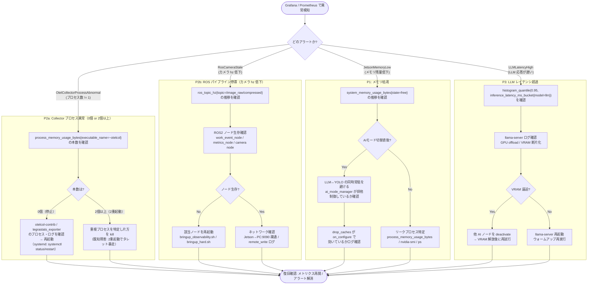

# 障害切り分けフロー — Robot SRE

OTel / Prometheus / Grafana で異常を検知したときの一次切り分け手順。
Prometheus アラート（`docker/observability/prod/alert_rules.yml`）の 4 パターン
（P1 メモリ枯渇 / P2a Collector プロセス異常 / P2b ROS パイプライン停滞 /
P3 LLM レイテンシ超過）に対応する。メトリクス名は M2-H（収集レイヤ最終化・2026-07-04）
確定の正典名。

関連:
- アラート定義: [`docker/observability/prod/alert_rules.yml`](../docker/observability/prod/alert_rules.yml)
- 収集レイヤ・正典メトリクス表: [`docs/observability_detail.md`](observability_detail.md) §収集メトリクス一覧
- スタック構成: [`docker/observability/README.md`](../docker/observability/README.md)
- 詳細ロードマップ: `todo/observability_otel.md` M2-F / M2-H

---

## 一次切り分けフロー

---

## パターン別チェックリスト

### P1: メモリ枯渇（`JetsonMemoryLow` / `system_memory_usage_bytes{state="free"} < 512000000` が 2 分継続）

Jetson Orin Nano 8GB の制約下で、重い AI ノード（LLM / YOLO / YOLO-World）が
同時常駐するとメモリが逼迫する。正典はホスト hostmetrics（M2-H）。

1. `system_memory_usage_bytes{state="free"}` の時系列を Grafana で確認し、落ち込みの起点を特定する。
2. 起点が AI モード切替と一致する場合、`ai_mode_manager_node` の排他制御
   （deactivate → cleanup → configure → activate）が正しく走ったかログで確認する。
3. 各 LifecycleNode の `on_configure` 内 `drop_caches` が効いているかを確認する。
4. モード切替と無関係な単調減少ならリークを疑い、`process_memory_usage_bytes{executable_name=~...}`
   （hostmetrics process スクレイパ）や `nvidia-smi` / `ps` でプロセス単位のメモリを確認する。

### P2a: Collector プロセス異常（`OtelCollectorProcessAbnormal` / プロセス数が 1 以外で 5 分継続）

ホスト hostmetrics の process スクレイパで otelcol-contrib の生存本数を監視する
（`--pid=host` 前提。M2-H）。0 個＝停止、2 個以上＝2重起動（既知障害: タレット暴走の原因になりうる）。

1. `count(process_memory_usage_bytes{executable_name=~".*otelcol.*"})` の値を確認する。
2. 0 個なら Collector プロセス・ログを確認して再起動する
   （systemd 化後: `systemctl status/restart otel-collector`）。
3. 2 個以上なら重複プロセスを `pgrep -fa otelcol` 等で特定し、片方を kill する。

### P2b: ROS パイプライン停滞（`RosCameraStale` / `ros_topic_hz{topic="/image_raw/compressed"} < 1` が 2 分継続）

カメラはどの AI モードでも常時 publish される想定のため、hz 低下は perception 層の停止を示す。

1. `ros_topic_hz{topic="/image_raw/compressed"}` の推移を確認する。
2. `work_event_node` / `metrics_node` / カメラノードの ROS2 生存を確認する。
   落ちていれば `bringup_observability.sh` / `bringup_hard.sh` で再起動。
3. どちらも生きていれば、Jetson → PC:9090 の疎通・`remote_write` の送信ログ
   （`Exporting failed. Will retry.` の有無）を確認する。

### P3: 推論レイテンシ超過（`LLMLatencyHigh` / `inference_latency_ms_bucket{model="llm"}` の p95 が 10 秒超で 1 分継続）

3A方式（各AIノード → metrics_node 集約）の Histogram。Prometheus では
`histogram_quantile(0.95, rate(inference_latency_ms_bucket{model="llm"}[5m]))` で見る。

1. Grafana でレイテンシ p95 のスパイクを確認する。
2. `llama-server` のログで GPU offload の状況・VRAM 断片化の兆候を確認する。
3. VRAM が逼迫していれば、他 AI ノードを `deactivate` して VRAM を解放後に再試行する。
4. VRAM に余裕があるのに遅い場合は `llama-server` を再起動し、ウォームアップを再実行する。

---

> 注: このフローは異常の**一次切り分け**を目的とする。恒久対策や根本原因分析は
> 各作業領域の `todo/logs/<領域>.md` を参照すること。
